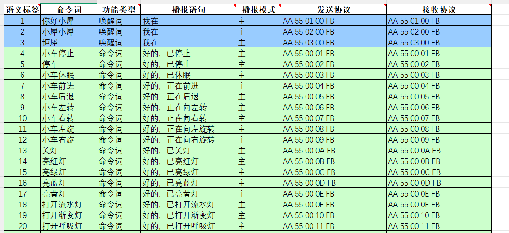

# Jetson serielle Kommunikation

Hinweis: Für das Sprachinteraktionsmodul muss die Werksfirmware geflasht werden; bei einem neuen, ungeflashten Sprachchip ist dies nicht erforderlich

## 1. Port prüfen

Über den USB-Anschluss an das Jetson-Mainboard anschließen.

Im Terminal erscheint das Gerät ttyUSB0, wenn es korrekt erkannt wurde (normalerweise ttyUSB0, es kann auch eine andere Gerätenummer sein)

```Plain Text
ls /dev/ttyUSB*
```


## 2. Code-Implementierung

speech_serial.py in das entsprechende Verzeichnis herunterladen

```Python
#!/usr/bin/env python3
# -*- coding: utf-8 -*-

import time
import serial
from typing import Optional, Tuple


class SpeechModule:
    """
    Serial communication controller for the speech module
    Encapsulates the interaction logic with the speech module
    """

    # Serial port configuration constants
    DEFAULT_PORT = "/dev/ttyUSB0"
    DEFAULT_BAUDRATE = 115200

    # Command word definitions (announcement words / function IDs)
    CMD_THIS_RED = 0x60
    CMD_THIS_GREEN = 0x61
    CMD_THIS_YELLOW = 0x62
    CMD_RECOGNIZE_YELLOW = 0x63
    CMD_RECOGNIZE_GREEN = 0x64
    CMD_RECOGNIZE_BLUE = 0x65
    CMD_RECOGNIZE_RED = 0x66
    CMD_INIT = 0x67

    def __init__(self, port: str = DEFAULT_PORT, baudrate: int = DEFAULT_BAUDRATE):
        self._port = port
        self._baudrate = baudrate
        self._serial_conn: Optional[serial.Serial] = None

    def connect(self) -> bool:
        """Establish serial connection"""
        try:
            self._serial_conn = serial.Serial(self._port, self._baudrate, timeout=0.1)
            if self._serial_conn.is_open:
                print(f"[Connected] Speech Serial Opened! Baudrate={self._baudrate}")
                return True
            return False
        except serial.SerialException as e:
            print(f"[Error] Speech Serial Open Failed: {e}")
            return False

    def send_command(self, cmd_id: int) -> None:
        """
        Send command frame
        Protocol format: 0xAA 0x55 0xFF [Data] 0xFB
        """
        if not self._serial_conn or not self._serial_conn.is_open:
            return

        # Build the complete data frame
        frame = bytes([0xAA, 0x55, 0xFF, int(cmd_id), 0xFB])

        self._serial_conn.write(frame)
        time.sleep(0.005)
        self._serial_conn.reset_input_buffer()  # Same as flushInput

    def read_response(self) -> Optional[int]:
        """
        Read and parse the returned data
        Returns: Read_ID (data from the 6th byte)
        """
        if not self._serial_conn or not self._serial_conn.is_open:
            return None

        # Check the bytes available in the buffer
        bytes_available = self._serial_conn.in_waiting
        if bytes_available <= 0:
            return None

        raw_data = self._serial_conn.read(bytes_available)
        hex_str = raw_data.hex()

        # Verify frame header 'aa55'
        if hex_str.startswith('aa55'):
            try:
                # Simple index extraction logic (kept consistent with the original code)
                # Note: assumes enough data; production code should add length validation
                # byte1 = hex_str[4:6] # keep the 5th byte from the original logic but unused
                byte2 = hex_str[6:8] # Extract the 6th byte

                read_id = int(byte2, 16)

                self._serial_conn.reset_input_buffer()
                time.sleep(0.005)
                print(f"Read_ID: {read_id}")
                return read_id
            except (IndexError, ValueError):
                pass

        return None

    def run(self):
        """Main run loop"""
        if not self.connect():
            return

        # Initialize the module
        self.send_command(self.CMD_INIT)
        time.sleep(0.005)

        print("[Listening] Waiting for data...")
        try:
            while True:
                self.read_response()
        except KeyboardInterrupt:
            print("
[Stopped] Program interrupted by user.")
        finally:
            if self._serial_conn and self._serial_conn.is_open:
                self._serial_conn.close()
                print("[Disconnected] Serial port closed.")


if __name__ == "__main__":
    module = SpeechModule()
    module.run()

```

## 3. Ergebnis

Der Inhalt der Ansagen kann über die beigefügte Datei 命令詞播報詞協議列表V1_中文文件 (Befehlswort-Ansageprotokoll-Liste) geprüft werden.

Das erste und zweite Byte AA 55 sind der Frame-Header des Protokolls, das dritte Byte 00 ist die Ansagefunktion, das vierte der ID der Ansage. Hier sieht man, dass „Fahrzeug vorwärts" hexadezimal 07 ist: im Programm 0x07 an Register 0x03 senden, um den Inhalt anzusagen. Das fünfte Byte ist der Endrahmen.



Folgenden Befehl im Terminal ausführen

```Plain Text
python3 -m speech_serial
```

Nach dem Aufweckwort antwortet die Konsole mit Read_ID: 0

Bei „Licht aus" antwortet die Konsole mit Read_ID: 13


Jetzt die beigefügte Datei 命令詞播報詞協議列表V1_中文文件 öffnen und das Protokoll für „Licht aus" prüfen


Das erste und zweite Byte AA 55 sind der Frame-Header, das dritte Byte die ID der zehn Funktionswörter des Chips, das vierte die ID des Befehlsworts. Hier sieht man, dass „Licht aus" hexadezimal 0D, dezimal 13 ist. Das fünfte Byte ist der Endrahmen.

Bei anderen Befehlswörtern druckt die Konsole ebenfalls die entsprechende ID – zum Ausprobieren
