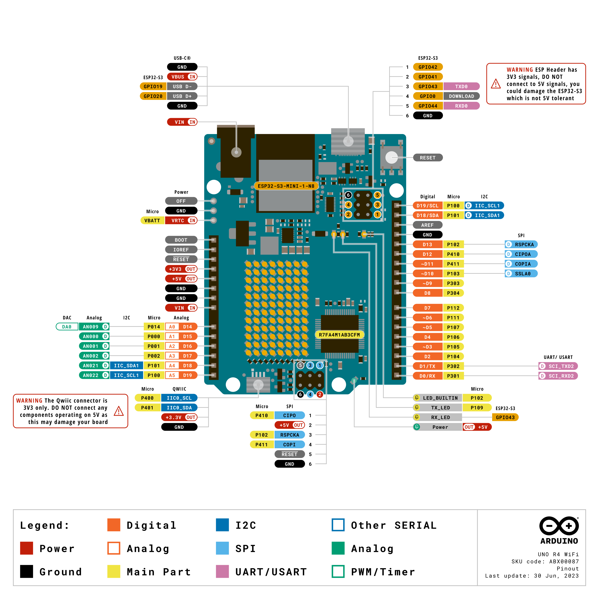

# IIC-Kommunikation

## 📁 Dateistruktur

```Plain Text
IIC_Voice/
├── IIC_Voice.ino    # 主程序
├── bsp_iic.hpp         # 头文件（地址和函数声明）
├── bsp_iic.cpp         # 实现文件
└── README.md            # 本教程
```

---

## 🔌 Hardwareanschluss



---

## 🔧 Kompilieren und Hochladen

### Erster Schritt: Arduino IDE öffnen

1. Öffnen Sie die Datei `IIC_Voice.ino`

2. Wählen Sie Ihr Entwicklungsboard-Modell (z. B. Arduino Uno)

3. Wählen Sie die entsprechende serielle Schnittstelle

### Zweiter Schritt: Kompilieren und Hochladen

1. Klicken Sie auf die Schaltfläche ✔️, um zu kompilieren

2. Klicken Sie auf die Schaltfläche ➡️, um auf das Board hochzuladen

---

## 📡 Serieller Test

### Seriellen Monitor in der Arduino IDE öffnen

- Baudrate: **115200**

- Abschlusszeichen: **Keine**

### Erwartete Ausgabe

Nach dem Einschalten sollte Folgendes zu sehen sein:

`IIC Voice Module Initialized`

Wenn Sie das Weckwort und das Befehlswort zum Modul sprechen, wird die entsprechende ID ausgegeben:

```Plain Text
ID: 1
ID: 2
ID: 10
```

---

## 📚 Registerzuordnung

---

## 📚 BSP-Schnittstellenbeschreibung

### IIC_Init()

```Plain Text
void IIC_Init(void);
```

**Funktion**: Initialisiert den I2C-Bus

**Beispiel**:

```Plain Text
void setup() {
  IIC_Init();
}
```

---

### IIC_ReadCommand()

```Plain Text
int IIC_ReadCommand(void);
```

**Funktion**: Liest die von dem Sprachmodul erkannte Befehls-ID

**Rückgabewert**:

- `0` - kein Befehl erkannt

- `1~254` - Befehls-ID

- `-1` - Kommunikationsfehler

**Beispiel**:

```Plain Text
int id = IIC_ReadCommand();
if (id > 0) {
  Serial.print("识别到命令: ");
  Serial.println(id);
}
```

---

### IIC_SetPassiveVoice()

```Plain Text
void IIC_SetPassiveVoice(uint8_t voiceID);
```

**Funktion**: Legt die Ansagephrase für die passive Wiedergabe fest

**Parameter**:

- `0x00` - Typ der passiven Ansagephrase

**Beispiel**:

```Plain Text
IIC_SetPassiveVoice(0x00);
delay(200);
```

---

### IIC_SetFunctionVoice()

```Plain Text
void IIC_SetFunctionVoice(uint8_t voiceID);
```

**Funktion**: Legt die Ansagephrase für die Funktionswort-Wiedergabe fest

**Parameter**:

- `0x00` - Typ der Funktionswort-Ansagephrase

**Beispiel**:

```Plain Text
IIC_SetFunctionVoice(0x00);
delay(200);
```

---

### IIC_SetCommandVoice()

```Plain Text
void IIC_SetCommandVoice(uint8_t voiceID);
```

**Funktion**: Legt die Ansagephrase für die Befehlswort-Wiedergabe fest

**Parameter**:

- `0x00` - Typ der Befehlswort-Ansagephrase

**Beispiel**:

```Plain Text
IIC_SetCommandVoice(0x00);
delay(200);
```

---

## 🎯 Beschreibung der Hauptprogrammlogik

```JavaScript
void setup() {
  Serial.begin(115200);
  IIC_Init();

  Serial.println("IIC Voice Module Initialized");

  IIC_SetCommandVoice(0x00);  // 上电播报命令词语音
  delay(200);
}

void loop() {
  int commandId = IIC_ReadCommand();

  if (commandId >= 0) {
    // 过滤无效值，防止重复输出
    if (commandId != 0 && commandId != 255 && commandId != lastCommandId) {
      Serial.print("ID: ");
      Serial.println(commandId);
      lastCommandId = commandId;

      // 示例：根据识别到的命令控制播报
      if (commandId == 1) {
        IIC_SetCommandVoice(0x00);  // 识别到命令1，播报命令词语音
      } else if (commandId == 2) {
        IIC_SetCommandVoice(0x00);  // 识别到命令2，播报命令词语音
      }
    } else if (commandId == 0 || commandId == 255) {
      if (lastCommandId != 0) {
        lastCommandId = 0;  // 重置状态
      }
    }
  } else {
    Serial.println("IIC Read Error");
    delay(1000);
  }

  delay(50);
}
```

---

## 🔍 Häufig gestellte Fragen

### Q1: Die serielle Ausgabe zeigt nur "IIC Read Error"

**Mögliche Ursachen:**

1. Falsche Verkabelung oder nicht angeschlossen

2. Modul nicht mit Strom versorgt

3. Falsche I2C-Adresse

**Lösung:**

- Prüfen Sie, ob SDA/SCL vertauscht sind

- Prüfen Sie, ob GND gemeinsam verbunden ist

- Prüfen Sie, ob die 5V-Stromversorgung in Ordnung ist

- Bestätigen Sie die Geräteadresse mit einem I2C-Scanprogramm

---

### Q2: Keine Ausgabe

**Mögliche Ursachen:**

1. Falsche Baudrate der seriellen Schnittstelle

2. Modul nicht aufgeweckt

**Lösung:**

- Vergewissern Sie sich, dass die Baudrate der seriellen Schnittstelle 115200 beträgt

- Sagen Sie zuerst das Weckwort und dann das Befehlswort

---

### Q3: Ausgabe "ID: 255" oder "ID: 0"

**Erläuterung:** Dies ist ein normales Phänomen

- `0` = kein Befehl erkannt

- `255` = keine neuen Daten

Diese Werte werden im Code bereits herausgefiltert und normalerweise nicht ausgegeben. Wenn Sie eine Ausgabe sehen, bedeutet das, dass der Code nicht wirksam ist.

---

## 💡 Vorteile der BSP-Architektur

### Klare Codeschichtung

- **bsp_iic.hpp** - nur Deklarationen ansehen, nicht die Implementierung

- **bsp_iic.cpp** - konkrete Implementierungsdetails

- **IIC_Voice.ino** - nur die Geschäftslogik betreffen

### Einfache Portierung

Wenn Sie auf eine andere Plattform wechseln (z. B. STM32, ESP32), müssen Sie nur die Implementierung in `bsp_iic.cpp` ändern; das Hauptprogramm muss nicht geändert werden.

### Einfache Wartung

Änderungen am I2C-bezogenen Code erfolgen nur in `bsp_iic.cpp` – eine Änderung wirkt überall.

---

## 🚀 Beispiele für Erweiterungsfunktionen

### Beispiel 1: Unterschiedliche Ansagen je nach Befehl auslösen

```Plain Text
if (commandId == 1) {
  IIC_SetCommandVoice(0x00);      // 播报命令词
} else if (commandId == 2) {
  IIC_SetFunctionVoice(0x00);     // 播报功能词
} else if (commandId == 3) {
  IIC_SetPassiveVoice(0x00);      // 播报被动语
}
```

### Beispiel 2: LED steuern

```Plain Text
if (commandId == 10) {
  digitalWrite(LED_PIN, LOW);    // 关灯
  IIC_SetCommandVoice(0x00);     // 播报确认
}
```

### Beispiel 3: Motor steuern

```Plain Text
if (commandId == 11) {
  motor_stop();
  IIC_SetCommandVoice(0x00);     // 播报确认
}
```

