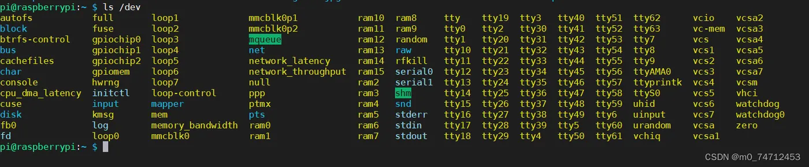
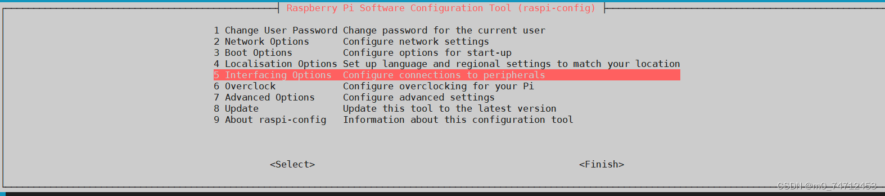
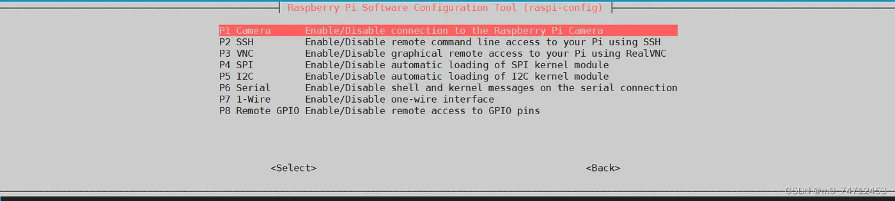
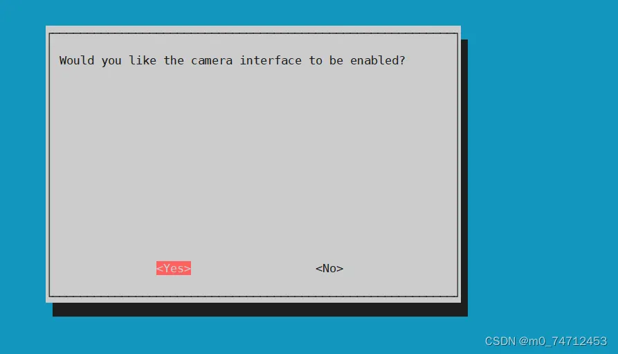
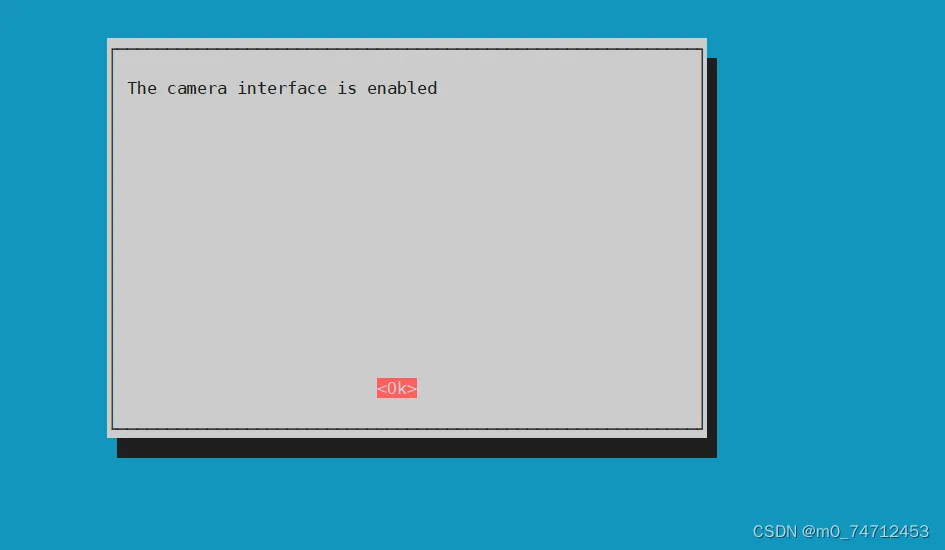
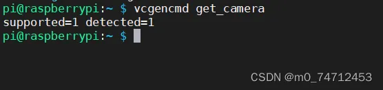
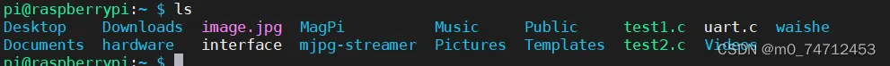

# 05、IMX219-CSI-Kamera (Raspberry Pi) Anleitung

##### 1、Verwenden Sie zunächst den Befehl "ls", um zu prüfen, ob ein vchiq-Geräteknoten vorhanden ist: geben Sie ls /dev ein

Wenn nicht, liegt möglicherweise ein Problem mit dem Kernel oder der Gerätehardware vor; versuchen Sie, das System neu zu flashen oder die Hardware auszutauschen.

##### 2、Führen Sie den Befehl "sudo raspi-config" aus, um die CSI-Kamera des Raspberry Pi zu aktivieren

Beenden Sie dann und geben Sie den Befehl sudo reboot ein, um den Raspberry Pi neu zu starten

##### 3、Geben Sie "vcgencmd get_camera" ein, um zu prüfen, ob die aktuelle Kamera und deren Aktivierung verfügbar sind

Wenn detected=0, ist das Kameramodul nicht richtig angeschlossen; überprüfen Sie die Hardware erneut. detected=1 bedeutet, dass die CSI-Kamera korrekt angeschlossen ist. supported=1 bedeutet, dass die Kamera aktiviert ist und verwendet werden kann. supported=0 bedeutet, dass die CSI-Kamera nicht aktiviert ist und das Kameramodul aktiviert werden muss.

## **3.Verwenden Sie den rapistill-Befehl, um ein Foto aufzunehmen**

Geben Sie **"raspistill -o image.jpg"** ein, um erfolgreich ein Foto aufzunehmen und zu speichern; dabei leuchtet die Kamera rot. Weitere Parameter finden Sie mit raspistill --help

Übertragen Sie das Bild image.jpg auf den Windows-Desktop und öffnen Sie es, um das Ergebnis der Aufnahme zu sehen

