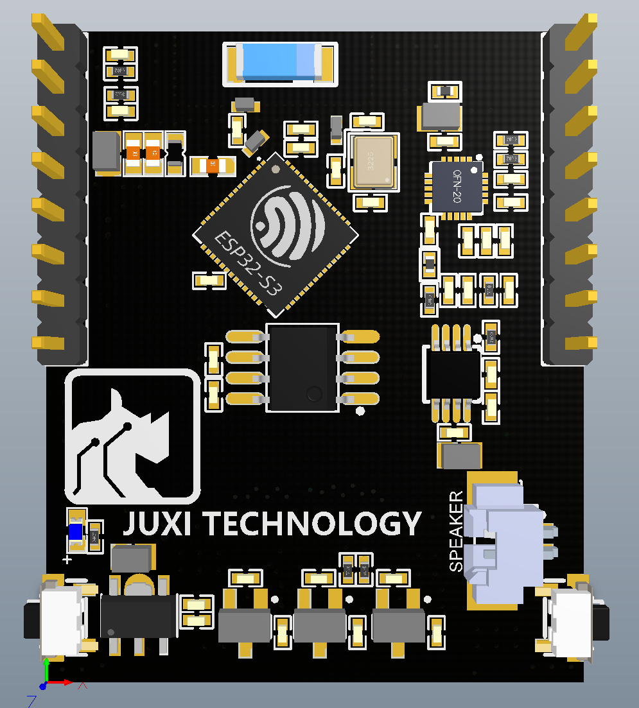
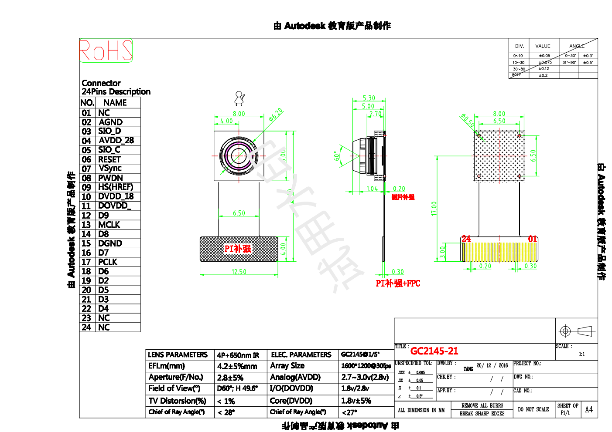
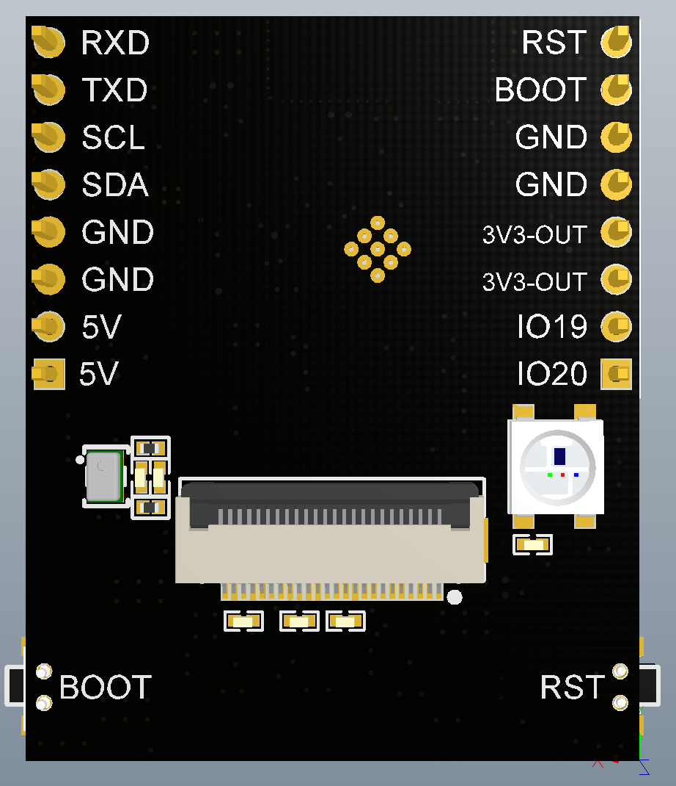
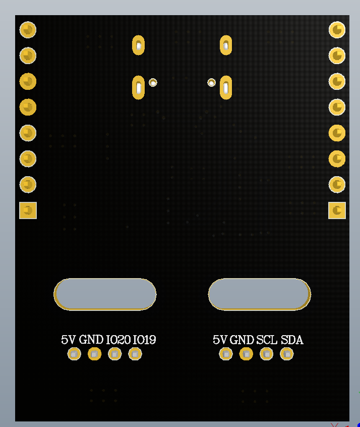

# ESP32-NanoCam Hardware-Spezifikation

> **[Im Shop kaufen](https://www.juxitech.com/de/products/esp32-s3-wifi-video-module)**


## 1. Hardware-Übersicht

Die Hardware-Angaben in diesem Abschnitt stammen aus den Schaltplänen NanoCamModule.pdf + NanoCamBASE.pdf. Gesamtarchitektur: Das Kernboard (ESP32-S3 + Kamera + Audio) wird auf das Basisboard (USB-Stromversorgung + serielle Programmierung) gesteckt.

```Plaintext
┌─────────────────────────────────────────────────────────┐
│                    NanoCam 核心板                         │
│  ┌──────────┐  ┌──────────┐  ┌────────────┐            │
│  │ ESP32-S3 │  │ ES8311   │  │ NS4150B   │            │
│  │   R8     │  │ I2S 麦克风│  │ I2S 功放   │            │
│  │ (QFN56)  │  │          │  │            │            │
│  └────┬─────┘  └──────────┘  └────────────┘            │
│       │                                                 │
│  ┌────┴─────┐  ┌──────────┐  ┌────────────┐            │
│  │ GD25Q128 │  │  DVP     │  │ ME6217C33  │            │
│  │ 16MB Flash│ │ 摄像头   │  │ 3.3V LDO   │            │
│  └──────────┘  │ FPC-24P  │  └────────────┘            │
│                └──────────┘                             │
├─────────────────────────────────────────────────────────┤
│                    NanoCam 底板                          │
│  ┌──────────┐  ┌──────────┐  ┌────────────────────┐    │
│  │ USB-C    │  │ CH340K   │  │ 一键下载电路        │    │
│  │ 5V输入   │  │ USB-UART │  │ (DTR/RTS→BOOT/EN)  │    │
│  └──────────┘  └──────────┘  └────────────────────┘    │
│                                                         │
│  扩展接口: I2C ×1, UART ×1, 5V/GND/3.3V                 │
└─────────────────────────────────────────────────────────┘
```



## 2. MCU und Speicher

### 2.1 MCU-Chip

|Parameter|Spezifikation|
|---|---|
|Modell|**ESP32-S3 N16R8**|
|Gehäuse|QFN56|
|CPU|Xtensa LX7 Dual-Core 240MHz|
|PSRAM|**8MB** (Octal SPI, Suffix R8)|
|Flash|**16MB** (Suffix N16, externer 128M-bit-SPI-Flash)|
|Takt|40MHz Quarz (passiv) + 10pF×2 Abgleichkondensatoren|

### 2.2 Flash-Speicher

|Parameter|Spezifikation|
|---|---|
|Modell|**GD25Q128ESIG**|
|Kapazität|128M-bit = **16MB**|
|Schnittstelle|SPI (Standard, vier Leitungen)|
|Hersteller|GigaDevice|

|Flash-Signal|ESP32-S3 GPIO|Funktion|
|---|---|---|
|CS|IO29|Chip Select|
|SO (DO)|IO31|Datenausgang|
|SI (DI)|IO32|Dateneingang|
|SCLK|IO30|Takt|
|WP|IO34|Schreibschutz|
|HOLD|IO33|Halt|

## 3. Kamera-Subsystem

### 3.1 DVP-Schnittstelle

|Parameter|Spezifikation|
|---|---|
|Schnittstellentyp|FPC 0.5 WS 24P (24-Pin-FPC-Sockel)|
|Unterstützte Sensoren|GC2145 (Standard) / OV2640 / OV5640 und weitere DVP-Kameras|
|I2C-Konfigurationsbus|SDA=IO41, SCL=IO42 (geteilt mit externem I2C)|
|Pixelformate|RGB565 / JPEG / YUV422 u. a.|



### 3.2 Vollständige DVP-Pinbelegung

|Signalkategorie|Signalname|ESP32 GPIO|Bemerkung|
|---|---|---|---|
|**Systemtakt**|XCLK|**IO9**|Haupttaktausgang 24MHz|
|**Pixeltakt**|PCLK|**IO6**|Pixel-Takteingang der Kamera|
|**Frame-Sync**|VSYNC|**IO13**|Vertikalsynchronisation|
|**Zeilen-Sync**|HREF|**IO11**|Horizontalreferenz|
|**Steuerung**|PWDN|**IO12**|Kamera-Power-Down-Steuerung|
|**Steuerung**|RESET|**IO14**|Kamera-Reset|
|**I2C**|SDA|**IO41**|Kamera-I2C-Daten (geteilt mit ES8311)|
|**I2C**|SCL|**IO42**|Kamera-I2C-Takt (geteilt mit ES8311)|
|**Daten D0**|Y2|**IO4**|Pixeldaten bit0|
|**Daten D1**|Y3|**IO2**|Pixeldaten bit1|
|**Daten D2**|Y4|**IO1**|Pixeldaten bit2|
|**Daten D3**|Y5|**IO3**|Pixeldaten bit3|
|**Daten D4**|Y6|**IO5**|Pixeldaten bit4|
|**Daten D5**|Y7|**IO7**|Pixeldaten bit5|
|**Daten D6**|Y8|**IO8**|Pixeldaten bit6|
|**Daten D7**|Y9|**IO10**|Pixeldaten bit7|

### 3.3 Zusammenfassung der Kamera-Signalgruppen

```Plaintext
Camera DVP 信号组:
  XCLK  = IO9     # Master clock out (24MHz)
  PCLK  = IO6     # Pixel clock in
  VSYNC = IO13    # Vertical sync
  HREF  = IO11    # Horizontal ref
  PWDN  = IO12    # Power down (active low)
  RESET = IO14    # Hardware reset

  D0(Y2) = IO4    D1(Y3) = IO2
  D2(Y4) = IO1    D3(Y5) = IO3
  D4(Y6) = IO5    D5(Y7) = IO7
  D6(Y8) = IO8    D7(Y9) = IO10

  SIOD(SDA) = IO41
  SIOC(SCL) = IO42
```

## 4. Audio-Subsystem

### 4.1 Audio-Architektur

```Plaintext
AP2718AT (模拟MEMS麦) → ES8311 Codec (ADC/DAC) → NS4150B (模拟功放) → 扬声器
                               ↕ I2S (MCLK=39,BCLK=38,WS=47,DOUT=48,DIN=40) + I2C (41/42, addr=0x30)
                            ESP32-S3
```

|Bauteil|Modell|Typ|Schnittstelle|
|---|---|---|---|
|Mikrofon|**AP2718AT**|Analoges MEMS-Siliziummikrofon|Differentielles Analogsignal → ES8311 ADC|
|Codec|**ES8311**|Audio-Codec (I2S+I2C)|I2S=MCLK=39,BCLK=38,WS=47,DOUT=48,DIN=40, I2C=41/42, addr=0x30|
|Verstärker|**NS4150B**|Analoger Klasse-D-Verstärker|ES8311-DAC-Ausgang → Analogeingang → Lautsprecher|

### 4.2 ES8311-Codec-I2S-Pins

|I2S-Signal|ESP32 GPIO|Funktion|
|---|---|---|
|MCLK|**IO39**|Haupttakt|
|BCLK (SCLK)|**IO38**|Bittakt|
|LRCLK (WS)|**IO47**|Links/Rechts-Kanaltakt|
|DOUT (DAC)|**IO48**|Serieller Datenausgang (Wiedergabe)|
|DIN (ADC)|**IO40**|Serieller Dateneingang (Aufnahme)|

> Audio verwendet den I2S0-Standard-Duplex-Modus; der ES8311-Codec unterstützt gleichzeitig Aufnahme und Wiedergabe.

### 4.3 ES8311-I2C-Steuerung

|I2C-Signal|GPIO|Beschreibung|
|---|---|---|
|SDA|IO41|Geteilter I2C-Bus mit der Kamera|
|SCL|IO42|Geteilter I2C-Bus mit der Kamera|
|Adresse|**0x30**|ES8311 8-bit-I2C-Adresse|

## 5. Stromversorgung

### 5.1 Versorgungskette

```Plaintext
USB-C (5V) ──→ 底板 NCE3401 P-MOSFET 反接保护 ──→ VDD50
                                              │
                    ┌─────────────────────────┤
                    ↓                         ↓
            核心板 ME6217C33 LDO            NS4150B 功放
                    │                  (5V 直供)
                    ↓
                 VDD33 (3.3V)
                    │
        ┌───────────┼───────────┐
        ↓           ↓           ↓
    ESP32-S3    ES8311 Codec   GD25Q128 Flash
    DVP摄像头   AP2718AT 麦    ME6211A18/28 LDO
```

### 5.2 Zentrale Bauteile

|Chip|Modell|Funktion|
|---|---|---|
|LDO|**ME6217C33P5G** (SOT-89-5)|5V→3.3V-Regelung|
|LDO|**ME6211A18M3G** (SOT-23)|5V→1.8V (Kamera-Kern)|
|LDO|**ME6211A28M3G** ×2 (SOT-23)|5V→2.8V (U6=AVDD, U7=DOVDD)|
|U1 Eingangsfilter|C14 (10μF) + C15 (0.1μF)|ME6217C33 Eingang|
|U1 Ausgangsfilter|C1 (22μF)|ME6217C33 Ausgang|
|Verpolschutz|**NCE3401** P-MOSFET|Schutz des Stromversorgungseingangs am Basisboard|
|Gate-Widerstand|R11 10KΩ|P-MOS-Gate auf Masse|

## 6. Basisboard und Flashen



### 6.1 USB-zu-Seriell

|Parameter|Spezifikation|
|---|---|
|Chip|**CH340K**|
|USB-Schnittstelle|USB-C (USB1)|
|Serielle Verbindung|TXD→U0RXD (IO44), RXD→U0TXD (IO43) (gekreuzt)|
|USB-Abgleichwiderstände|R4, R5 22R/1% (in Reihe zu D+/D-)|
|DTR/RTS|Ein-Klick-Programmierung steuert BOOT + EN automatisch|


### 6.2 Ein-Klick-Download-Schaltung

Die automatische Programmierung erfolgt über Q1, Q2 (S8050 NPN-Transistoren):

|CH340K-Signal|Steuerung|Zielpin|
|---|---|---|
|DTR|→ Q1 →|ESP32 **EN** (CHIP_PU)|
|RTS|→ Q2 →|ESP32 **BOOT** (IO0)|

> Prinzip: Das USB-Flash-Tool steuert über DTR/RTS-Umschaltung automatisch die BOOT- und EN-Sequenz — kein manueller Tastendruck erforderlich.

### 6.3 Steckverbinder Kernboard↔Basisboard

|Basisboard-Stiftleiste|Kernboard-Stiftleiste|Signalname|ESP32 GPIO|Funktion|
|---|---|---|---|---|
|P1-1|P1-1|**VDD50**|—|5V-Stromversorgungsausgang|
|P1-2|P1-2|**VDD50**|—|5V-Stromversorgungsausgang|
|P1-3|P1-3|**GND**|—|Masse|
|P1-4|P1-4|**GND**|—|Masse|
|P1-5|P1-5|**SDA**|IO41|I2C-Daten (geteilt mit Kamera/ES8311)|
|P1-6|P1-6|**SCL**|IO42|I2C-Takt (geteilt mit Kamera/ES8311)|
|P1-7|P1-7|**U0TXD**|IO43|UART0 Senden (an CH340K RXD)|
|P1-8|P1-8|**U0RXD**|IO44|UART0 Empfangen (an CH340K TXD)|
|**P2-1**|P2-1|**ESP_P**|IO20|USB-Differenzdaten positiv (D+)|
|**P2-2**|P2-2|**ESP_N**|IO19|USB-Differenzdaten negativ (D-)|
|P2-3|P2-3|**VDD33**|—|3.3V-Stromversorgungsausgang|
|P2-4|P2-4|**VDD33**|—|3.3V-Stromversorgungsausgang|
|P2-5|P2-5|**GND**|—|Masse|
|P2-6|P2-6|**GND**|—|Masse|
|P2-7|P2-7|**BOOT**|IO0|Boot-Modus/Programmierung|
|P2-8|P2-8|**CHIP_PU**|EN|Chip-Reset-Steuerung|



### 6.4 Erweiterungsschnittstellen des Basisboards

|Schnittstelle|Herausgeführte Signale|Verwendung|
|---|---|---|
|P3 (I2C, 4Pin)|5V1, GND, SDA, SCL|Externe I2C-Geräte|
|P4 (UART, 4Pin)|5V1, GND, ESP_P, ESP_N|Externe USB-/Seriellgeräte|

## 7. Vollständige GPIO-Belegungstabelle

> **Gesamt**: 33 GPIOs sind belegt, ca. 8 GPIOs verfügbar.

|GPIO|Funktion|Signal|Bemerkung|
|---|---|---|---|
|**IO0**|BOOT|BOOT|Boot-Modus/Programmierung (S2-Taste, 10K Pull-up + 0.1μF Entprellung)|
|**IO1**|DVP D2|CAM_Y4|Pixeldaten bit2|
|**IO2**|DVP D1|CAM_Y3|Pixeldaten bit1|
|**IO3**|DVP D3|CAM_Y5|Pixeldaten bit3|
|**IO4**|DVP D0|CAM_Y2|Pixeldaten bit0|
|**IO5**|DVP D4|CAM_Y6|Pixeldaten bit4|
|**IO6**|DVP PCLK|CAM_PCLK|Pixel-Takteingang|
|**IO7**|DVP D5|CAM_Y7|Pixeldaten bit5|
|**IO8**|DVP D6|CAM_Y8|Pixeldaten bit6|
|**IO9**|DVP XCLK|CAM_XCLK|Kamera-Haupttakt (24MHz)|
|**IO10**|DVP D7|CAM_Y9|Pixeldaten bit7|
|**IO11**|DVP HREF|CAM_HREF|Zeilen-Synchronisation|
|**IO12**|DVP PWDN|CAM_PWDN|Kamera-Power-Down-Steuerung|
|**IO13**|DVP VSYNC|CAM_VSYNC|Frame-Synchronisation|
|**IO14**|DVP RESET|CAM_RESET|Kamera-Reset|
|**IO18**|WS2812|RGB_LED_DIN|WS2812-RGB-LED-Dateneingang|
|**IO19**|USB-Differenz|D- (ESP_N)|USB-Differenzdaten negativ (D-)|
|**IO20**|USB-Differenz|D+ (ESP_P)|USB-Differenzdaten positiv (D+)|
|**IO21**|WS2812 DOUT|RGB_LED_DOUT|WS2812-Kaskadenausgang (nutzbar, wenn nicht kaskadiert)|
|**IO29**|SPI CS|Flash_CS|Chip Select des externen Flash|
|**IO30**|SPI SCLK|Flash_CLK|Takt des externen Flash|
|**IO31**|SPI SO|Flash_DO|Datenausgang des externen Flash|
|**IO32**|SPI SI|Flash_DI|Dateneingang des externen Flash|
|**IO33**|SPI HOLD|Flash_HOLD|HOLD des externen Flash|
|**IO34**|SPI WP|Flash_WP|Schreibschutz des externen Flash|
|**IO38**|I2S BCLK|I2S_BCLK|ES8311-Bittakt|
|**IO39**|I2S MCLK|I2S_MCLK|ES8311-Haupttakt|
|**IO40**|I2S DIN|I2S_DIN|ES8311-ADC-Dateneingang|
|**IO41**|I2C SDA|I2C_SDA|Geteilt von Kamera + ES8311 + externem I2C|
|**IO42**|I2C SCL|I2C_SCL|Geteilt von Kamera + ES8311 + externem I2C|
|**IO43**|UART0 TX|UTXD|UART0 Senden (Basisboard CH340K)|
|**IO44**|UART0 RX|URXD|UART0 Empfangen (Basisboard CH340K)|
|**IO47**|I2S WS|I2S_WS|ES8311-Wortauswahl (LRCK)|
|**IO48**|I2S DOUT|I2S_DOUT|ES8311-DAC-Datenausgang|
|**EN**|CHIP_PU|RST/EN|Enable/Reset (S1-Taste, 10K Pull-up)|

### Verfügbare GPIOs (nicht belegt, erweiterbar)

|GPIO|Eigenschaft|Empfohlene Verwendung|
|---|---|---|
|IO15|Universal-IO|Erweiterung|
|IO16|Universal-IO|Erweiterung|
|IO17|Universal-IO|Erweiterung|
|IO35|Universal-IO|Erweiterung|
|IO36|Universal-IO|Erweiterung|
|IO37|Universal-IO|Erweiterung|
|IO45|Universal-IO|Erweiterung|
|IO46|Universal-IO|Erweiterung|

> ⚠️ Belegte GPIOs: 0,1,2,3,4,5,6,7,8,9,10,11,12,13,14,18,19,20,21,29,30,31,32,33,34,38,39,40,41,42,43,44,47,48
>
> Verfügbar: 8 GPIOs

## 8. Wichtige Design-Constraints

### 8.1 I2S-Peripheriekonfiguration

- Der ESP32-S3 verfügt über zwei I2S-Controller:
    - **I2S0**: dem ES8311-Codec zugewiesen (MCLK=IO39, BCLK=IO38, WS=IO47, DOUT=IO48, DIN=IO40), bidirektionaler I2S-Duplex, unterstützt gleichzeitig Aufnahme und Wiedergabe
- ES8311-I2C-Steuerung: SDA=IO41, SCL=IO42, Geräteadresse 0x30

### 8.2 Koexistenz von DVP- und I2S-DMA

- DVP nutzt den DMA-Kanal der **LCD_CAM**-Peripherie
- ES8311 nutzt I2S0-DMA (ein einziges I2S-Interface, bidirektional)
- Beide kollidieren nicht, beachten Sie jedoch die PSRAM-Bandbreite (8MB PSRAM sind ausreichend)
- GPIO45/46 sind nicht mit dem Audio verbunden und anderweitig nutzbar; GPIO47 wird für I2S WS verwendet

### 8.3 Gemeinsame I2C-Busnutzung

- IO41 (SDA) + IO42 (SCL) verbinden gleichzeitig die Kamera und die externe I2C-Schnittstelle
- I2C-Pull-up-Widerstände: R12 (SDA, 4.7K/1%), R13 (SCL, 4.7K/1%), Pull-up auf VDD33
- Stellen Sie sicher, dass die Kamera-I2C-Adresse nicht mit externen Geräten kollidiert
- OV2640-Standard-I2C-Adresse: 0x60 (Schreiben) / 0x61 (Lesen) — kein Konflikt mit ES8311 (0x30)

### 8.4 Ausreichende Flash-Kapazität

- **16MB Flash** bieten reichlich Platz und unterstützen:
    - OTA-Dual-Partitionierung (factory + ota_0 + ota_1)
    - SPIFFS für das Web-Verwaltungsbackend (~1MB)
    - XiaoZhi-AI-Mehrsprachigkeits-Ressourcenpaket (.p3-Datei)
    - NVS-Konfigurationspartition
    - Reserve für Upgrades
- Keine Sorge um die Firmware-Größe — die Multi-Agent-AI passt vollständig hinein

### 8.5 Eingangspin-Vorgaben der DVP-Kamera

- D0-D7 sowie VSYNC/HREF/PCLK sind Eingangspins und werden vom Kamerasensor getrieben
- Bei der Treiberentwicklung müssen diese Pins zwingend nur als INPUT-Modus konfiguriert werden
- Die I2S-Audiopins (38,39,40,47,48) können als Ausgang konfiguriert werden (vom ESP32-S3 unterstützt)

## 9. ESP-IDF-Konfigurationsempfehlungen

### 9.1 Wichtige sdkconfig-Einträge

```Plaintext
# 芯片
CONFIG_IDF_TARGET_ESP32S3=y
CONFIG_ESP32S3_DEFAULT_CPU_FREQ_240=y

# Flash (16MB)
CONFIG_ESPTOOLPY_FLASHSIZE_16MB=y
CONFIG_ESPTOOLPY_FLASHMODE_QIO=y
CONFIG_ESPTOOLPY_FLASHFREQ_80M=y

# PSRAM (8MB Octal)
CONFIG_SPIRAM=y
CONFIG_SPIRAM_MODE_OCT=y
CONFIG_SPIRAM_SPEED_80M=y
CONFIG_SPIRAM_MALLOC_ALWAYSINTERNAL=4096
CONFIG_SPIRAM_MALLOC_RESERVE_INTERNAL=49152
CONFIG_MBEDTLS_EXTERNAL_MEM_ALLOC=y

# Cache
CONFIG_ESP32S3_INSTRUCTION_CACHE_32KB=y
CONFIG_ESP32S3_DATA_CACHE_64KB=y
CONFIG_ESP32S3_DATA_CACHE_LINE_64B=y

# 摄像头
CONFIG_CAMERA_MODULE_CUSTOM=y
CONFIG_CAMERA_PIN_XCLK=9
CONFIG_CAMERA_PIN_PCLK=6
CONFIG_CAMERA_PIN_VSYNC=13
CONFIG_CAMERA_PIN_HREF=11
CONFIG_CAMERA_PIN_SIOD=41
CONFIG_CAMERA_PIN_SIOC=42
CONFIG_CAMERA_PIN_PWDN=12
CONFIG_CAMERA_PIN_RESET=14
CONFIG_CAMERA_PIN_Y2=4
CONFIG_CAMERA_PIN_Y3=2
CONFIG_CAMERA_PIN_Y4=1
CONFIG_CAMERA_PIN_Y5=3
CONFIG_CAMERA_PIN_Y6=5
CONFIG_CAMERA_PIN_Y7=7
CONFIG_CAMERA_PIN_Y8=8
CONFIG_CAMERA_PIN_Y9=10
CONFIG_CAMERA_XCLK_FREQ=24000000

# 音频 (ES8311 Codec, I2S0)
# ES8311 I2S: MCLK=39, BCLK=38, WS=47, DOUT=48, DIN=40
# ES8311 I2C: SDA=41, SCL=42, addr=0x30
```

### 9.2 Kamera-Konfiguration

```C
// esp32-camera 引脚配置
camera_config_t config = {
    .pin_pwdn  = 12,
    .pin_reset = 14,
    .pin_xclk  = 9,
    .pin_siod  = 41,
    .pin_sioc  = 42,
    .pin_d7    = 10,
    .pin_d6    = 8,
    .pin_d5    = 7,
    .pin_d4    = 5,
    .pin_d3    = 3,
    .pin_d2    = 1,
    .pin_d1    = 2,
    .pin_d0    = 4,
    .pin_vsync = 13,
    .pin_href  = 11,
    .pin_pclk  = 6,
    .xclk_freq_hz = 24000000,
    .pixel_format = PIXFORMAT_RGB565,  // 或 PIXFORMAT_JPEG
    .frame_size   = FRAMESIZE_QVGA,    // 320x240
    .jpeg_quality = 12,
    .fb_count     = 2,
    .fb_location  = CAMERA_FB_IN_PSRAM,
    .grab_mode    = CAMERA_GRAB_WHEN_EMPTY,
};
```

## Nächste Schritte

- [Schnellstart](./ESP32-NanoCam-Quick-Start.md) — in fünf Schritten Flashen, Vernetzung und KI-Moduswechsel durchlaufen
- [Handbuch zum seriellen Protokoll](./ESP32-NanoCam-Serial-Protocol.md) — vollständige AT-Befehlsreferenz

<RelatedProducts slugs="esp32-s3-wifi-module" />
