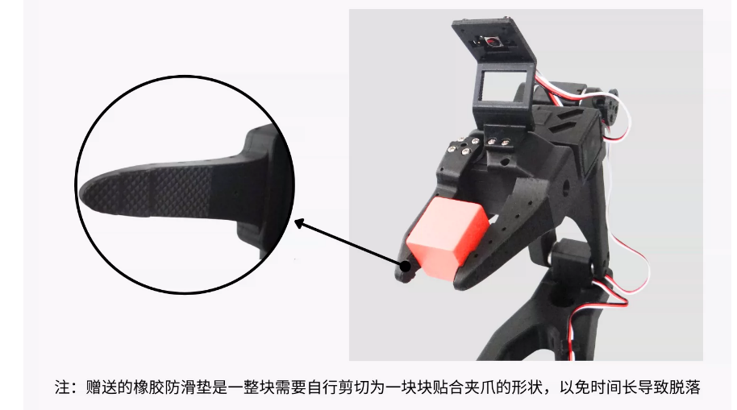

# SO-ARM100&amp;101 Armhalterung und Umgebungskamera-Kit – Montage-Tutorial

Zum Debugging der USB-Kamera siehe das [Tutorial zur USB-Kamera mit Autofokus](https://juxitech.feishu.cn/docx/JXstdNbN6oiL1WxiqJrc2OJDnrf?from=from_copylink)

## Montage der SO-ARM101-Armhalterung

Beim fertigen Produkt sind die Muttern im Greifer bereits montiert – direkt zu Schritt 2 springen

## Montage des Umgebungskamera-Kits

1. Zuerst den Winkel-Feinjustierungsbügel fixieren

2. Seitliches Umgebungskamera-Kit

3. Oben montiertes Umgebungskamera-Kit

## Gummi-Antirutschpads – selbst zuschneiden

