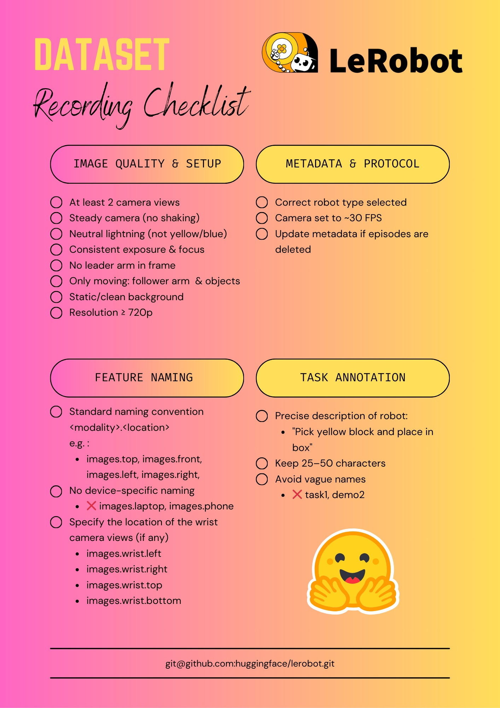

# Schritt 6: Hinweise zum Erfassen von Datensätzen

https://huggingface.co/blog/lerobot-datasets#what-makes-a-good-dataset

Der Führungsarm darf nicht im Bild erscheinen

<RelatedProducts slugs="so-arm101" />
