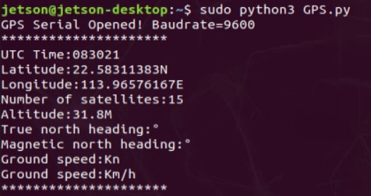
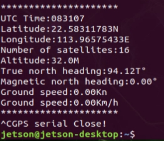

# Jetson: GPS-Auswertung

**1. Lernziel**

In dieser Lektion lernen wir hauptsächlich, mit Jetson Orin und dem GPS-Modul Positionsinformationen zu lesen und zu analysieren.

**2. Vorbereitung**

Das GPS-Modul verwendet UART- oder USB-Kommunikation; hier wird die USB-Kommunikation als Beispiel verwendet.

Verbinden Sie Jetson Orin und das GPS-Modul mit einem Type-C-Kabel, führen Sie den Befehl ls /dev | grep 'ttyUSB' aus; Sie können sehen, dass das GPS-Modul als USB0 erkannt wird.

 

**3****. Programm**

Das Programm dieser Lektion finden Sie unter: GPS.py

USB initialisieren:

 

Funktion zum Abrufen und Analysieren der Positionsinformationen; in der folgenden Abbildung werden aus den Positionsinformationen die mit GNGGA beginnenden Positionsinformationen herausgefiltert und anschließend die Daten analysiert und in den jeweiligen globalen Variablen gespeichert.

 

 

Auf dieselbe Weise werden die Kursinformationen von GNVTG abgerufen und analysiert.

 

Die analysierten Daten werden in einer Schleife ausgegeben

 

**4. Programm ausführen**

Geben Sie im Terminal sudo python3 GPS.py ein, um das Programm auszuführen.

**5.Versuchsergebnis**

Nach dem Einschalten benötigt das Modul etwa 32s zum Starten. Danach blinkt die serielle Statusanzeige-LED am Modul kontinuierlich, und es können normal Daten empfangen werden.

Nach dem Start des Programms beginnt die USB-Initialisierung. Bei erfolgreicher Initialisierung wird „GPS Serial Opened! Baudrate=9600“ angezeigt, andernfalls „GPS Serial Open Failed!“. Bei einem Fehler müssen die Verkabelung oder der USB-Port überprüft werden; anschließend werden Position und Kursinformationen in einer Schleife ausgegeben.

 

Drücken Sie Ctrl+C, um das Lesen der Informationen zu beenden.

 

Beachten Sie, dass sich die Modulantenne im Freien befinden muss, da sonst möglicherweise kein GPS-Signal gefunden werden kann; wenn kein Signal gefunden wird, wird „GPS no found“ ausgegeben.

<RelatedProducts slugs="gps-beidou-module" />
