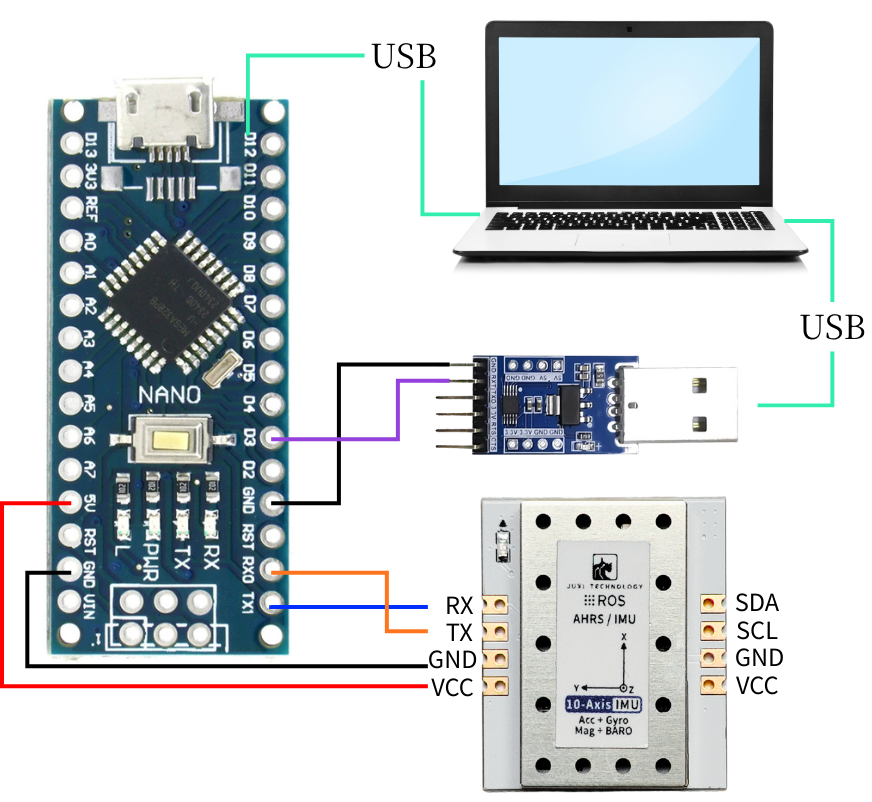
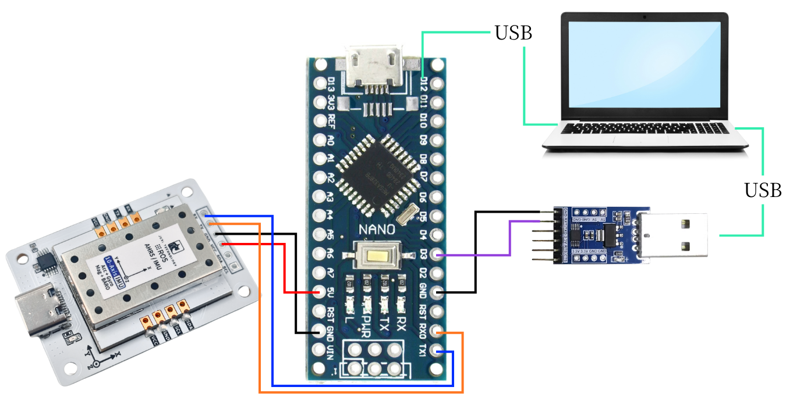
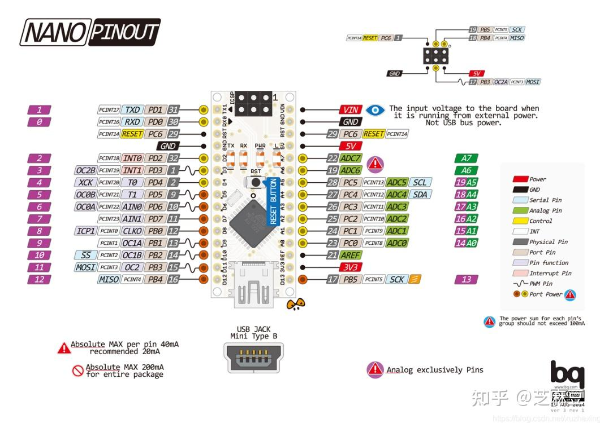
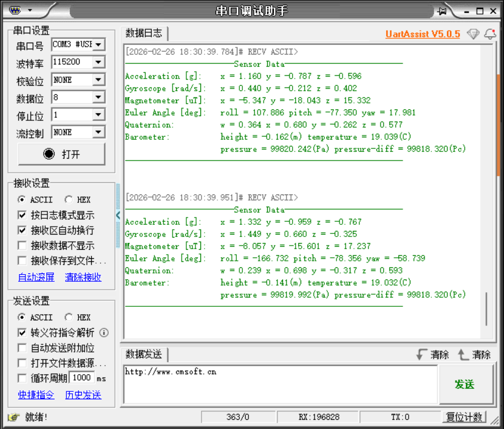

# Arduino

Dieses Beispiel verwendet das Arduino-Nano-Entwicklungsboard, einen Windows-PC, mehrere Jumper-Kabel, den IMU-Lagesensor und ein USB-TTL-Modul.

[Arduino.rar](/downloads/Arduino.rar)


## 1. Gerät anschließen







## 2. Kerncode-Erläuterung

Den konkreten Code finden Sie im Quellcode der Unterlagen.

```C++
//Daten im Ringpuffer parsen, vollständige Frames extrahieren und Cache aktualisieren
//Process RX ring buffer, parse frames and update internal cache
void IMU_UART_Process(void)
{
    enum {
        RX_STATE_EXPECT_HEAD1 = 0,
        RX_STATE_EXPECT_HEAD2,
        RX_STATE_EXPECT_LENGTH,
        RX_STATE_EXPECT_FUNCTION,
        RX_STATE_COLLECT_DATA
    };

    static uint8_t  rx_state = RX_STATE_EXPECT_HEAD1;
    static uint8_t  frame_length = 0;
    static uint8_t  frame_function = 0;
    static uint8_t  frame_buffer[64]; //Datenbereich + Prüfsumme / data section + checksum
    static uint16_t frame_index = 0;

    uint8_t current_byte = 0;

    //Alle Daten im Ringpuffer verarbeiten
    while (_rxbuf_pop(&current_byte) == 0) {
        switch (rx_state) {
        case RX_STATE_EXPECT_HEAD1:
            //Nach Frame-Header 1 suchen
            if (current_byte == FRAME_HEAD1) {
                rx_state = RX_STATE_EXPECT_HEAD2;
            }
            //Andernfalls im aktuellen Zustand bleiben
            break;

        case RX_STATE_EXPECT_HEAD2:
            //Nach Frame-Header 2 suchen
            if (current_byte == FRAME_HEAD2) {
                rx_state = RX_STATE_EXPECT_LENGTH;
            } else {
                //Frame-Header stimmt nicht überein, Suche neu beginnen
                rx_state = RX_STATE_EXPECT_HEAD1;
            }
            break;

        case RX_STATE_EXPECT_LENGTH:
            //Framelänge speichern
            frame_length = current_byte;
            rx_state = RX_STATE_EXPECT_FUNCTION;
            break;

        case RX_STATE_EXPECT_FUNCTION:
            //Funktionscode speichern
            frame_function = current_byte;
            frame_index = 0;
            rx_state = RX_STATE_COLLECT_DATA;
            break;

        case RX_STATE_COLLECT_DATA: {
            //Datenlänge berechnen (Framelänge - 2 Byte Frame-Header - 1 Byte Länge - 1 Byte Funktionscode)
            uint16_t data_length = (frame_length >= 4) ? (uint16_t)(frame_length - 4) : 0;
            
            //Prüfen, ob die Datenlänge gültig ist
            if (data_length == 0 || data_length > sizeof(frame_buffer)) {
                rx_state = RX_STATE_EXPECT_HEAD1;
                break;
            }

            //Aktuelles Byte speichern
            frame_buffer[frame_index++] = current_byte;
            
            //Prüfen, ob alle Daten gesammelt sind
            if (frame_index >= data_length) {
                //Prüfsumme berechnen
                uint8_t calculated_checksum = (uint8_t)(FRAME_HEAD1 + FRAME_HEAD2 + frame_length + frame_function);
                for (uint16_t i = 0; i < data_length - 1; ++i) {
                    calculated_checksum += frame_buffer[i];
                }

                //Prüfsumme verifizieren
                uint8_t received_checksum = frame_buffer[data_length - 1];
                if (calculated_checksum == received_checksum) {
                    //Prüfung bestanden, Daten parsen
                    _parse_frame_data(frame_function, frame_buffer);
                }
                
                //Status zurücksetzen, bereit für den nächsten Frame
                rx_state = RX_STATE_EXPECT_HEAD1;
            }
        } break;

        default:
            //Unbekannter Status, zurücksetzen
            rx_state = RX_STATE_EXPECT_HEAD1;
            break;
        }
    }
}

//Datenframe parsen
static void _parse_frame_data(uint8_t frame_function, const uint8_t *frame_data)
{
    switch (frame_function) {
        case IMU_FUNC_RAW_ACCEL: {
            //Konstanten Skalierungsfaktor definieren
            const float ACCEL_RATIO = 16.0f / 32767.0f;
            const float DEG2RAD = 3.14159265358979323846f / 180.0f;
            const float GYRO_RATIO = (2000.0f / 32767.0f) * DEG2RAD;
            const float MAG_RATIO = 800.0f / 32767.0f;
            
            //Beschleunigungsdaten parsen
            s_ax = to_int16(&frame_data[0]) * ACCEL_RATIO;
            s_ay = to_int16(&frame_data[2]) * ACCEL_RATIO;
            s_az = to_int16(&frame_data[4]) * ACCEL_RATIO;

            //Gyroskopdaten parsen
            s_gx = to_int16(&frame_data[6]) * GYRO_RATIO;
            s_gy = to_int16(&frame_data[8]) * GYRO_RATIO;
            s_gz = to_int16(&frame_data[10]) * GYRO_RATIO;

            //Magnetometerdaten parsen
            s_mx = to_int16(&frame_data[12]) * MAG_RATIO;
            s_my = to_int16(&frame_data[14]) * MAG_RATIO;
            s_mz = to_int16(&frame_data[16]) * MAG_RATIO;
            break;
        }
        case IMU_FUNC_EULER:
            s_roll = to_float(&frame_data[0]);
            s_pitch = to_float(&frame_data[4]);
            s_yaw = to_float(&frame_data[8]);
            break;
        case IMU_FUNC_QUAT:
            s_q0 = to_float(&frame_data[0]);
            s_q1 = to_float(&frame_data[4]);
            s_q2 = to_float(&frame_data[8]);
            s_q3 = to_float(&frame_data[12]);
            break;
        case IMU_FUNC_BARO:
            s_height = to_float(&frame_data[0]);
            s_temperature = to_float(&frame_data[4]);
            s_pressure = to_float(&frame_data[8]);
            s_pressure_contrast = to_float(&frame_data[12]);
            break;
        case IMU_FUNC_VERSION:
            s_version_high = frame_data[0];
            s_version_mid = frame_data[1];
            s_version_low = frame_data[2];
            break;
        case IMU_FUNC_RETURN_STATE:
            s_last_rx_function = frame_data[0];
            s_last_rx_state = (int16_t)frame_data[1];
            break;
        default:
            //Unbekannter Frametyp, Fehlerbehandlung kann ergänzt werden
            break;
    }
}
```

IMU_UART_Process(): liest die Cache-Daten und ruft _parse_frame_data zur Analyse der protokollkonformen Daten auf.

_parse_frame_data(): analysiert den Datenrahmen.

## 3. IMU-Daten auslesen

Nach dem Download des Programms auf das Arduino den seriellen Assistenten öffnen (Parameter wie unten abgebildet): Die IMU-Daten werden fortlaufend ausgegeben. Ändert man die Ausrichtung des IMU-Moduls, ändern sich die Daten.



Hinweis: Oben werden die Daten eines 10-Achsen-IMU gelesen; 6-Achsen haben keine Magnetometer- und Barometerdaten, 9-Achsen keine Barometerdaten.
