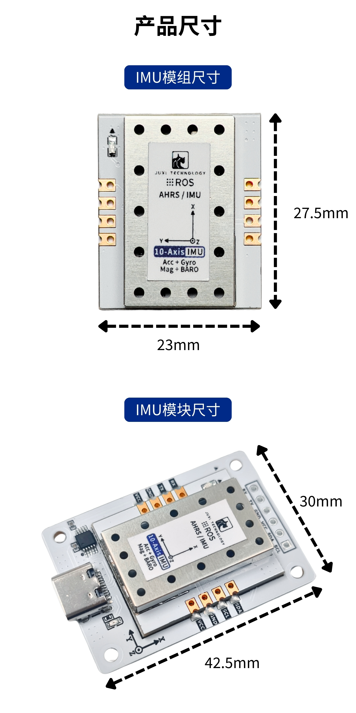

# Produktinformation

> **[Im Shop kaufen](https://www.juxitech.com/de/products/imu-module-ahrs-attitude-and-heading-angle-sensor)**

## Einführung in das IMU-Modul

Hochpräziser IMU-Attitüdensensor mit integriertem **72-MHz-Hochleistungs-32-Bit-Prozessor** für Echtzeit-Attitüdenberechnung und dynamische Kompensation bei einer Datenausgabefrequenz von bis zu 100 Hz – vereint die Vorteile schneller Reaktion und stabiler Ausgabe. Unterstützt sowohl IIC- als auch serielle Kommunikationsmodi, ist kompatibel mit Mikrocontroller- und Linux-Hosts und lässt sich nahtlos in das ROS-System integrieren; weit verbreitet in leistungsstarken Anwendungsszenarien wie der Bewegungssteuerung von Robotern, der Lagestabilisierung von UAVs sowie der intelligenten Navigation und Positionierung.

## 1. Versionsübersicht

| Leistungsvergleich                |                                                      |                                                              |                                                              |
| --------------------------------- | ---------------------------------------------------- | ------------------------------------------------------------ | ------------------------------------------------------------ |
|                                   | 6-Achsen                                             | 9-Achsen                                                     | 10-Achsen                                                    |
| Hochleistungs-32-Bit-Prozessor    | √                                                    | √                                                            | √                                                            |
| 3-Achsen-Gyroskop                 | √                                                    | √                                                            | √                                                            |
| 3-Achsen-Akzelerometer            | √                                                    | √                                                            | √                                                            |
| 3-Achsen-Magnetometer             | -                                                    | √                                                            | √                                                            |
| Barometer                         | -                                                    | -                                                            | √                                                            |
| AHRS-Attitüden-Datenfusionsalgorithmus | -                                             | √                                                            | √                                                            |
| Mahony-Filteralgorithmus          | √                                                    | √                                                            | √                                                            |
| Kommunikationsschnittstelle       | Type-C (Basisplatine erforderlich) / IIC-Stiftleiste |                                                              |                                                              |
| Kommunikationsart                 | IIC / seriell                                        |                                                              |                                                              |
| Positionierung / Anwendungsszenarien | Für kostenorientierte Anwendungen entwickelt, erfüllt die Anforderungen für Anwendungen mit hoher dynamischer Reaktion | Basiert auf der 6-Achsen-Hardwarearchitektur mit integriertem 3-Achsen-Magnetometermodul und ist mit dem AHRS-Attitüden-Datenfusionsalgorithmus abgestimmt, was die Stabilität und Messgenauigkeit der Datenausgabe erheblich erhöht | Ergänzt die 9-Achsen-Sensorarchitektur um ein Barometer, das präzise Höheninformationen ausgeben kann, und eignet sich für Anwendungsszenarien mit höheren Anforderungen an die Wahrnehmung von Lage und Position im 3D-Raum |

### Pin-Funktionsbeschreibung

| SDA  | I2C-serielle Datenleitung     |
| ---- | ----------------------------- |
| SCL  | I2C-serielle Taktleitung      |
| GND  | Masse                         |
| 3V3  | 3V3                           |
| RX   | Pin für seriellen Datenempfang |
| TX   | Pin für serielles Datensenden  |
| GND  | Masse                         |
| 5V   | 5V                            |

## 2. Produktparameter

| Produktparameter    |                                                              |
| ------------------- | ------------------------------------------------------------ |
|                     | Hinweise                                                     |
| Serielle Baudrate   | 115200bps                                                    |
| Serielle Ausgabefrequenz | Standard 25 Hz, von 10 Hz bis 100 Hz einstellbar        |
| IIC-Taktrate        | 100KHz                                                       |
| Ausgabedaten        | 3-Achsen-Beschleunigung, 3-Achsen-Winkelgeschwindigkeit, 3-Achsen-Gyroskop, 3-Achsen-Eulerwinkel, 3-Achsen-Magnetometer, Luftdruck, Höhe, Temperatur, Quaternionen (*rote Schrift: nur 9-/10-Achsen-Version; blaue Schrift: nur 10-Achsen-Version) |
| Startzeit           | 5000ms                                                       |
| Betriebstemperatur  | -40°C~+85°C                                                  |
| Lagertemperatur     | -40°C~+100°C                                                 |
| Stoßfestigkeit      | 20kg (nackte Platine)                                        |
| Unterstützte Geräte | Linux-Hosts: PC, Raspberry Pi, Jetson-Serie, RDK-Serie; MCU-Hosts: STM32, MSPM0, ESP32, Pico, Arduino |
| Betriebsspannung    | 5V oder 3.3V                                                 |
| Betriebsstrom       | 11mA                                                         |
| Produktabmessungen  | 27.4mm*22.6mm*12mm                                           |
| Produktgewicht      | 3.8g                                                         |
| ROS-Unterstützung   | ROS1/ROS2                                                    |

## 3. Sensor-Leistungsparameter

Leistungsparameter der IMU-Daten

| IMU                    | Akzelerometer     | Gyroskop         | Magnetometer     |
| ---------------------- | ----------------- | ---------------- | ---------------- |
| Messbereich            | ±16g              | ±2000°/s         | ±8Gauss          |
| Auflösung              | 0.0005(g/LSB)     | 0.061(°/s)/(LSB) | 0.244mGauss/LSB  |
| RMS-Rauschen (100Hz-Bandbreite) | 1.0mg-RMS | 0.07°/S-RMS      | /                |
| Temperaturdrift        | ±0.15mg/C         | 0.015°/s/°C      | /                |
| Bandbreite             | 12.5~1600Hz       | 12.5~1600Hz      | /                |

Leistungsparameter der Navigationsdaten

| Parameter                                | Typischer Wert |                 |
| ---------------------------------------- | -------------- | --------------- |
| Nick-/Rollwinkel (bei horizontaler Ausrichtung) | Messbereich | X:±180°, Y:±90° |
| Genauigkeit                              | 0.0055°        |                 |
| Gierwinkel (bei horizontaler Ausrichtung) | Messbereich   | Z:±180°         |
| Genauigkeit                              | 0.0055°        |                 |

Leistungsparameter des Barometers

| Parameter            | Bedingung     | Typischer Wert |
| -------------------- | ------------- | -------------- |
| Messbereich          |               | 300~2000hPa    |
| RMS-Rauschen         | Standardmodus | 1Pa-RMS        |
| Relative Genauigkeit |               | ±0.12hPa       |

## 4. Abmessungsparameter

