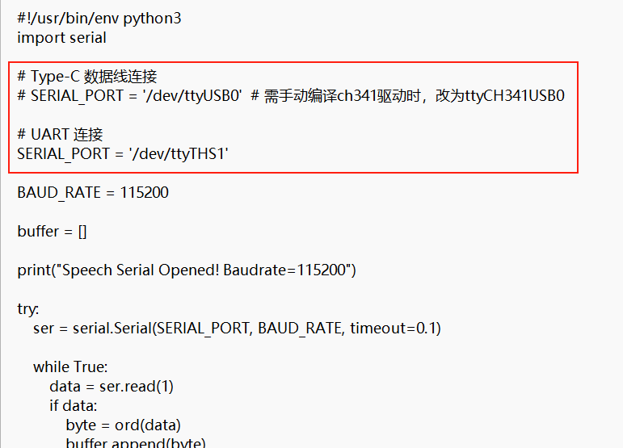
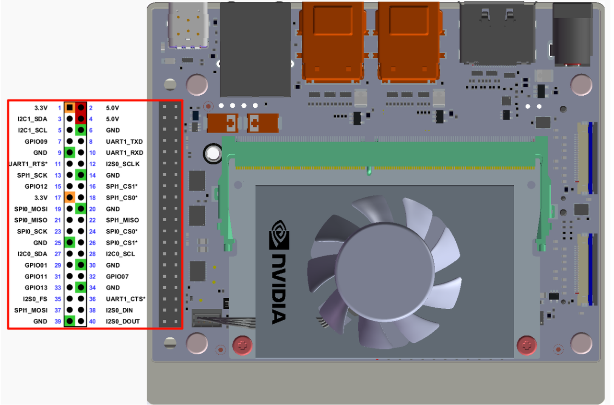
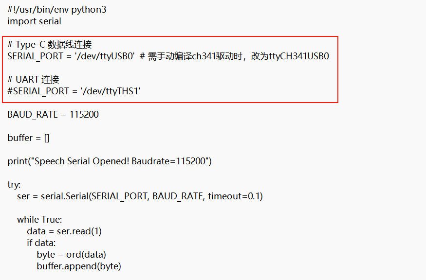

# Comunicación por puerto serie

## Instalar dependencias

```Plain Text
sudo apt-get update
```

```Plain Text
sudo apt-get install -y python3-smbus python3-serial
```

## Comprobar los grupos de usuarios

```Plain Text
sudo usermod -aG i2c $USER
```

```Plain Text
sudo usermod -aG dialout $USER
```

Cierre la sesión y vuelva a iniciarla para que surta efecto.

## Ubicación de los archivos

`UART_Voice/uart_voice.py`

Cuando el módulo se conecta al Jetson mediante los pines UART, comente `SERIAL_PORT = '/dev/ttyUSB0'` y descomente `SERIAL_PORT = '/dev/ttyTHS1'`



## Instrucciones de cableado



## Comprobar el puerto serie

```Plain Text
ls /dev/ttyTHS*
```

## Ejecución

```Plain Text
cd UART_Voice
```

```Plain Text
python3 uart_voice.py
```

## Formato de salida

```Plain Text
Speech Serial Opened! Baudrate=115200
ID:4
ID:1
ID:10
```

Cuando el módulo se conecta al Jetson mediante un cable de datos Type, descomente `SERIAL_PORT = '/dev/ttyUSB0'` y comente `SERIAL_PORT = '/dev/ttyTHS1'`



## Comprobar el puerto serie

```Plain Text
ls /dev/ttyUSB*
```

## Ejecución

```Plain Text
cd UART_Voice
```

```Plain Text
python3 uart_voice.py
```

## Formato de salida

```Plain Text
Speech Serial Opened! Baudrate=115200
ID:4
ID:1
ID:10
```

## Solución de problemas

### El puerto serie está ocupado

Si el puerto serie no se puede abrir, compruebe si está ocupado por otro servicio:

```Plain Text
sudo systemctl stop nvgetty
```

```Plain Text
sudo systemctl disable nvgetty
```


