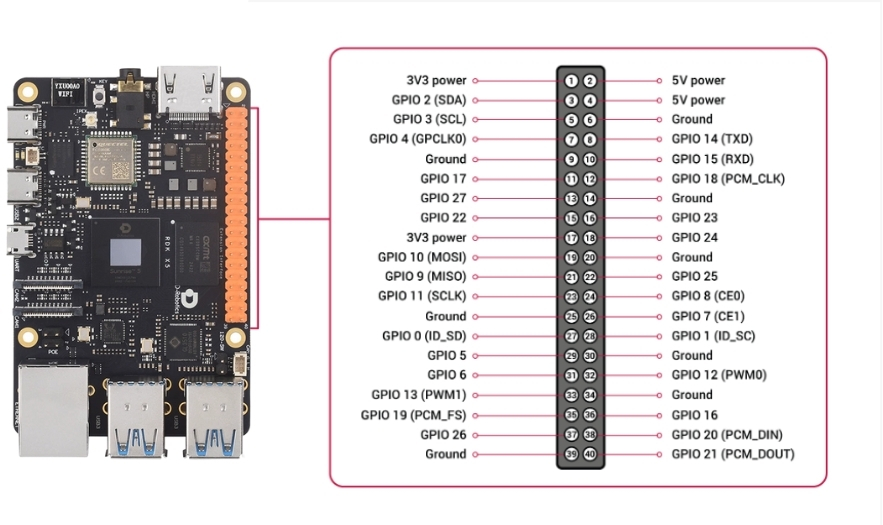

# RDK: Comunicación IIC

## Introducción

Este repositorio proporciona código de ejemplo en Python para la comunicación entre la plataforma RDK X5 (Raspberry Pi) y el módulo de interacción por voz de IA, y admite dos modos de comunicación: I2C y UART.

- **Módulo de reconocimiento de voz**: admite reconocimiento de voz sin conexión y emite el ID del comando tras el reconocimiento

- **Funciones de reproducción**: admite reproducción pasiva, reproducción de palabras de función y reproducción de palabras de comando

- **Protocolo de comunicación**: dirección I2C 0x2A, velocidad en baudios UART 115200

- **Lenguaje de programación**: Python 3

---

## Conexión del hardware

### Conexión general

> **Importante:** ¡asegúrese de que todos los dispositivos compartan una tierra común!
> 
> 

---

### Conexión de la versión I2C

**Nota**: por defecto se utiliza el bus I2C 5 (numeración BCM)



---

## Configuración del entorno

### Requisitos del sistema

- RDK X5

- Sistema Ubuntu / Debian

- Python 3.7+

### Instalar paquetes de dependencias

```Bash
# 更新软件包
sudo apt update
sudo apt upgrade -y

# 安装 Python 库
sudo apt install -y python3-pip python3-smbus i2c-tools
```

### Habilitar la interfaz I2C

```Bash
# 打开配置工具
sudo raspi-config

# 选择 Interface Options → I2C → Enable
# 重启生效
sudo reboot
```

### Probar las interfaces de hardware

```Bash
# 测试 I2C 设备
sudo i2cdetect -y 5
```

---

## Uso de la versión IIC

### Comprobar los archivos de código

```Bash
cd IIC_Voice
ls -la
# 应该看到 iic_voice.py
```

### Configurar el bus I2C

Edite el archivo `iic_voice.py` y modifique los parámetros necesarios:

```Bash
# I2C 设备地址
DEVICE_ADDRESS = 0x2A

# 寄存器地址
REG_RESULT = 0xDA

# I2C 总线编号（根据实际连接修改）
bus = smbus.SMBus(5)  # I2C 总线 5
```

### Ejecutar el programa

```Bash
# 赋予执行权限
chmod +x iic_voice.py

# 运行（需要 sudo 权限访问 I2C）
sudo python3 iic_voice.py
```

### Ejecutar la prueba

Tras un inicio correcto se mostrará:

```Bash
Speech Serial Opened! Baudrate=115200
```

Diga una palabra de comando al módulo de voz y se mostrará el ID correspondiente:

```Bash
Speech Serial Opened! Baudrate=115200
ID:1
ID:4
ID:10
```

### Detener el programa

Pulse `Ctrl + C` para detener el programa:

```Bash
Program terminated
```

---

## Solución de problemas

### Q1: Permisos insuficientes para las operaciones de I2C

**A: Añada el usuario al grupo de usuarios de I2C:**

```Bash
sudo usermod -aG i2c $USER
# 重新登录生效
```

O bien ejecute el programa con `sudo`

---

### Q2: No se detecta el dispositivo I2C

**A: Compruebe:**

1. Confirme que I2C esté habilitado (raspi-config)

2. Compruebe si SDA/SCL están invertidos

3. Compruebe si comparten tierra común

4. Compruebe si el dispositivo está alimentado

```Bash
# 扫描 I2C 设备
sudo i2cdetect -y 5
# 如果看到 0x2A，说明设备连接正常
```

---

### Q3: El ID del comando solo muestra 0 o no aparece

**A: Comportamiento normal:**

- 0 = no se ha reconocido ningún comando válido

- el ID solo se emite cuando se dice una palabra de comando válida

- active primero el módulo y luego diga el comando

---

### Q4: La precisión de reconocimiento no es alta

**A: Sugerencias de optimización:**

- Asegúrese de que el entorno sea silencioso y que el ruido de fondo no sea demasiado alto

- Mantenga una distancia moderada respecto al micrófono (10-50cm)

- Hable a un ritmo moderado y articule con claridad

---

## Soporte técnico

Si tiene problemas, compruebe lo siguiente:

1. Si el cableado del hardware es correcto (¡la tierra común es muy importante!)

2. Si la velocidad en baudios del puerto serie es 115200

3. Si la dirección I2C es correcta (0x2A)

4. Si hay permisos suficientes para acceder a la interfaz de hardware

## Comandos de depuración habituales

```Bash
ls -l /dev/i2c*      # 查看 I2C 设备
groups                # 查看用户组权限
```

<RelatedProducts slugs="ai-voice-module" />
