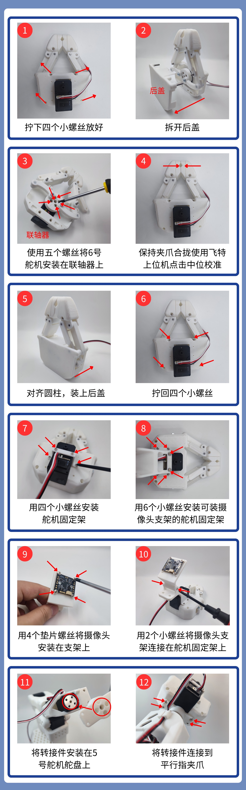

# Instalación de la pinza de dedos paralelos

[Onshape](https://cad.onshape.com/documents/96518c699fd03eea508b06d3/w/d5f95a6266b027d84ae48634/e/317bed52afdde5ea3dcfc236) para ver el archivo de modelo

[PincOpen装配体.step](/downloads/PincOpen装配体.step)

**平行指夹爪安装步骤.mp4**（平行指夹爪安装步骤.mp4，体积超过站点单文件上限，可向 support@juxitech.com 索取）

## 1、Desatornilla los cuatro tornillos pequeños y retira la tapa posterior

## 2、Instala el servomotor n.º 6 en el acoplamiento con cinco tornillos

## 3、Con el software de PC de Feetech, haz clic en la calibración de posición central (¡mantén la pinza cerrada!)

**Descargar la herramienta de depuración de servomotores Feetech**

- Computadora Windows

https://gitee.com/ftservo/fddebug

Descarga [`FD1.9.8.5(250729).7z`](https://gitee.com/ftservo/fddebug/blob/master/FD1.9.8.5(250729).7z), descomprímelo y ejecuta el programa exe que contiene

- Computadora Ubuntu

https://github.com/Kotakku/FT_SCServo_Debug_Qt

1. Abre la herramienta de depuración de PC de Feetech, selecciona el número de puerto COM, con una velocidad en baudios de un millón, y haz clic en “打开”

2. Haz clic en “搜索”; cuando aparezca “STS3215”, haz clic en “停止” y luego en “STS3215”

3. Selecciona “编程” en la parte superior

4. Haz clic en “中位校准”

## 4、Alinea el cilindro y coloca la tapa posterior

## 5、Vuelve a atornillar los cuatro tornillos pequeños

## 6、Instala el soporte de fijación del servomotor con cuatro tornillos pequeños

## 7、Instala con 6 tornillos pequeños el soporte de fijación del servomotor que puede montar el soporte de la cámara

## 8、Instala la cámara en el soporte con 4 tornillos con arandela

## 9、Conecta el soporte de la cámara al soporte de fijación del servomotor con 2 tornillos pequeños

## 10、Instala la pieza adaptadora en el disco del servomotor n.º 5

## 11、Conecta la pieza adaptadora a la pinza de dedos paralelos

<RelatedProducts slugs="so-arm101" />
