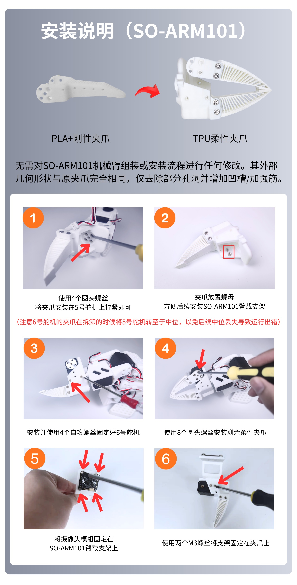

# Soporte de brazo y kit de cámara ambiental SO-ARM100&101 – Tutorial de instalación

Para depurar la cámara USB, consulte el [tutorial de la cámara USB con enfoque automático](https://juxitech.feishu.cn/docx/JXstdNbN6oiL1WxiqJrc2OJDnrf?from=from_copylink)

## Pasos de instalación del soporte de brazo SO-ARM100

## Pasos de instalación del soporte de brazo SO-ARM101

En el producto terminado, las tuercas ya están montadas en la pinza – puede saltar directamente al paso 2

## Pasos de instalación del soporte del kit de cámara ambiental

1. Fijar primero el soporte de ángulo de ajuste fino

2. Kit de cámara ambiental lateral

3. Kit de cámara ambiental superior

## Almohadillas antideslizantes de goma – cortar a medida

