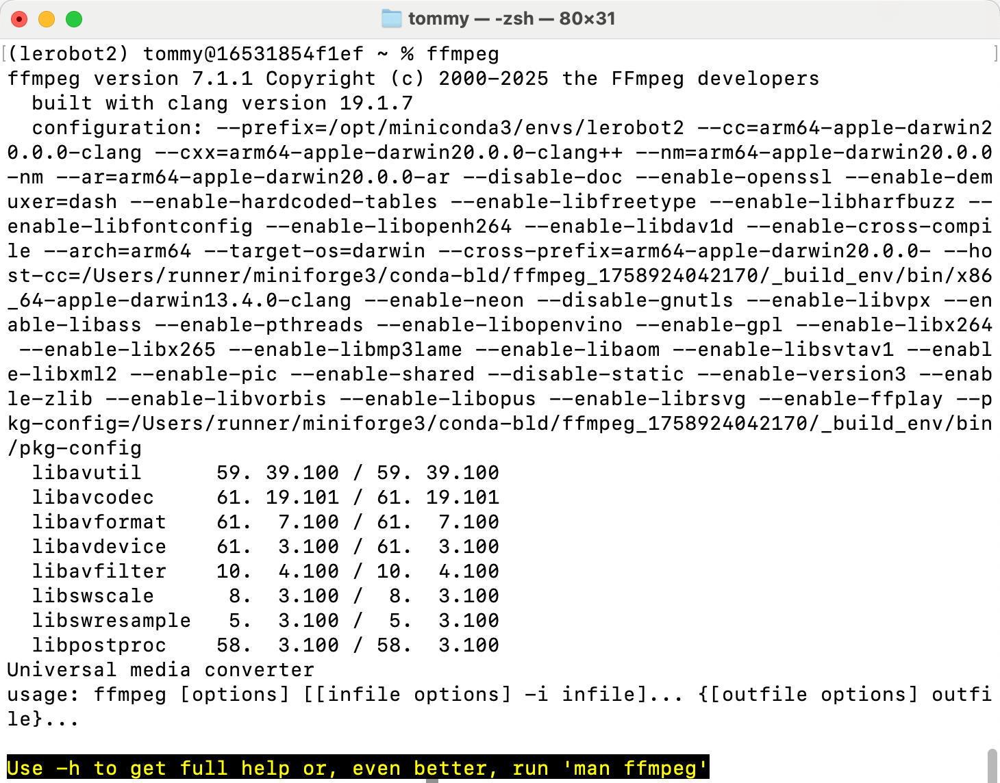
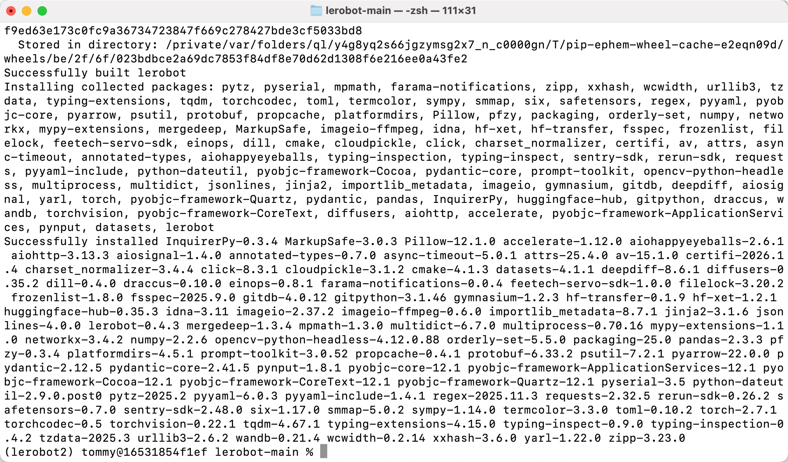
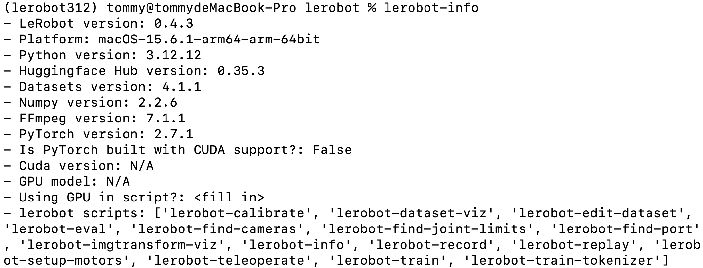

# Paso 1: Instalar el entorno de LeRobot (macOS)

El brazo líder negro utiliza un adaptador de corriente de 5V6A

El brazo seguidor blanco utiliza un adaptador de corriente de 12V5A

## Otorgar permisos


## Instalar Miniconda

https://www.anaconda.com/download

## Cambiar la fuente de pip

```Shell
pip config set global.index-url https://mirrors.aliyun.com/pypi/simple
```

## Cambiar la fuente de conda

```Shell
# Vaciar la configuración original de .condarc (opcional, para evitar conflictos)
echo "" > ~/.condarc

# Escribir la configuración del espejo de Tsinghua
cat << EOF > ~/.condarc
channels:
  - defaults
show_channel_urls: true
default_channels:
  - https://mirrors.tuna.tsinghua.edu.cn/anaconda/pkgs/main
  - https://mirrors.tuna.tsinghua.edu.cn/anaconda/pkgs/r
  - https://mirrors.tuna.tsinghua.edu.cn/anaconda/pkgs/msys2
custom_channels:
  conda-forge: https://mirrors.tuna.tsinghua.edu.cn/anaconda/cloud
  msys2: https://mirrors.tuna.tsinghua.edu.cn/anaconda/cloud
  bioconda: https://mirrors.tuna.tsinghua.edu.cn/anaconda/cloud
  menpo: https://mirrors.tuna.tsinghua.edu.cn/anaconda/cloud
  pytorch: https://mirrors.tuna.tsinghua.edu.cn/anaconda/cloud
  pytorch-lts: https://mirrors.tuna.tsinghua.edu.cn/anaconda/cloud
  simpleitk: https://mirrors.tuna.tsinghua.edu.cn/anaconda/cloud
EOF

# Limpiar la caché para que la configuración surta efecto
conda clean -i
```

## Crear el entorno virtual

```Shell
conda create -y -n lerobot python=3.12
```

## Entrar al entorno virtual

```Shell
conda activate lerobot
```

## Instalar ffmpeg

```Shell
conda install ffmpeg=7.1.1 -c conda-forge -y
```

Verificar que la instalación se realizó correctamente

```Shell
ffmpeg
```



## Descargar LeRobot

- Descargar el repositorio de código oficial de LeRobot

```Shell
git clone https://github.com/huggingface/lerobot.git
```

## Instalar el repositorio de código

```Shell
# cd lerobot-main
cd lerobot
pip install -e ".[feetech]"
```




## Verificar que la instalación se realizó correctamente

```Shell
lerobot-info

python

import lerobot
import torch
torch.cuda.is_available()
import scservo_sdk
```




<RelatedProducts slugs="so-arm101" />
