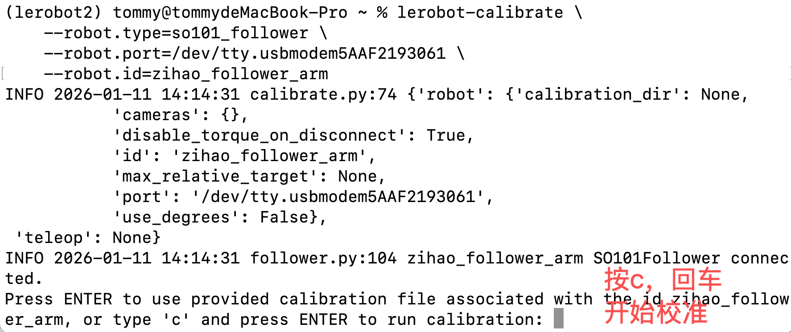
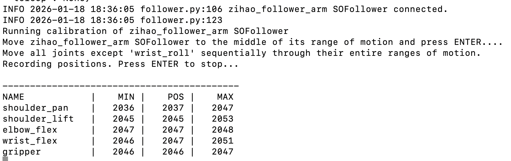
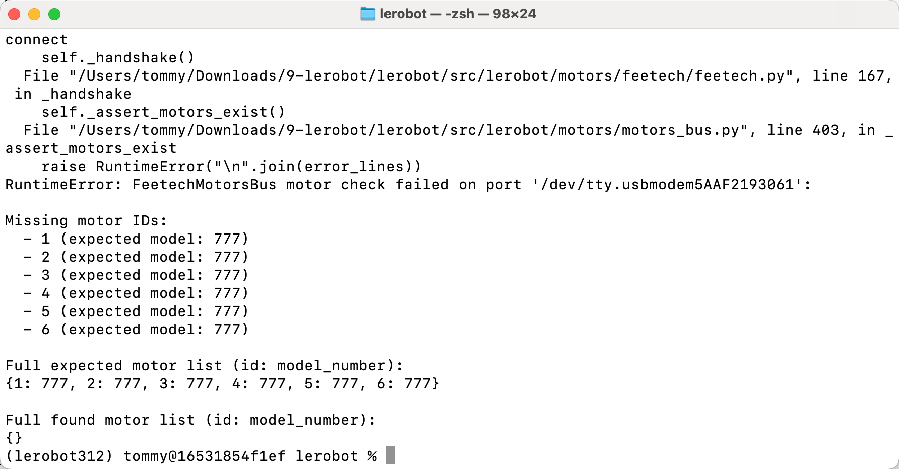

# Paso 3: Calibrar el brazo robótico (macOS)

## Repasar los números de puerto

Brazo seguidor:

/dev/tty.usbmodem5AAF2193061

/dev/tty.wchusbserial5AAF2193061

Brazo líder:

/dev/tty.usbmodem5AAF2194741

/dev/tty.wchusbserial5AAF2194741

## Calibrar el brazo seguidor Follower

```Shell
lerobot-calibrate \
    --robot.type=so101_follower \
    --robot.port=/dev/tty.usbmodem5AAF2193061 \
    --robot.id=my_follower_arm
```




## Calibrar el brazo líder Leader

```Shell
lerobot-calibrate \
    --teleop.type=so101_leader \
    --teleop.port=/dev/tty.usbmodem5AAF2194741 \
    --teleop.id=my_leader_arm
```


## Ver el archivo de configuración de calibración

```Shell
sudo nano /Users/<usuario>/.cache/huggingface/lerobot/calibration/teleoperators/so101_leader/my_leader_arm.json
```

## Errores comunes

- No se encuentra uno o varios de los servomotores



## Notas

### ① Uno de los brazos llega al límite y deja de moverse

Es necesario recalibrar

[wx_camera_1768098182808.mp4](/downloads/wx_camera_1768098182808.mp4)

### ② No se encuentra el servomotor



El servomotor no está enchufado

<RelatedProducts slugs="so-arm101" />
