# ⚒️Montaje del producto terminado

Lista de accesorios

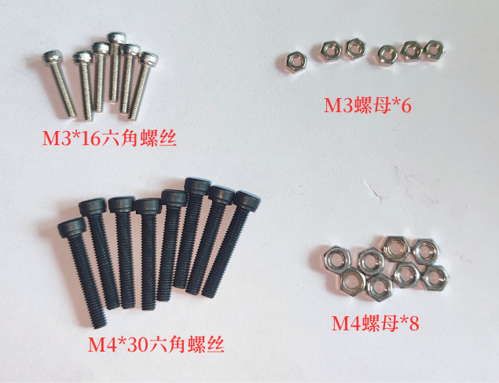

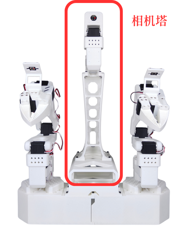

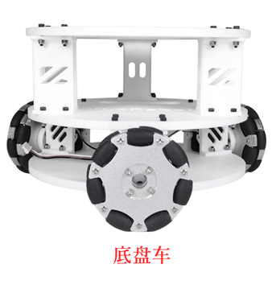

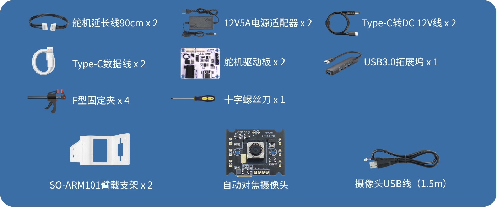

## Instalar el chasis rodante

1、Coloque el chasis rodante justo debajo del carrito y preste atención a la dirección de instalación del chasis rodante **(observe la inscripción “XLerobot” del chasis)**

Las posiciones de instalación de la base de la torre de cámara y del chasis rodante se muestran en la figura

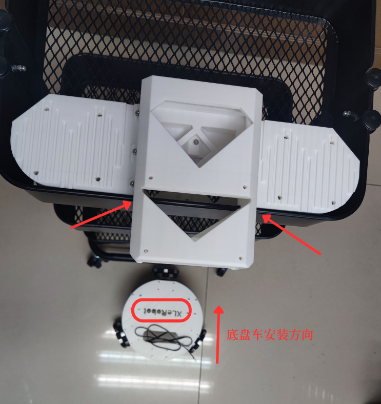

2、Pase el **cable prolongador de servomotor de 90CM** a través de la malla metálica del carrito

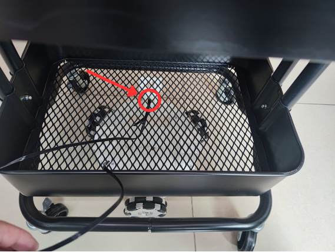

3、Utilice 6 **tornillos hexagonales M3\*16** y 6 **tuercas M3** para fijar el chasis rodante a la parte inferior del carrito

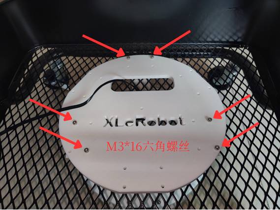

## Instalar la base de la torre de cámara

Preste atención a las **ranuras** señaladas por las dos flechas y encájela en el borde de la capa inferior del carrito

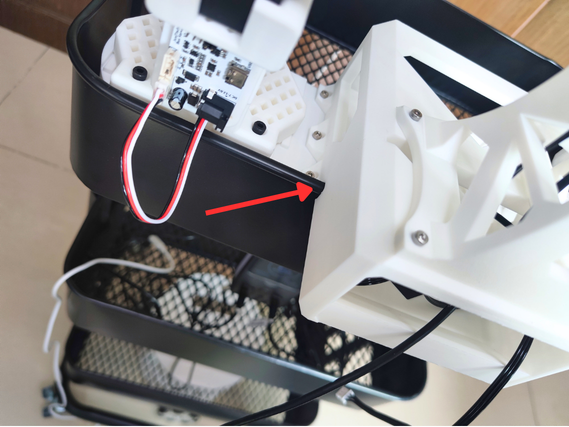

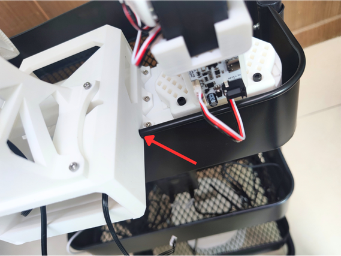

## Fijar los brazos seguidores SO-ARM101

Utilice 8** tornillos hexagonales M4\*30** y 8 **tuercas M4** para fijar los dos brazos seguidores a la **base de la torre de cámara**

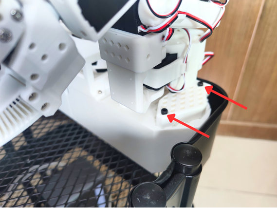

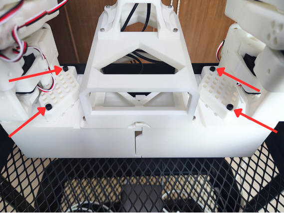

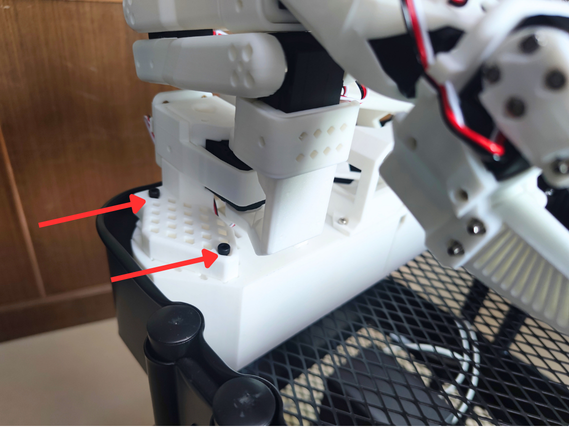

## Conectar el cable de datos a la placa controladora del servomotor

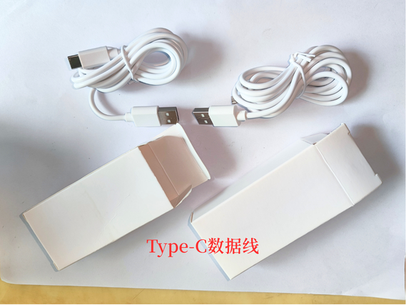

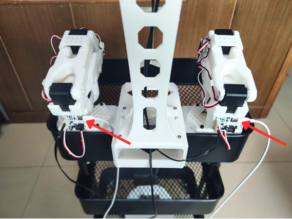

## Conectar el cable de alimentación a la placa controladora del servomotor

Cable de alimentación PD a DC12V3A

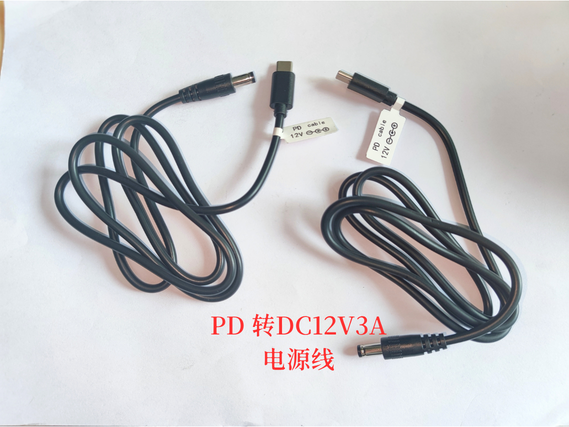

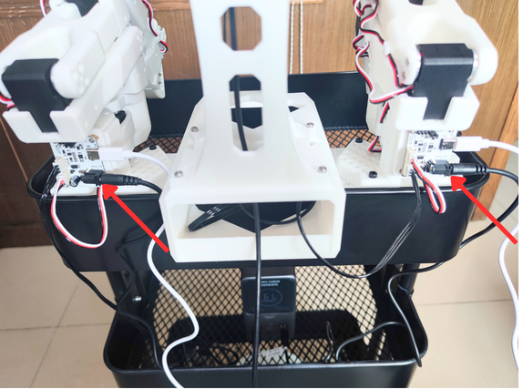

## Cableado del servomotor

1、Conecte el **cable prolongador de servomotor de 90Cm** de la torre de cámara a la **placa controladora del servomotor derecha ①**

2、El **cable prolongador de servomotor de 90CM** atraviesa **dos capas de malla metálica** y se conecta a la **placa controladora del servomotor izquierda ②**

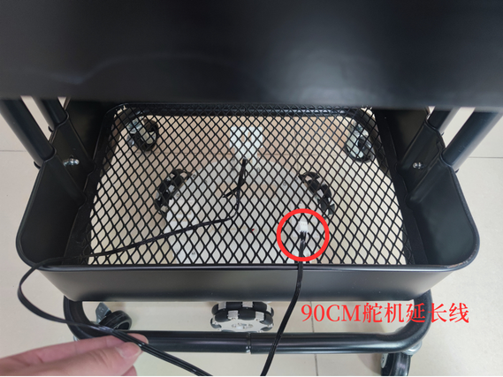

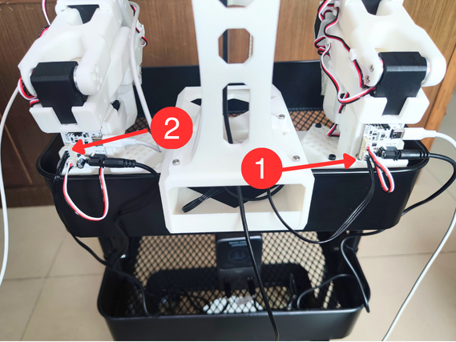

## Conectar la cámara al controlador anfitrión

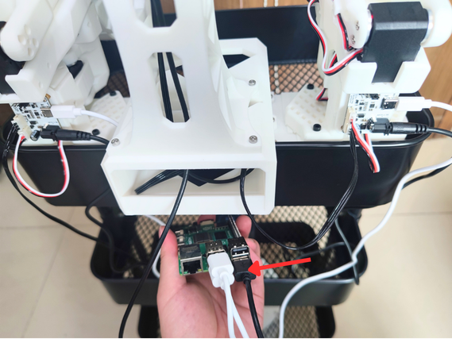

## Esquema de cableado de la batería externa

**¡La batería externa, la Raspberry Pi y el cable de alimentación de la Raspberry Pi PD 5V5A deben adquirirse por separado!**

① Cable de alimentación de la Raspberry Pi PD 5V5A

② Conector de alimentación de la Raspberry Pi

③ Conector del cable de alimentación PD a DC12V3A de la placa controladora del servomotor izquierda

④ Conector del cable de alimentación PD a DC12V3A de la placa controladora del servomotor derecha

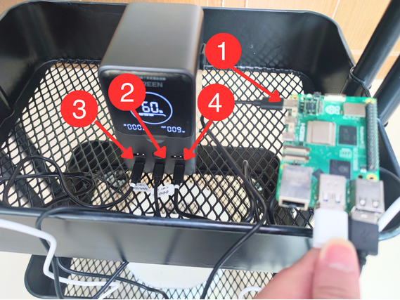

