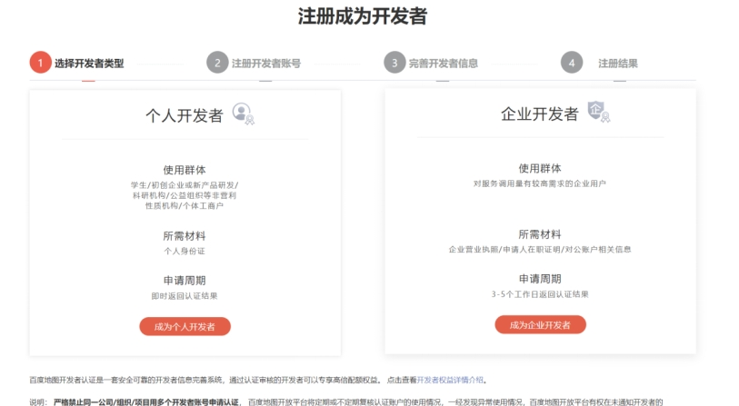
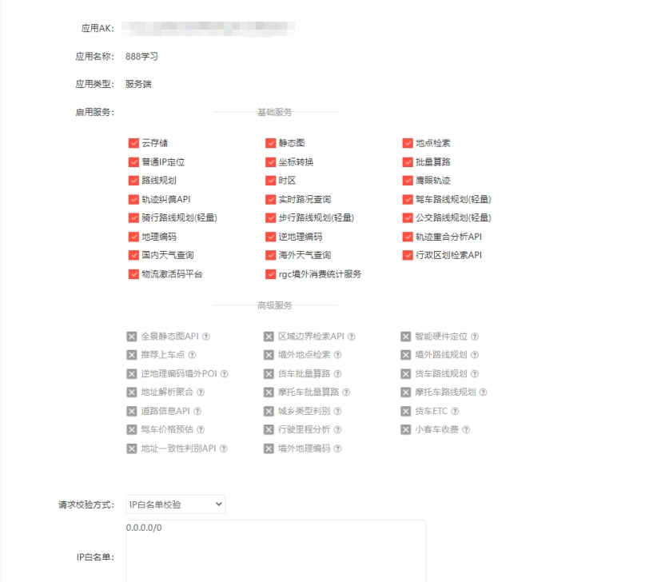
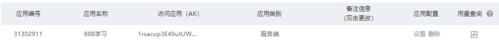
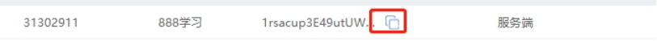

# Jetson: API de Baidu Maps

**1.** **Método de registro**

Acceda a la plataforma abierta de Baidu Maps https://lbsyun.baidu.com/

Desplace la página hasta el final

Haga clic en Registrarse ahora

 

Se recomienda elegir la opción de desarrollador individual (ya que la solicitud puede utilizarse el mismo día)

Siga las indicaciones y complete los pasos uno a uno

 

**2. Obtener la ak**

Utilizamos la ubicación por IP normal del servicio web; la documentación puede consultarse en el siguiente enlace.

https://lbsyun.baidu.com/index.php?title=webapi/ip-api

Haga clic en Consola, seleccione Mis aplicaciones y seleccione Crear aplicación.

 

El nombre de la aplicación puede ser cualquiera; seleccione Servidor como tipo de aplicación, habilite el servicio e introduzca 0.0.0.0/0 en la lista blanca.

 

Haga clic en Enviar para generar una aplicación.

 

Copie el valor de ak de nuestra aplicación

 

Péguelo en el programa y guárdelo; así podrá leer la información de posición mediante Baidu Maps.

<RelatedProducts slugs="gps-beidou-module" />
