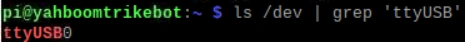
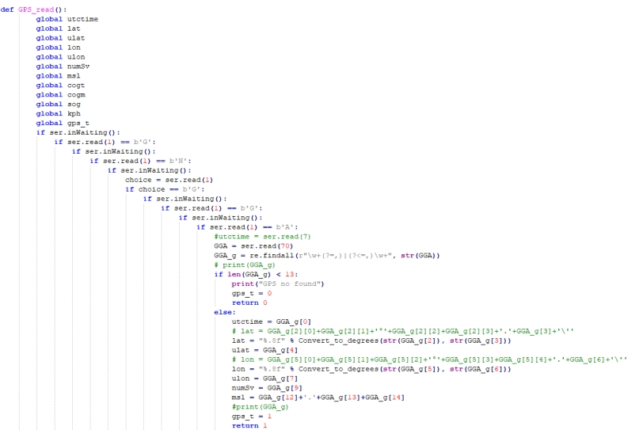
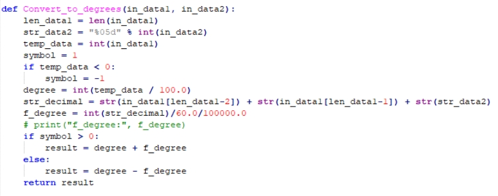
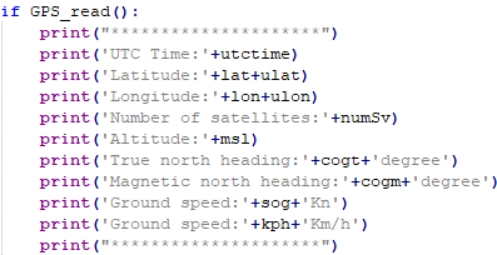
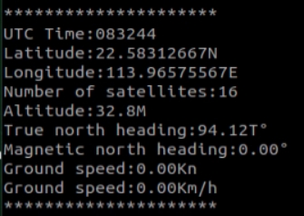

# Raspberry Pi: análisis GPS

**1. Objetivos de aprendizaje**

En esta lección aprenderemos principalmente a utilizar la Raspberry Pi y el módulo GPS para leer y analizar la información de posición.

**2. Preparación previa**

El módulo GPS utiliza comunicación UART o comunicación USB. Aquí se toma como ejemplo la comunicación USB.

Utilice un cable type-c para conectar la Raspberry Pi y el módulo GPS; ejecute el comando ls /dev | grep 'ttyUSB' y podrá ver que el módulo de voz se reconoce como USB0

 

**3. Programa**

Para el programa de esta lección, consulte: GPS.py

Inicializar USB:

 

Función de obtención y análisis de la información de posición. En la siguiente figura se filtran, de entre la información de posición, los mensajes que comienzan por GNGGA y, a continuación, se analizan los datos y se almacenan en las distintas variables globales.

 

 

Del mismo modo se obtuvo y analizó la información de rumbo de GNVTG.

 

Los datos analizados se imprimen de forma cíclica

 

**4. Ejecutar el programa**

En la terminal, introduzca sudo python2 GPS.py para ejecutar el programa.

**5.** **Fenómeno experimental**

Tras encender el módulo, este tarda unos 32 s en arrancar; después, el LED indicador de impresión por el puerto serie del módulo parpadeará de forma continua, momento en el que se pueden recibir datos con normalidad.

Una vez ejecutado el programa, comienza la inicialización del USB; si la inicialización se realiza correctamente se muestra "GPS Serial Opened! Baudrate=9600", de lo contrario se muestra "GPS Serial Open Failed!". Si hay un error, debe comprobar el cableado o el puerto USB; a continuación se imprimen de forma cíclica la posición y la información de rumbo.

 

Pulse Ctrl+C para salir de la lectura de información.

Tenga en cuenta que la antena del módulo debe estar en el exterior; de lo contrario, es posible que no se encuentre la señal GPS. Cuando no se encuentre la señal, se imprimirá "GPS no found".

<RelatedProducts slugs="gps-beidou-module" />
