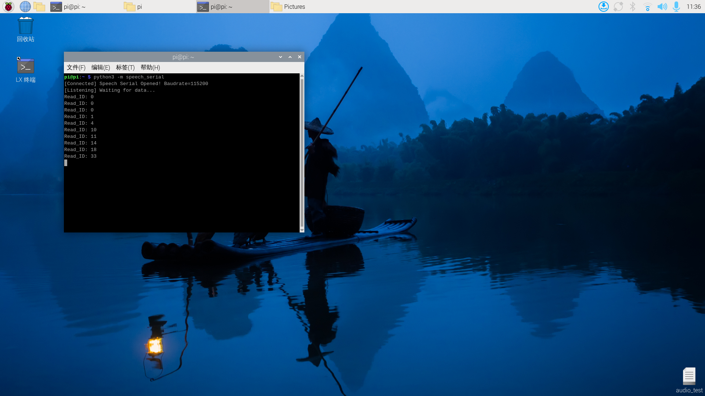

# Communication série Raspberry Pi

Attention : le module d'interaction vocale nécessite le flashage du firmware d'usine ; si la puce vocale est neuve et non flashée, ce n'est pas nécessaire

## 1. Vérifier le port

Brancher via le port USB sur la Raspberry Pi.

En saisissant dans le terminal, l'apparition du périphérique ttyUSB0 indique une reconnaissance correcte (normalement ttyUSB0, cela peut aussi être un autre numéro de périphérique)

```Plain Text
ls /dev/ttyUSB*
```


## 2. Implémentation du code

Télécharger speech_serial.py dans le répertoire correspondant

```Python
#!/usr/bin/env python3
# -*- coding: utf-8 -*-

import time
import serial
from typing import Optional, Tuple


class SpeechModule:
    """
    Serial communication controller for the speech module
    Encapsulates the interaction logic with the speech module
    """

    # Serial port configuration constants
    DEFAULT_PORT = "/dev/ttyUSB0"
    DEFAULT_BAUDRATE = 115200

    # Command word definitions (announcement words / function IDs)
    CMD_THIS_RED = 0x60
    CMD_THIS_GREEN = 0x61
    CMD_THIS_YELLOW = 0x62
    CMD_RECOGNIZE_YELLOW = 0x63
    CMD_RECOGNIZE_GREEN = 0x64
    CMD_RECOGNIZE_BLUE = 0x65
    CMD_RECOGNIZE_RED = 0x66
    CMD_INIT = 0x67

    def __init__(self, port: str = DEFAULT_PORT, baudrate: int = DEFAULT_BAUDRATE):
        self._port = port
        self._baudrate = baudrate
        self._serial_conn: Optional[serial.Serial] = None

    def connect(self) -> bool:
        """Establish serial connection"""
        try:
            self._serial_conn = serial.Serial(self._port, self._baudrate, timeout=0.1)
            if self._serial_conn.is_open:
                print(f"[Connected] Speech Serial Opened! Baudrate={self._baudrate}")
                return True
            return False
        except serial.SerialException as e:
            print(f"[Error] Speech Serial Open Failed: {e}")
            return False

    def send_command(self, cmd_id: int) -> None:
        """
        Send command frame
        Protocol format: 0xAA 0x55 0xFF [Data] 0xFB
        """
        if not self._serial_conn or not self._serial_conn.is_open:
            return

        # Build the complete data frame
        frame = bytes([0xAA, 0x55, 0xFF, int(cmd_id), 0xFB])

        self._serial_conn.write(frame)
        time.sleep(0.005)
        self._serial_conn.reset_input_buffer()  # Same as flushInput

    def read_response(self) -> Optional[int]:
        """
        Read and parse the returned data
        Returns: Read_ID (data from the 6th byte)
        """
        if not self._serial_conn or not self._serial_conn.is_open:
            return None

        # Check the bytes available in the buffer
        bytes_available = self._serial_conn.in_waiting
        if bytes_available <= 0:
            return None

        raw_data = self._serial_conn.read(bytes_available)
        hex_str = raw_data.hex()

        # Verify frame header 'aa55'
        if hex_str.startswith('aa55'):
            try:
                # Simple index extraction logic (kept consistent with the original code)
                # Note: assumes enough data; production code should add length validation
                # byte1 = hex_str[4:6] # keep the 5th byte from the original logic but unused
                byte2 = hex_str[6:8] # Extract the 6th byte

                read_id = int(byte2, 16)

                self._serial_conn.reset_input_buffer()
                time.sleep(0.005)
                print(f"Read_ID: {read_id}")
                return read_id
            except (IndexError, ValueError):
                pass

        return None

    def run(self):
        """Main run loop"""
        if not self.connect():
            return

        # Initialize the module
        self.send_command(self.CMD_INIT)
        time.sleep(0.005)

        print("[Listening] Waiting for data...")
        try:
            while True:
                self.read_response()
        except KeyboardInterrupt:
            print("
[Stopped] Program interrupted by user.")
        finally:
            if self._serial_conn and self._serial_conn.is_open:
                self._serial_conn.close()
                print("[Disconnected] Serial port closed.")


if __name__ == "__main__":
    module = SpeechModule()
    module.run()

```

## 3. Résultat

Le contenu des annonces peut être vérifié via le fichier joint 命令詞播報詞協議列表V1_中文文件 (liste des protocoles d'annonce).

Les premier et deuxième octets AA 55 sont l'en-tête de trame du protocole, le troisième octet 00 est la fonction d'annonce, le quatrième l'ID du contenu annoncé. Ici, « véhicule avance » est 07 en hexadécimal : envoyer 0x07 au registre 0x03 pour annoncer le contenu correspondant. Le cinquième octet est la trame de fin.


Exécuter la commande suivante dans le terminal

```Plain Text
python3 -m speech_serial
```

Après le mot de réveil, la console répond avec Read_ID : 0

En disant « éteindre la lumière », la console répond avec Read_ID : 13



On peut alors ouvrir le fichier joint 命令詞播報詞協議列表V1_中文文件 et vérifier le protocole de « éteindre la lumière »


Les premier et deuxième octets AA 55 sont l'en-tête de trame, le troisième octet l'ID des dix mots de fonction de la puce, le quatrième l'ID du mot de commande. Ici, « éteindre la lumière » est 0D en hexadécimal, soit 13 en décimal. Le cinquième octet est la trame de fin.

En disant d'autres mots de commande, la console affiche également l'ID correspondant – à essayer librement
