# 01、Utilisation de la caméra CSI

## 1、Configurer les broches de la caméra CSI

```Plain Text
sudo /opt/nvidia/jetson-io/jetson-io.py
```

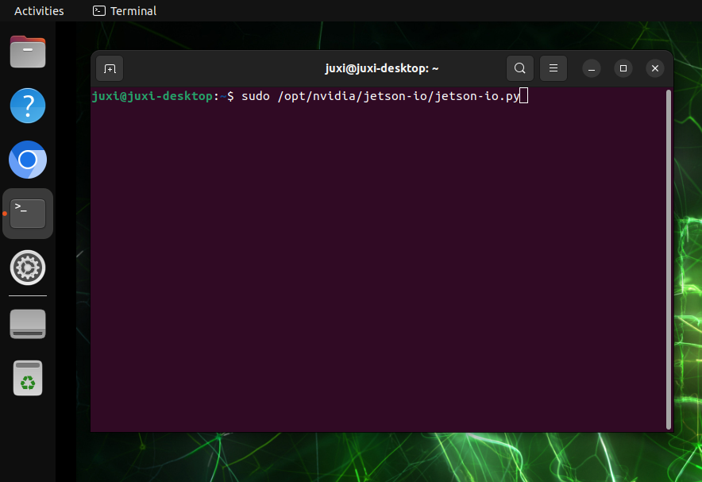

Utilisez la flèche bas pour sélectionner **Configure Jetson 24pin CSI Connector**. Appuyez ensuite sur Entrée pour passer à l'option suivante.

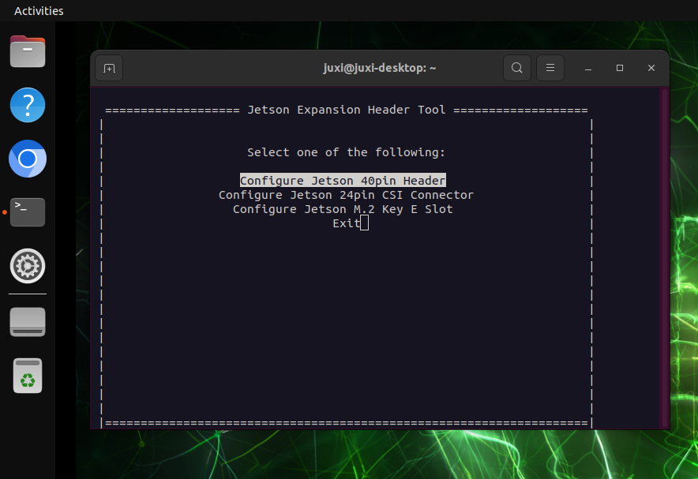

Sélectionnez **Configure for compatible hardware**, puis appuyez sur Entrée.

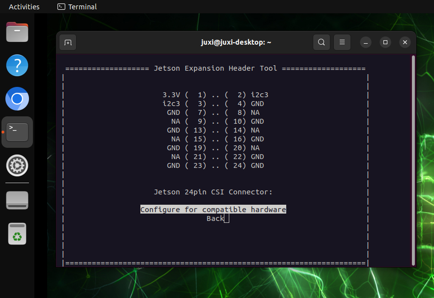

Utilisez la flèche bas pour sélectionner **Camera IMX219 Dual**, puis appuyez sur Entrée.

Si, après le redémarrage, l'aperçu de la caméra affiche une erreur ou un écran noir, choisissez ici Camera IMX219-C.

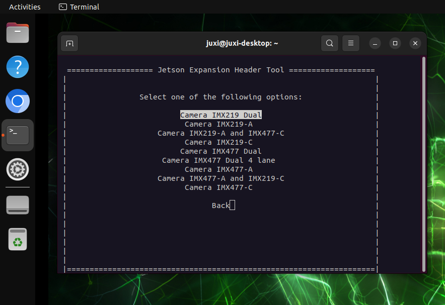

Sélectionnez **Save pin changes**, puis appuyez sur Entrée.

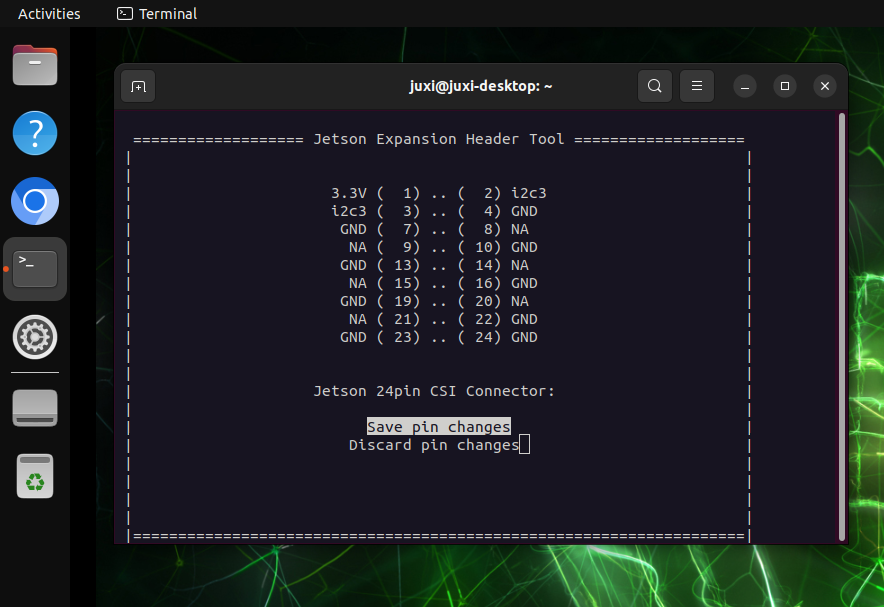

Utilisez la flèche bas pour sélectionner **Save and reboot to reconfigure pins**, puis appuyez sur Entrée.

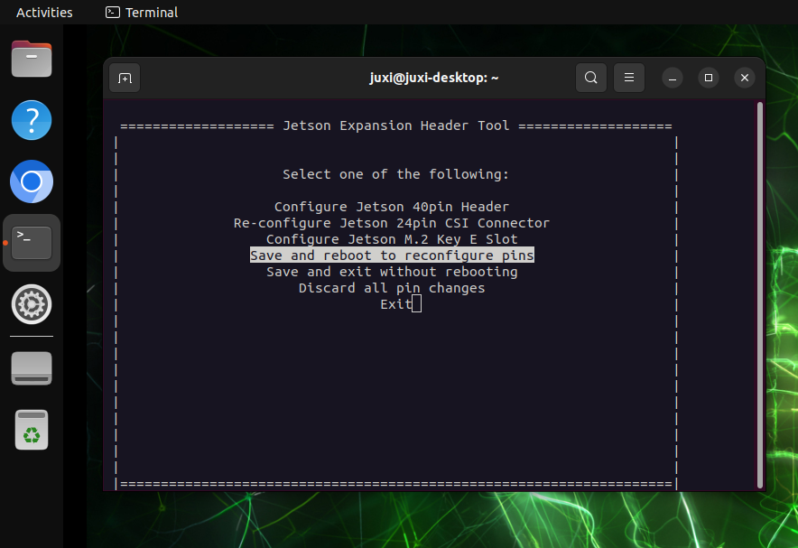

Lorsque l'interface suivante apparaît, appuyez directement sur la touche Entrée, la carte mère redémarre.

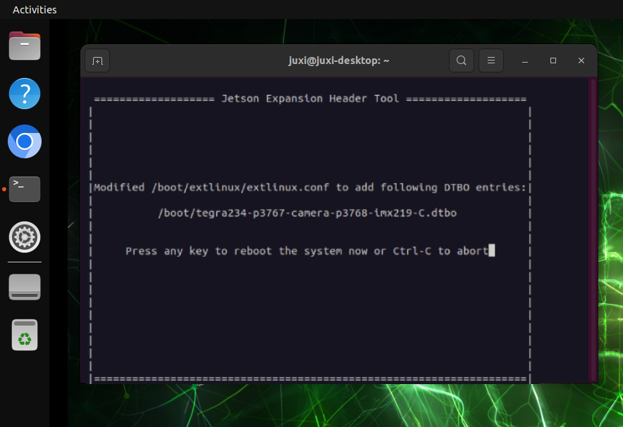

## 2、Afficher les périphériques vidéo

```Plain Text
ls /dev/video*
```

L'image montre le résultat de la connexion de deux caméras CSI : en général, une caméra CSI affiche un périphérique `video`.

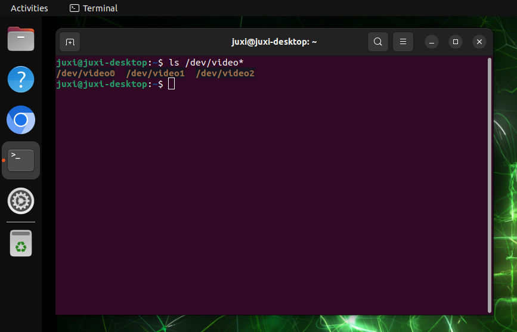

## 3、Afficher l'image de la caméra en aperçu

Saisissez la commande suivante dans le terminal ; le système ouvre automatiquement une fenêtre avec l'image de la caméra : par défaut, le périphérique `/dev/video0` est ouvert.

```Plain Text
nvgstcapture-1.0
```

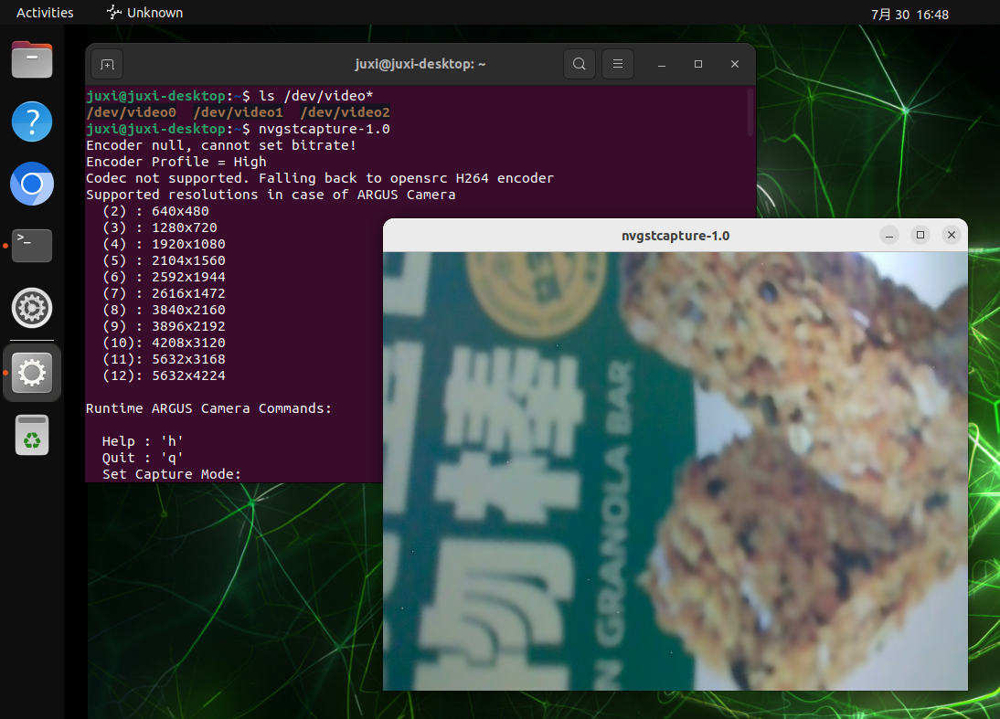

### 3.1、Spécifier la caméra

Si plusieurs caméras sont présentes, vous pouvez spécifier l'ID de la caméra :

```Plain Text
nvgstcapture-1.0 --sensor-id=1
```

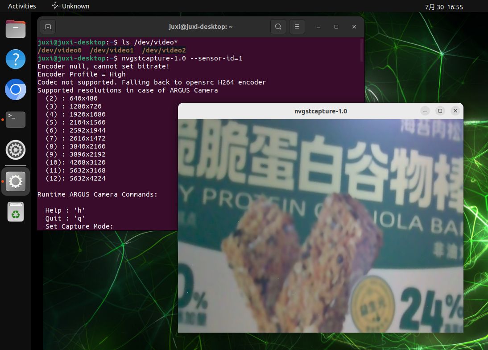

### 3.2、Spécifier la résolution d'aperçu

Si une seule caméra CSI est présente, vous pouvez remplacer `--sensor-id=1` par `--sensor-id=0` :

```Plain Text
nvgstcapture-1.0 --sensor-id=1 --cus-prev-res=1280x720
```

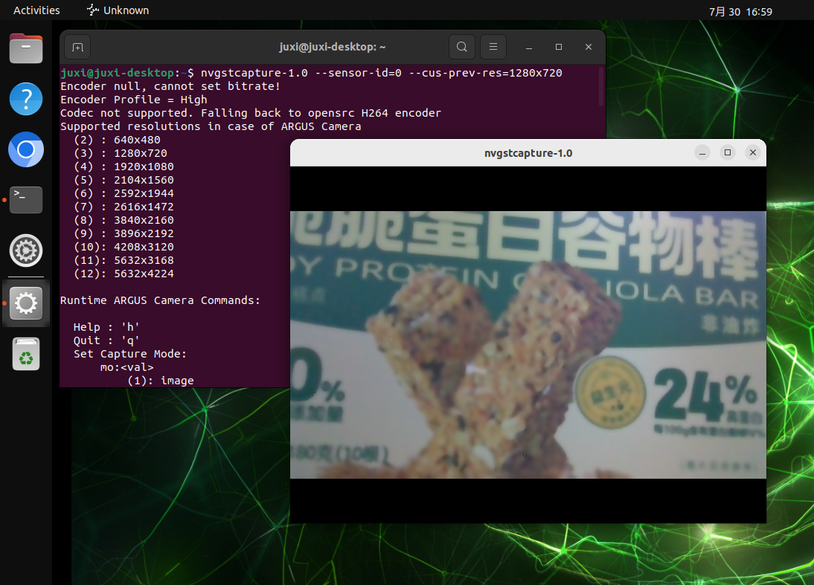


