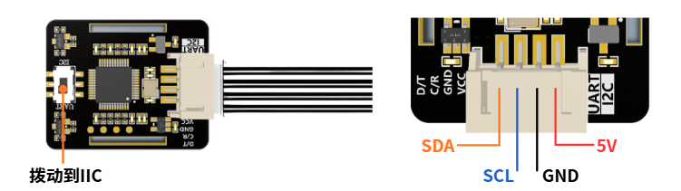
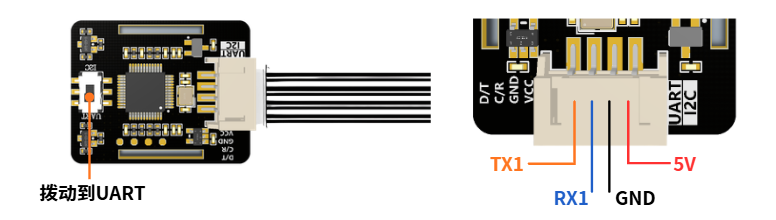
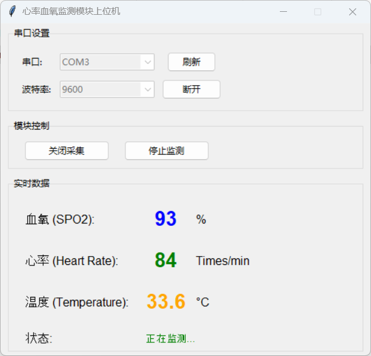

# Capteur de fréquence cardiaque et SpO2

## Présentation du produit

Le capteur JUXI de fréquence cardiaque et d'oxymétrie repose sur la puce MAX30102, prend en charge la communication IIC et UART, et collecte en temps réel la fréquence cardiaque et la saturation en oxygène. Fournit une bibliothèque Arduino et un SDK Python (Raspberry Pi / Windows / Jetson), ainsi qu'un logiciel de visualisation.

**Caractéristiques** :
- Puce haute précision MAX30102
- Communication IIC et UART
- Bibliothèque Arduino + SDK Python
- Logiciel de visualisation Windows
- Code open source : [GitHub](https://github.com/Juxi-Technology/JUXI_HeartRate_SPO2)

## Spécifications du produit

| Paramètre | Spécification |
|------|------|
| Puce | MAX30102 |
| Mesures | Fréquence cardiaque (HR) / Saturation en oxygène (SpO2) |
| Interfaces | IIC (0x57) / UART (9600 bps) |
| Tension | 3,3 V – 5 V |
| Support de développement | Arduino / Python (RPi / Windows / Jetson) |

## Démarrage rapide

### Câblage

**Câblage IIC** :



| MAX30102 | Arduino / Raspberry Pi |
|----------|-----------------|
| VCC | 3,3 V / 5 V |
| GND | GND |
| SCL | SCL (horloge I2C) |
| SDA | SDA (données I2C) |

**Câblage UART** :



| MAX30102 | Arduino UNO |
|----------|------------|
| VCC | VCC |
| GND | GND |
| TX | Broche 4 |
| RX | Broche 5 |

### Exemple de code Arduino

Installer la bibliothèque : copiez `JUXI_HeartRate_SPO2.h` et `.cpp` du dossier `src/` du dépôt dans le répertoire libraries d'Arduino.

```cpp
#include "JUXI_HeartRate_SPO2.h"

#define I2C_COMMUNICATION
#define I2C_ADDRESS  0x57
JUXI_HeartRate_SPO2_I2C MAX30102(&Wire, I2C_ADDRESS);

void setup() {
  Serial.begin(9600);
  while (!MAX30102.begin()) {
    Serial.println("init fail!");
    delay(1000);
  }
  Serial.println("start measuring...");
}

void loop() {
  MAX30102.sensor_read_data();
  int heartRate = MAX30102.sensor_get_heartRate();
  int spo2 = MAX30102.sensor_get_spo2();

  if (heartRate > 0 && spo2 > 0) {
    Serial.print("Heart Rate: ");
    Serial.print(heartRate);
    Serial.print(" bpm, SpO2: ");
    Serial.print(spo2);
    Serial.println(" %");
  }
  delay(100);
}
```

### Exemple de code Python (Raspberry Pi / Jetson)

```python
import sys
import os
import time
sys.path.append(os.path.dirname(os.path.realpath(__file__)))
from JUXI_HeartRate_SPO2 import *

# Select communication mode: ctype=0 for IIC, ctype=1 for UART
ctype = 1

if ctype == 0:
    I2C_1 = 0x01
    I2C_ADDRESS = 0x57
    max30102 = JUXI_HeartRate_SPO2_i2c(I2C_1, I2C_ADDRESS)
else:
    max30102 = JUXI_HeartRate_SPO2_uart(9600)

def setup():
    while not max30102.begin():
        print("init fail!")
        time.sleep(1)
    print("start measuring...")
    max30102.sensor_start_collect()
    time.sleep(1)

def loop():
    max30102.sensor_read_data()
    hr = max30102.sensor_get_heartRate()
    spo2 = max30102.sensor_get_spo2()
    if hr > 0 and spo2 > 0:
        print(f"Heart Rate: {hr} bpm, SpO2: {spo2}%")
    time.sleep(0.1)

if __name__ == "__main__":
    setup()
    try:
        while True:
            loop()
    except KeyboardInterrupt:
        print("Program ended")
```

## Logiciel de visualisation

JUXI fournit un logiciel Windows qui affiche en temps réel les courbes de fréquence cardiaque et de SpO2 :



- Chemin du dépôt : `HeartRateOximeter/上位机源代码/HeartRateOximeter.py`
- Téléchargement : [GitHub Releases](https://github.com/Juxi-Technology/JUXI_HeartRate_SPO2)

## Questions fréquentes

**Q : L'initialisation échoue (init fail) ?**
Vérifiez le câblage. En mode IIC, vérifiez l'adresse du périphérique (0x57 par défaut). En mode UART, assurez-vous que la vitesse est de 9600.

**Q : Les mesures sont instables ?**
Assurez-vous que le capteur est bien en contact avec la peau. Posez votre doigt fermement sur le capteur et évitez de bouger.

**Q : Comment l'utiliser sous Windows ?**
Consultez les exemples et la documentation du dossier `python/windows/` du dépôt.

## Support technique

- E-mail : support@juxitech.com
- Site officiel : [www.juxitech.com](https://www.juxitech.com)
- Dépôt open source : [GitHub](https://github.com/Juxi-Technology/JUXI_HeartRate_SPO2)
