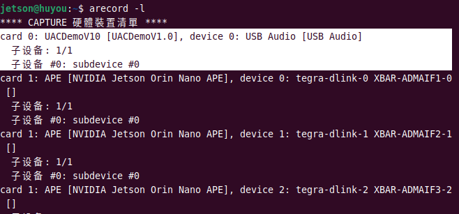
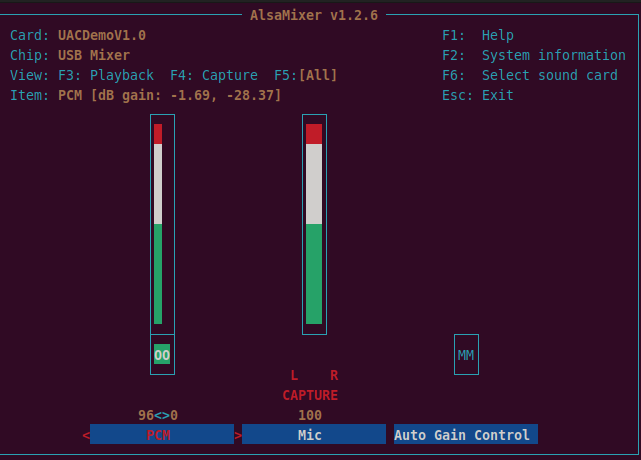
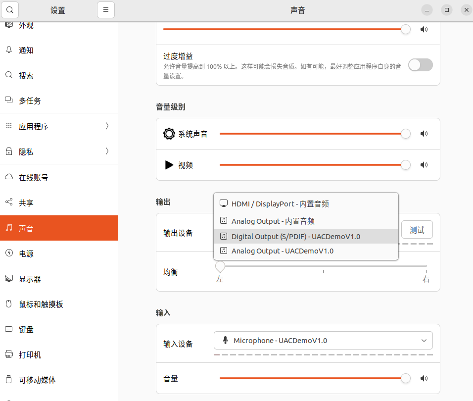
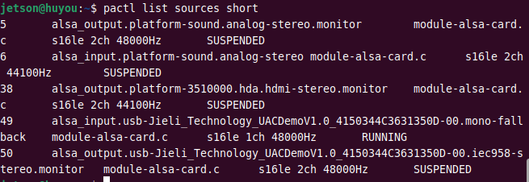
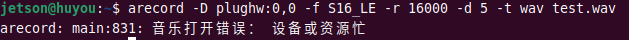
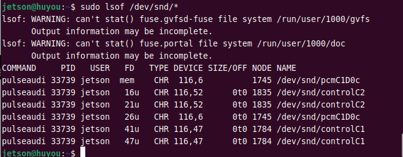
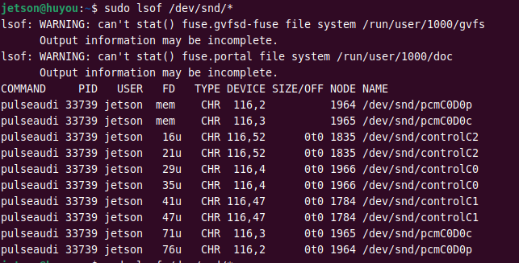
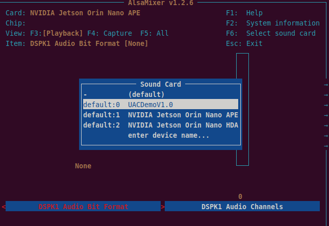

# Carte son USB sans pilote

> **[Acheter en boutique](https://www.juxitech.com/fr/products/usb-2-0-driver-free-sound-card-onboard-mic-speaker-for-ai-voice-interaction)**


# Logiciel de test visuel (Windows)

[audio_tools.7z](https://juxitech.feishu.cn/wiki/Wuc3wAppNi5elfkSI6VccrNDnfE)

**Récapitulatif des commandes (passable)

- Mettre à jour le système et installer les outils :

    - Exécuter : `sudo apt update && sudo apt full-upgrade`

    - Installer ALSA : `sudo apt install alsa-base alsa-utils`

- Identifier le matériel :

    - Lister les périphériques audio : `aplay -l`

    - Voir les périphériques audio PCI/USB : `lspci | grep -i audio`,`lsusb`

- Configuration et vérification de base :

    - Lancer l'assistant de configuration : `sudo alsaconf` (si disponible)

    - Régler le volume : `alsamixer` (**M** pour couper/rétablir le son, flèches pour le volume, ESC pour quitter)

    - Enregistrer les réglages : `sudo alsactl store`

    - Test de lecture : tester la sortie audio (haut-parleurs / casque branchés) :

```Bash
# Jouer un son de test ; -D spécifie la carte son USB (X = numéro card de aplay -l)
speaker-test -c 2 -D plughw:X,0
```

- Redémarrer le service audio : `sudo systemctl restart alsa` (un redémarrage du système peut être nécessaire : `sudo reboot`)

# Série Jetson & système Ubuntu & Raspberry Pi

## Débogage en ligne de commande

### 1. Brancher la carte son USB

1. Avant d'insérer la carte son USB, afficher les périphériques USB avec `lsusb` :



2. Insérer la carte son USB puis relancer `lsusb` : le périphérique supplémentaire est la carte son USB :


3. `arecord -l` liste tous les périphériques d'enregistrement ; notre carte son USB y figure :


4. `aplay -l` liste tous les périphériques de lecture :



### 2. Utiliser la carte son USB

Si `arecord -l` affiche par exemple UACDemoV1.0, c'est notre carte son. Pour card 0 ; device 0, remplacer dans la commande par plughw:0,0 afin de désigner ce périphérique d'enregistrement :



Exécuter la commande d'enregistrement native de Linux pour tester un enregistrement de 5 secondes :

`arecord -D plughw:0,0 -f S16_LE -r 16000 -d 5 -t wav test.wav`

`plughw:0,0` signifie `card 0, device 0`, c'est-à-dire notre carte son USB ; adapter selon le résultat de `arecord -l`. Si UACDemoV1.0 est affiché comme card 1 ; device 1, remplacer `plughw:0,0` par `plughw:1,1`. Le paramètre `plughw` assure la conversion de format automatique et fait le pont entre différents formats de données et le matériel. Autres paramètres d'arecord :

|Commande|Signification|Signification ici|
|---|---|---|
|-D|Choisir le nom du périphérique|Utiliser la carte son USB externe « plughw:1.0 »|
|-f|Format d'enregistrement|S16_LE = entier signé 16 bits en petit boutiste (little-endian)|
|-r|Fréquence d'échantillonnage|16000 = échantillonnage 16 kHz|
|-d|Durée d'enregistrement|Enregistrement 5 secondes|
|-t|Format d'enregistrement|Format wav|
|test.wav|Nom de fichier (chemin possible)|Le fichier s'appelle test.wav|

Si le son est trop faible, utiliser `alsamixer` et appuyer sur `F6` pour sélectionner la carte son USB :



Puis appuyer sur `F5` pour afficher les périphériques d'enregistrement et de lecture. Augmenter le volume d'enregistrement avec la flèche haut. PCM = lecture, CAPTURE MIC = enregistrement :



Ensuite, lire avec la commande `aplay` :

`aplay -D plughw:0,0 -f S16_LE -r 16000 -c 1 test.wav`

Explication des paramètres :

- -D plughw:0,0 : spécifie le périphérique d'enregistrement. plughw:0,0 = premier périphérique de la première carte son.

- -f S16_LE : définit le format du fichier audio. S16_LE = entier signé 16 bits en petit boutiste (Signed 16-bit Little Endian), un format audio courant ; « petit boutiste » signifie que l'octet de poids faible est stocké à l'adresse basse de la mémoire.

- -r 16000 : définit la fréquence d'échantillonnage.

- -c 1 : définit le nombre de canaux.

- -d 5 : définit la durée d'enregistrement en secondes.

## Affichage visuel avec PulseAudio



Vérifier PulseAudio en [ligne de commande](https://so.csdn.net/so/search?q=%E5%91%BD%E4%BB%A4%E8%A1%8C&spm=1001.2101.3001.7020) :

`pactl list sources short`            # Liste toutes les sources audio disponibles du serveur PulseAudio



> 49 = index de la source
>
> Alsa _input.usb = périphérique d'entrée USB, donc un microphone
>
> s16le = format d'échantillonnage audio 16 bits signé petit boutiste
>
> 1ch = mono.
>
> 48000Hz = fréquence d'échantillonnage, 48000 échantillons par seconde
>
> SUSPENDED = micro actuellement suspendu
>
> RUNNING = micro en cours d'utilisation

## Appeler la carte son USB sans pilote depuis Python

Chercher vous-même des exemples, par exemple « [Python调用USB免驱声卡](https://blog.csdn.net/weixin_44463519/article/details/157463731?spm=1001.2101.3001.6650.3&utm_medium=distribute.pc_relevant.none-task-blog-2%7Edefault%7EYuanLiJiHua%7ECtr-3-157463731-blog-105694458.235%5Ev43%5Epc_blog_bottom_relevance_base9&depth_1-utm_source=distribute.pc_relevant.none-task-blog-2%7Edefault%7EYuanLiJiHua%7ECtr-3-157463731-blog-105694458.235%5Ev43%5Epc_blog_bottom_relevance_base9&utm_relevant_index=4) »

## Récapitulatif des problèmes

### Jetson

1. Périphérique occupé



Fermer la page de paramètres et réexécuter la commande

Si cela ne suffit pas, débrancher/rebrancher ou redémarrer

Voir quel processus occupe le périphérique audio :

`sudo lsof /dev/snd/*`

Avant de brancher la carte son :


Après avoir branché la carte son :


Tuer le processus `kill -9 PID` ; PID = celui apparu après le branchement (33739 sur la capture)

Puis relancer l'enregistrement et la lecture

### Raspberry Pi

1. Bruit important

```Plain Text
D'abord mettre le volume du micro à 100
Ouvrir un terminal
$ sudo vi /boot/config.txt    #ou peut-être /boot/firmware/config.txt
Ajouter à la fin du fichier
audio_pwm_mode = 2
ESC puis :wq pour enregistrer et quitter
Ensuite redémarrer
$ reboot
```

2. Les réglages de volume sont réinitialisés à chaque redémarrage

Après avoir réglé le volume,

il faut enregistrer la configuration actuelle dans le fichier de configuration par défaut du système

Exécuter les commandes suivantes pour persister les réglages :

```Bash
sudo chmod 664 /var/lib/alsa/asound.state
sudo alsactl store
```

### Machine virtuelle Ubuntu

1. Parasites à l'enregistrement

Solution : changer la compatibilité du contrôleur USB en 3.0 ou 3.1

# RDK x3&x5

## Vérifier les numéros de périphérique

Vérifier que la carte son existe et quel est son numéro.

Avec `cat /proc/asound/cards`, vérifier que la carte son est enregistrée :

```Shell
0 [duplexaudio    ]: simple-card - duplex-audio
                      duplex-audio
```

Avec `cat /proc/asound/devices`, vérifier les périphériques logiques :

```Shell
root@ubuntu:~# cat /proc/asound/devices
  2: [ 0- 0]: digital audio playback
  3: [ 0- 0]: digital audio capture
  4: [ 0]   : control
 33:        : timer
```

Avec `ls /dev/snd/`, vérifier les fichiers de périphérique réels côté espace utilisateur :

```Shell
root@ubuntu:~# ls /dev/snd/
by-path/   controlC0  pcmC0D0c   pcmC0D0p   timer
```

Ces vérifications confirment : la carte son 0 est la carte son embarquée ; les périphériques existent avec le numéro `0-0`. Les périphériques réellement utilisés sont `pcmC0D0p` et `pcmC0D0c`.

## Enregistrer 5 secondes de son pour tester

`arecord -D plughw:0,0 -f S16_LE -r 16000 -d 5 -t wav test.wav`

`plughw:0,0` signifie `card 0, device 0`, c'est-à-dire notre carte son USB. `plughw` assure la conversion de format automatique et fait le pont entre différents formats de données et le matériel. Autres paramètres d'arecord :

|Commande|Signification|Signification ici|
|---|---|---|
|-D|Choisir le nom du périphérique|Utiliser la carte son USB externe « plughw:1.0 »|
|-f|Format d'enregistrement|S16_LE = entier signé 16 bits en petit boutiste (little-endian)|
|-r|Fréquence d'échantillonnage|16000 = échantillonnage 16 kHz|
|-d|Durée d'enregistrement|Enregistrement 5 secondes|
|-t|Format d'enregistrement|Format wav|
|test.wav|Nom de fichier (chemin possible)|Le fichier s'appelle test.wav|

Si le son est trop faible, utiliser `alsamixer` et appuyer sur `F6` pour sélectionner la carte son USB :


Puis appuyer sur `F5` pour afficher les périphériques d'enregistrement et de lecture. Augmenter le volume d'enregistrement avec la flèche haut. PCM = lecture, CAPTURE MIC = enregistrement :


Ensuite, lire avec la commande `aplay` :

`aplay -D plughw:0,0 -f S16_LE -r 16000 -c 1 test.wav`

Explication des paramètres :

- -D plughw:0,0 : spécifie le périphérique d'enregistrement. plughw:0,0 = premier périphérique de la première carte son.

- -f S16_LE : définit le format du fichier audio. S16_LE = entier signé 16 bits en petit boutiste (Signed 16-bit Little Endian), un format audio courant ; « petit boutiste » signifie que l'octet de poids faible est stocké à l'adresse basse de la mémoire.

- -r 16000 : définit la fréquence d'échantillonnage.

- -c 1 : définit le nombre de canaux.

- -d 5 : définit la durée d'enregistrement en secondes.

## Questions fréquentes

### Comment distinguer la carte son USB de la carte son embarquée sur un board RDK ?

### Comment faire coexister la sous-carte audio de la série RDK X3 avec la carte son USB et les utiliser simultanément ?

### Comment activer les fonctions audio du RDKS100 via l'interface graphique ?

Voir [Traitement et applications multimédia RDK](https://developer.d-robotics.cc/rdk_doc/FAQ/multimedia#usb-%E5%A3%B0%E5%8D%A1%E5%92%8C%E6%9D%BF%E8%BD%BD%E5%A3%B0%E5%8D%A1%E5%A6%82%E4%BD%95%E5%8C%BA%E5%88%86%E4%BD%BF%E7%94%A8)

# Vérifier le pilote audio de base

Que la carte son USB sans pilote fonctionne dépend **essentiellement du noyau**

- Le support USB Audio Class est-il activé (`CONFIG_USB_AUDIO`) ?

- Le module noyau correspondant est-il chargé (par ex. `snd-usb-audio`) ?

Si le noyau le prend en charge, il suffit d'installer les outils audio de base. Si le noyau est allégé, il faut le recompiler pour activer le pilote.

**Étape 1 : vérifier que le noyau prend en charge snd_usb_audio**

```Plain Text
# Méthode 1 : vérifier si le module pilote est chargé
lsmod | grep snd_usb_audio

# Méthode 2 : vérifier si le module est intégré au noyau (même non chargé)
modinfo snd_usb_audio  # sortie présente = noyau compatible ; aucune sortie = module non compilé dans le noyau
```

**Si `modinfo` ne renvoie rien** : le noyau système n'inclut pas ce pilote ; recompiler le noyau et activer dans `.config` :

```Plain Text
CONFIG_SND_USB_AUDIO=m  # compiler en module, ou =y pour intégrer au noyau
CONFIG_SND_USB_UA101=y
CONFIG_SND_USB_CAIAQ=y
```

**Si `modinfo` renvoie une sortie** : charger directement le module :

```Bash
sudo modprobe snd_usb_audio
```

#### Étape 2 : installer les outils audio de base (absents par défaut en version allégée)

Les systèmes allégés n'ont généralement pas `alsa-utils` ; les installer manuellement :

```Bash
# Systèmes Ubuntu/Debian
sudo apt update && sudo apt install -y alsa-utils usbutils

# Sans réseau : télécharger le paquet offline d'alsa-utils et l'installer avec dpkg -i
```

#### Étape 3 : vérifier la reconnaissance et le fonctionnement de la carte son USB

1. Insérer la carte son USB et vérifier la reconnaissance :

```Bash
# Voir l'énumération USB
lsusb | grep -i audio

# Lister les périphériques audio
aplay -l
```

Une entrée `card X` liée à `USB Audio` dans la sortie signifie que la reconnaissance a réussi.

2. Tester la sortie audio (haut-parleurs / casque branchés) :

```Bash
# Jouer un son de test ; -D spécifie la carte son USB (X = numéro card de aplay -l)
speaker-test -c 2 -D plughw:X,0
```

#### Étape 4 : (facultatif) installer un service audio (pour le bureau / la lecture en arrière-plan)

Pour la lecture en arrière-plan ou avec un environnement de bureau, les versions allégées nécessitent un service audio supplémentaire :

```Bash
# Service léger (recommandé, fonctionne sans bureau)
sudo apt install -y pulseaudio

# ou PipeWire (recommandé pour Ubuntu 22.04+)
sudo apt install -y pipewire pipewire-alsa
```

### Problèmes courants des versions allégées et solutions

**1. Droits insuffisants : l'utilisateur normal ne peut pas accéder à la carte son**

Solution : ajouter l'utilisateur au groupe `audio`, effectif après redémarrage :

```Bash
sudo usermod -aG audio $USER
```

2.**Pas de son alors que le périphérique est bien reconnu**

Solution : augmenter le volume avec `alsamixer` et couper/rétablir le son (touche **M**) :

```Bash
alsamixer -c X  # X = numéro card de la carte son USB
```

3.**Noyau trop ancien pour les nouvelles cartes son USB – deux cas**

```Bash
sudo apt install -y linux-generic && sudo reboot
```

```Bash
sudo modprobe snd-hda-intel model=generic #(essayer d'autres valeurs selon le modèle)
# Créer le fichier de configuration du pilote
sudo echo "options snd-hda-intel model=generic" > /etc/modprobe.d/sound.conf
sudo reboot
```


---

## Dépôt officiel

Dépôt open source de la carte son USB sans pilote JUXI : [GitHub](https://github.com/Juxi-Technology/Driver-Free-Sound-Card)

Plug-and-play, compatible Raspberry Pi, Jetson, PC, etc. Aucun pilote supplémentaire : le système la reconnaît automatiquement comme périphérique d'entrée/sortie audio.
