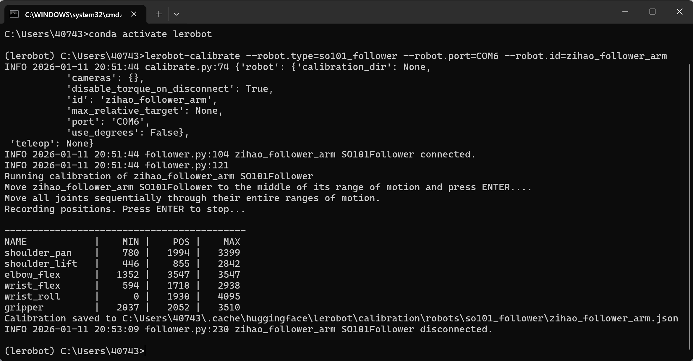
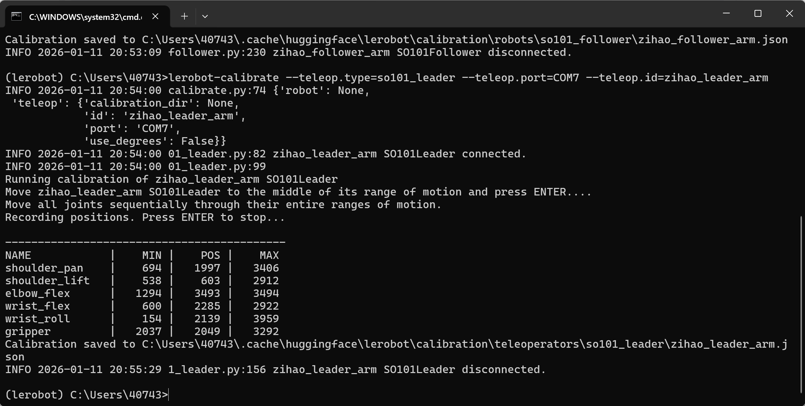

# Étape 3 : Calibration du bras (Windows)

Il faut brancher simultanément le bras maître et le bras esclave

## Calibrer le bras esclave Follower

```Shell
lerobot-calibrate --robot.type=so101_follower --robot.port=COM6 --robot.id=my_follower_arm
```



## Calibrer le bras maître Leader

```Shell
lerobot-calibrate --teleop.type=so101_leader --teleop.port=COM7 --teleop.id=my_leader_arm
```



## Emplacement d'export des fichiers

C:\Users\<nom-utilisateur-Windows>\.cache\huggingface\lerobot\calibration\robots\so101_follower\my_follower_arm.json

C:\Users\<nom-utilisateur-Windows>\.cache\huggingface\lerobot\calibration\teleoperators\so101_leader\my_leader_arm.json

## Calibrer après avoir changé de bras robotisé

lerobot-calibrate --robot.type=so101_follower --robot.port=COM4 --robot.id=my_follower_arm

## Points d'attention

### ① Un bras s'arrête lorsqu'il atteint la butée

Une recalibration est nécessaire

[wx_camera_1768098182808.mp4](/downloads/wx_camera_1768098182808.mp4)

### ② Servomoteur introuvable


Le servomoteur n'est pas branché ; rebranchez-le et faites pivoter un peu le connecteur

<RelatedProducts slugs="so-arm101" />
