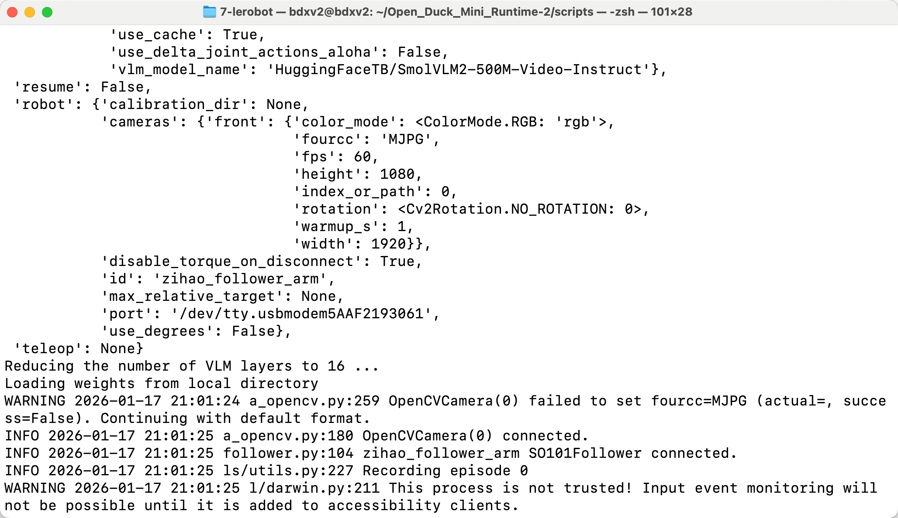
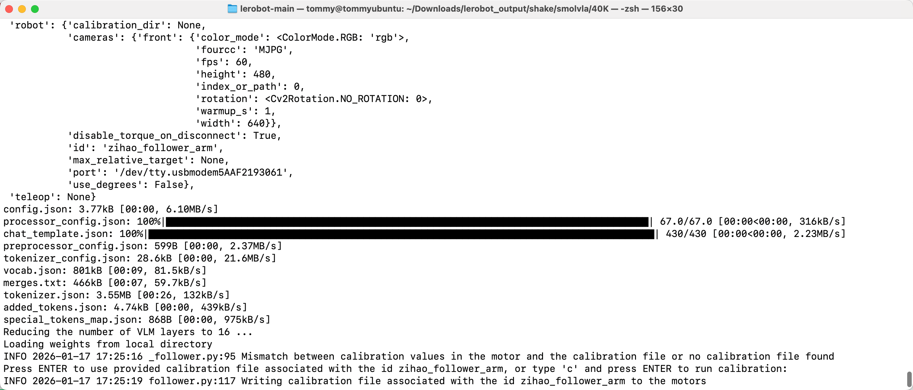

# Étape 8 : Commande de déploiement smolvla

> Le déploiement utilise uniformément `lerobot-rollout` ; pour l'usage et les paramètres, voir [Description de la ligne de commande](/fr/tutorials/robot-arms/so-arm101/lerobot/08-Inference/CLI-Reference).

## Ubuntu

- Supprimer le dataset existant (le cas échéant)

```Shell
sudo chmod 666 /dev/ttyACM*
sudo rm -rf /home/<nom-utilisateur>/.cache/huggingface/lerobot/<nom-utilisateur>/rollout_lerobot_my_dataset_shake_hands
```

- Ligne de commande de déploiement

```Shell
lerobot-rollout  \
  --strategy.type=base \
  --robot.type=so101_follower \
  --robot.port=/dev/ttyACM0 \
  --robot.cameras="{ front: {type: opencv, index_or_path: 0, width: 1280, height: 720, fps: 30, fourcc: "MJPG"}}" \
  --robot.id=my_follower_arm \
  --policy.path=/home/<nom-utilisateur>/Downloads/lerobot_output/shake/smolvla/40K/pretrained_model \
  --task="Shake Hands" \
  --duration=60 \
  --display_data=false
```

## Mac

- Supprimer le dataset existant (le cas échéant)

```Shell
sudo rm -rf /Users/<nom-utilisateur>/.cache/huggingface/lerobot/<nom-utilisateur>/rollout_lerobot_my_dataset_shake_hands
```

- Ligne de commande de déploiement

```Shell
lerobot-rollout  \
  --strategy.type=base \
  --robot.type=so101_follower \
  --robot.port=/dev/tty.usbmodem5AAF2193061 \
  --robot.cameras="{front: {type: opencv, index_or_path: 0, width: 1280, height: 720, fps: 30, fourcc: "MJPG"}}" \
  --robot.id=my_follower_arm \
  --policy.path=/Users/<nom-utilisateur>/Downloads/7-lerobot/shake/smolvla/40K/pretrained_model \
  --task="Shake Hands" \
  --duration=60 \
  --display_data=false
```





<RelatedProducts slugs="so-arm101" />
