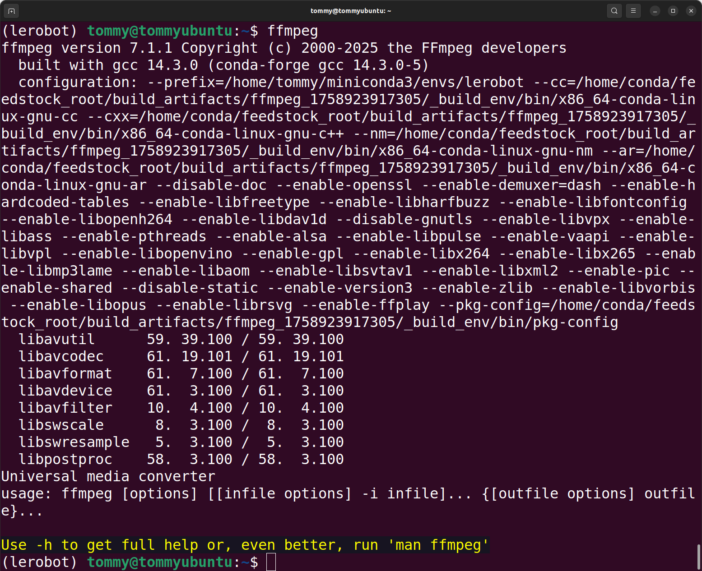

# Configuration (Windows)

Le bras meneur noir utilise un adaptateur secteur 5V6A

Le bras suiveur blanc utilise un adaptateur secteur 12V5A

## Installer Miniconda

anaconda.com/download/success

Ou cliquez directement sur ce lien pour télécharger le programme d'installation

https://repo.anaconda.com/miniconda/Miniconda3-latest-Windows-x86_64.exe


## Changer la source conda

```Shell
# Vider d'abord la configuration de source existante (pour éviter les conflits)
conda config --remove-key channels

# Remplacer la source par défaut de conda et les sources tierces courantes par le miroir de Tsinghua
# Ajouter les sources de paquets par défaut (main/r/msys2)
conda config --add channels https://mirrors.tuna.tsinghua.edu.cn/anaconda/pkgs/main/
conda config --add channels https://mirrors.tuna.tsinghua.edu.cn/anaconda/pkgs/r/
conda config --add channels https://mirrors.tuna.tsinghua.edu.cn/anaconda/pkgs/msys2/

# Ajouter les sources tierces courantes
conda config --add channels https://mirrors.tuna.tsinghua.edu.cn/anaconda/cloud/conda-forge/
conda config --add channels https://mirrors.tuna.tsinghua.edu.cn/anaconda/cloud/msys2/
conda config --add channels https://mirrors.tuna.tsinghua.edu.cn/anaconda/cloud/bioconda/
conda config --add channels https://mirrors.tuna.tsinghua.edu.cn/anaconda/cloud/menpo/
conda config --add channels https://mirrors.tuna.tsinghua.edu.cn/anaconda/cloud/pytorch/

# Activer l'affichage de la source de téléchargement ; lors de l'installation, l'adresse de téléchargement précise s'affichera
conda config --set show_channel_urls yes

# Vider le cache d'index pour appliquer la nouvelle source
conda clean -i

# Consulter la configuration actuelle (vérifier que la source a bien été ajoutée)
conda config --show-sources
```

## Créer un environnement virtuel

```Shell
conda create -y -n lerobot python=3.12
```

## Activer l'environnement virtuel

```Shell
conda activate lerobot
```

## Installer ffmpeg

```Shell
conda install *ffmpeg*=7.1.1 *-c* conda-forge -y
```

Vérifiez que l'installation a réussi

```Shell
ffmpeg
```




## Télécharger LeRobot

- Téléchargez le dépôt de code officiel de LeRobot

```Shell
git clone https://github.com/huggingface/lerobot.git
```

## Installer le dépôt de code

```Shell
cd lerobot
```

```Plain Text
pip install -e ".[feetech]"
```


## Vérifier que l'installation a réussi

```Shell
python

import lerobot
import scservo_sdk
import torch
torch.cuda.is_available()
```


<RelatedProducts slugs="xlerobot" />
