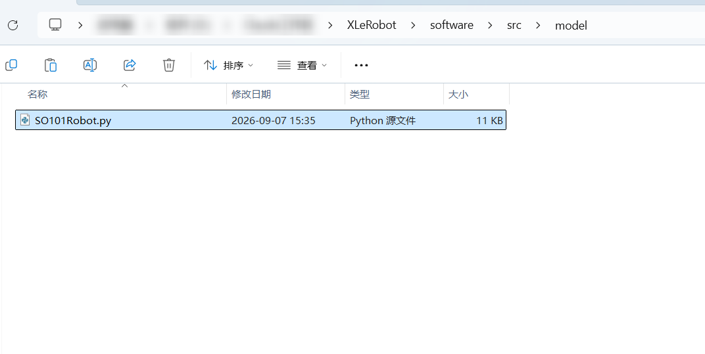
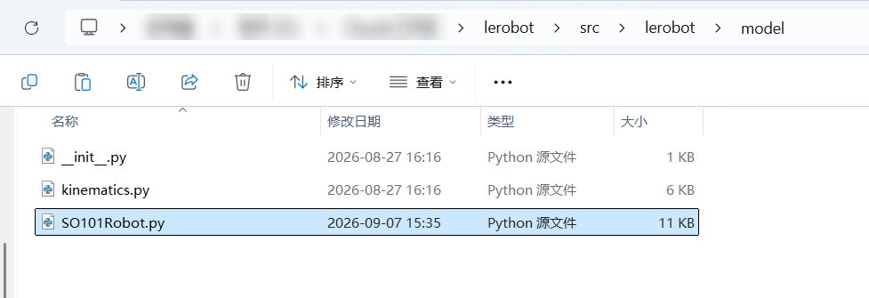
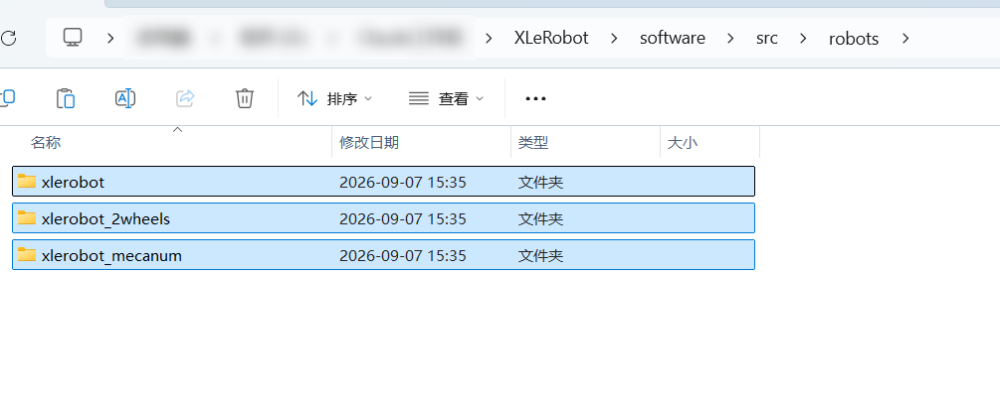
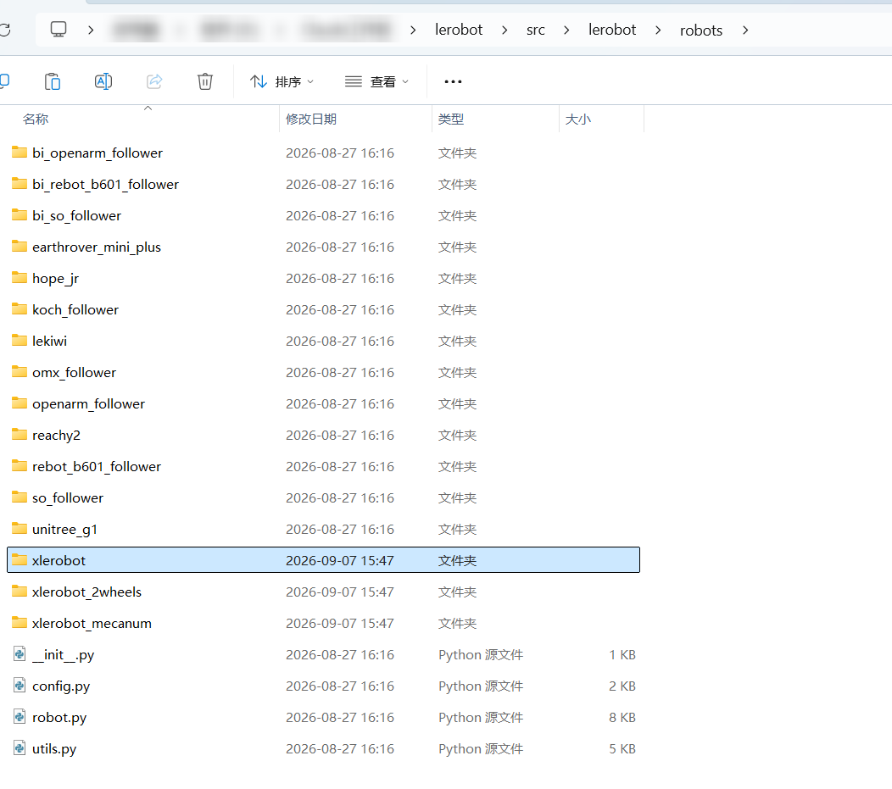
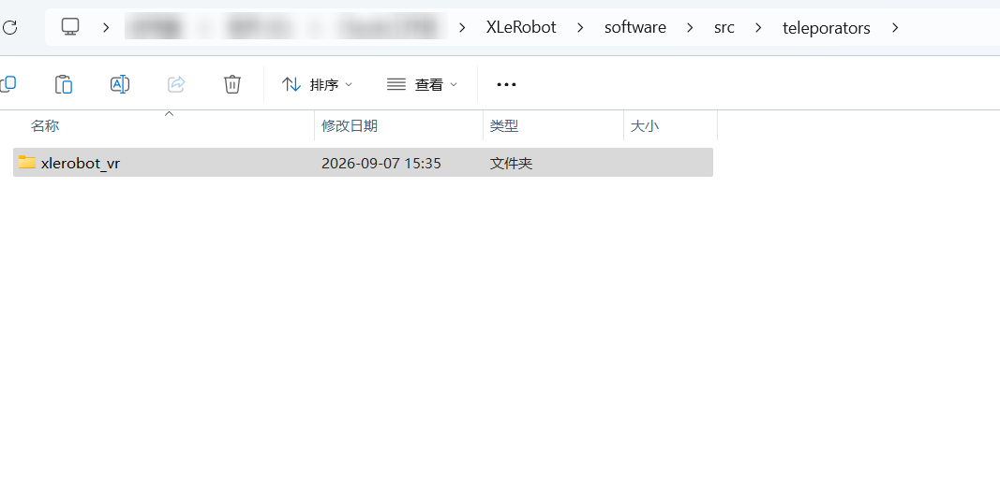
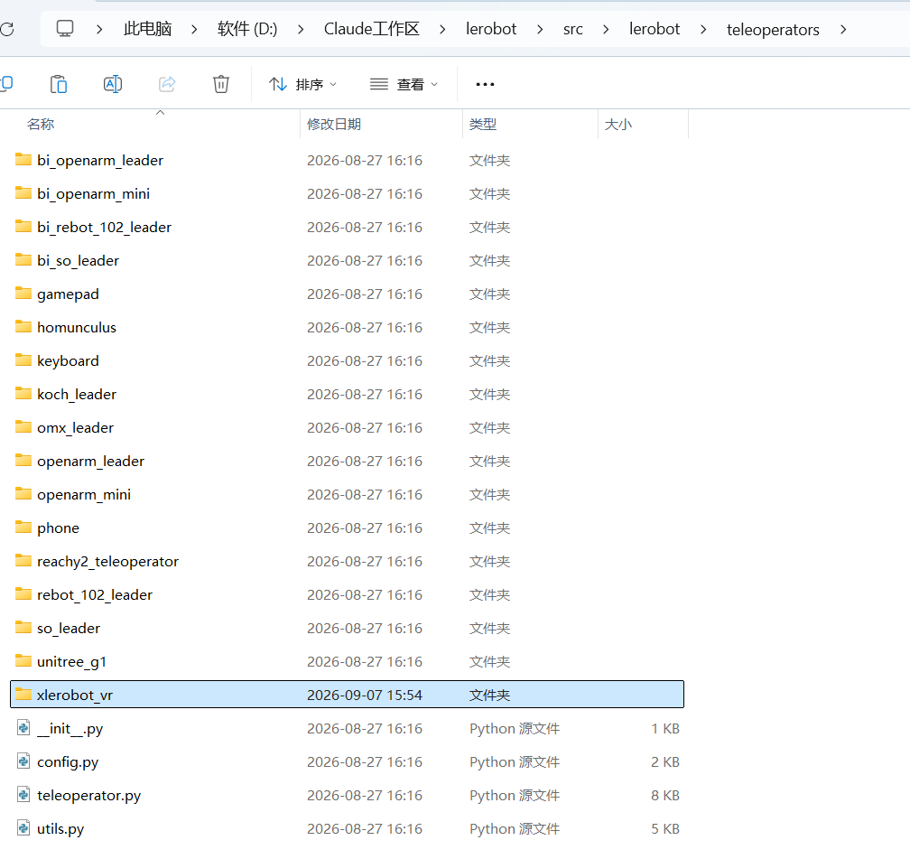
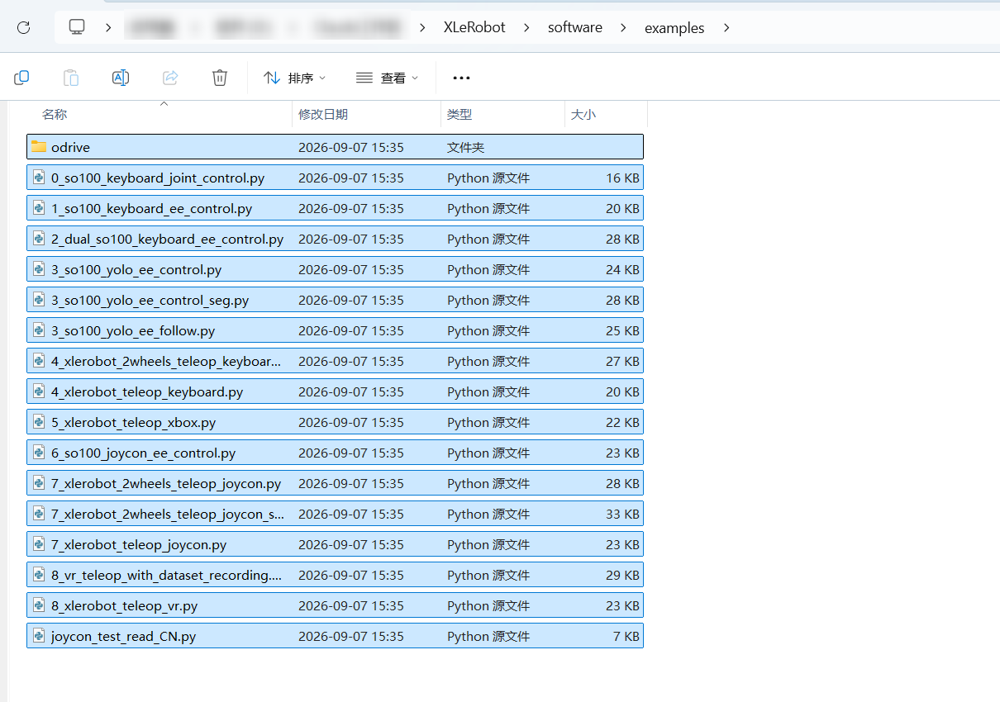
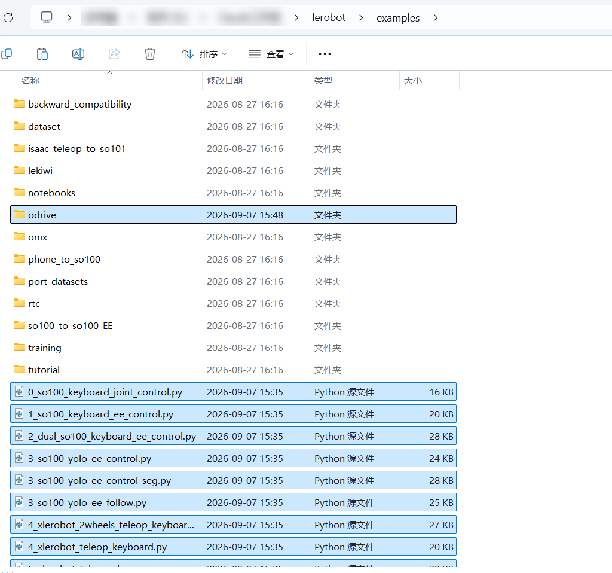

# Déplacer les fichiers XLeRobot

Téléchargez et extrayez l'archive à l'adresse https://github.com/Vector-Wangel/XLeRobot

ou

```Bash
Git clone https://github.com/Vector-Wangel/XLeRobot
```

Copiez le solveur de cinématique inverse analytique du robot SO101 situé sous `~\XLeRobot\software\src\model文件夹` vers
`~\lerobot\src\lerobot\model文件夹`





Copiez les dossiers situés sous `~\XLeRobot\software\src\robots文件夹` vers
`~\lerobot\src\lerobot\robot文件夹`





Remarque

Si vous souhaitez effectuer une construction basée sur le Raspberry Pi, décommentez `xlerobot_host` et `xlerobot_client` dans `~\lerobot\src\lerobot\robots\xlerobot__init__.py`.

Copiez les dossiers situés sous `~\XLeRobot\software\src\teleporators文件夹` vers
`~\lerobot\src\lerobot\teleporators文件夹`





Copiez tous les fichiers situés sous `~\XLeRobot\software\examples文件夹` vers
`~\lerobot\examples文件夹`






Tutoriel https://xlerobot.readthedocs.io/zh-cn/latest/software/index.html

<RelatedProducts slugs="xlerobot" />
