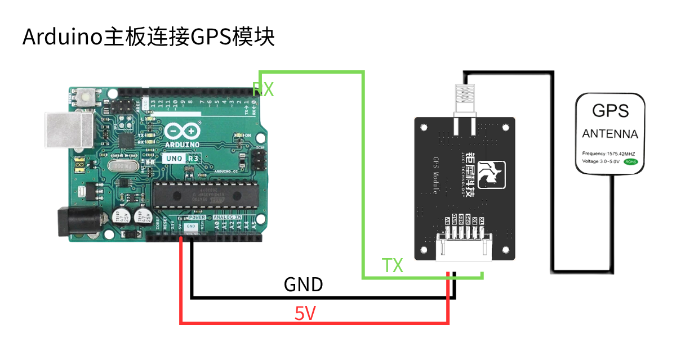
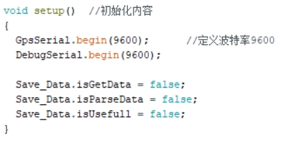
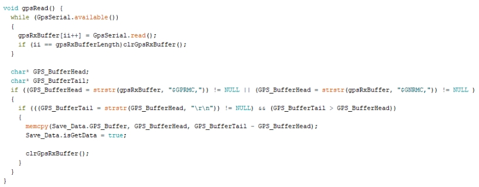
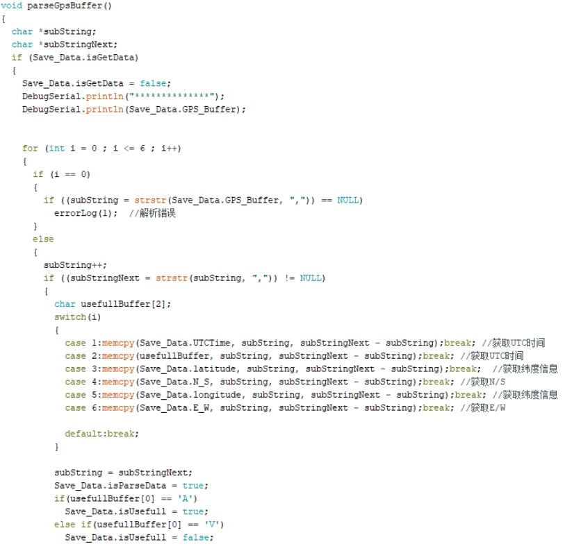
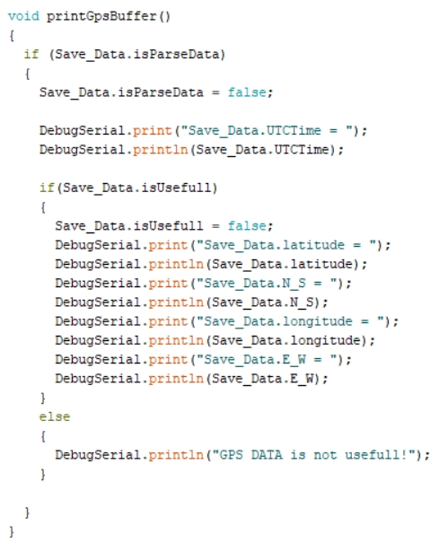
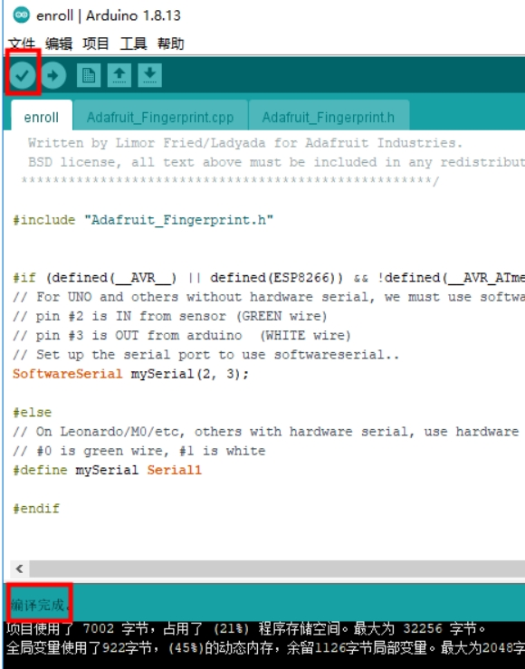
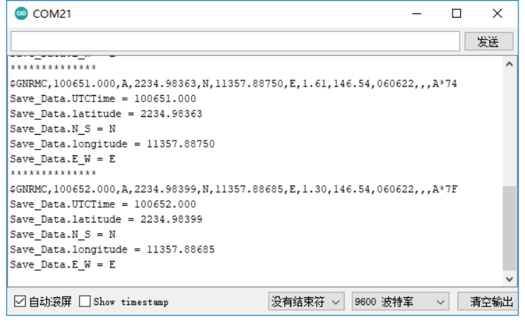

# Arduino : analyse de position

**1. Objectif d'apprentissage**

Dans cette leçon, nous allons principalement apprendre à utiliser Arduino et le module GPS pour réaliser la fonction d'analyse et d'impression des informations de position.

**2. Préparation**

Le module GPS utilise la communication UART et USB. Ici, le port UART de l'Arduino UNO est utilisé pour lire les informations. Connectez le TX du module à la broche D0 de la carte Arduino UNO. VCC et GND sont connectés respectivement à 5V et GND.

**3.** **Programme**

Initialiser le port série.

 

Lire les données du port série.

 

Analyser les données du port série.

 

Imprimer les informations de position analysées.

 

**4. Compiler et télécharger le programme**

4.1 Nous devons ouvrir le fichier avec le logiciel Arduino IDE, puis cliquer sur « √ » dans la barre de menus pour compiler le programme, et attendre que le texte « Compilation réussie » apparaisse en bas à gauche.

 

4.2 Dans la barre de menus de l'Arduino IDE, nous devons sélectionner 【Outils】---【Port】--- le port qui vient de s'afficher dans le gestionnaire de périphériques, comme le montre l'illustration ci-dessous.

 

4.3 Après la sélection, cliquez sur « → » dans la barre de menus pour téléverser le code sur la carte UNO. Lorsque le texte « Téléversement terminé » apparaît en bas à gauche, cela signifie que le programme a été téléversé avec succès sur la carte UNO, comme le montre l'illustration ci-dessous.

 

 

**5. Résultat de l'expérience**

Après la mise sous tension, le module a besoin d'environ 32s pour démarrer. Ensuite, la LED d'état d'impression série sur le module clignote en continu, et les données peuvent alors être reçues normalement.

Après le téléchargement et l'exécution du programme, ouvrez la fenêtre du moniteur série et le logiciel série, réglez le débit en bauds sur 9600 ; le port série imprime en boucle les informations de position en temps réel analysées.

 

Notez que l'antenne du module doit être à l'extérieur, sinon le signal GPS risque de ne pas être trouvé.

<RelatedProducts slugs="gps-beidou-module" />
