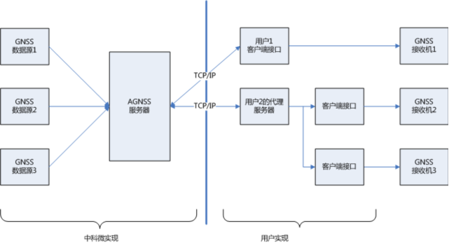
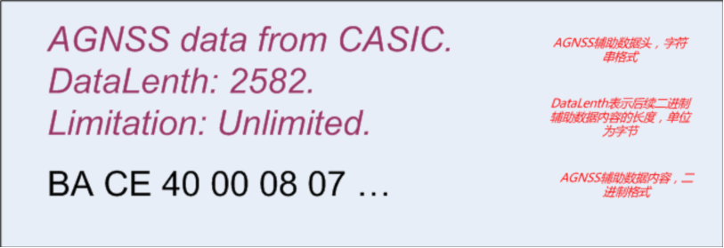
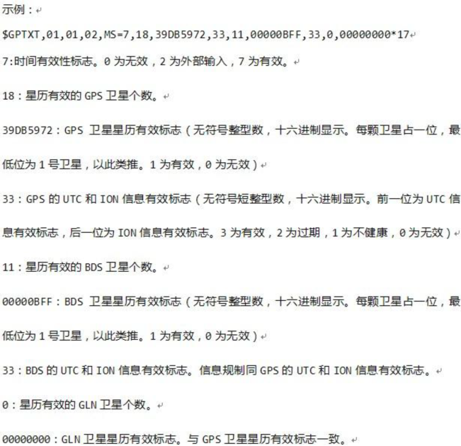
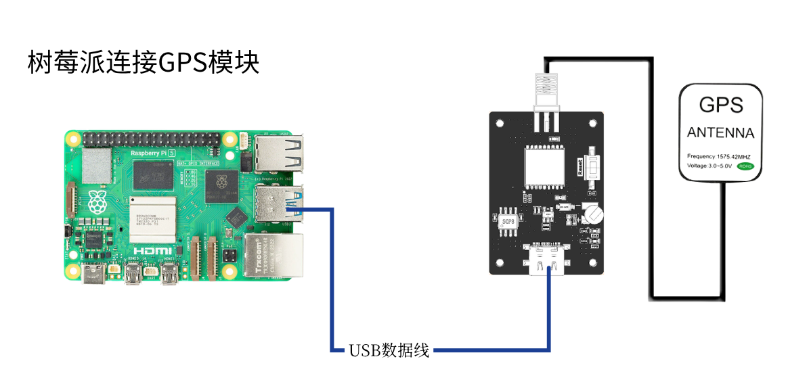
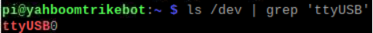
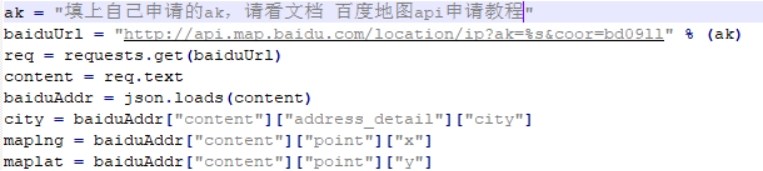
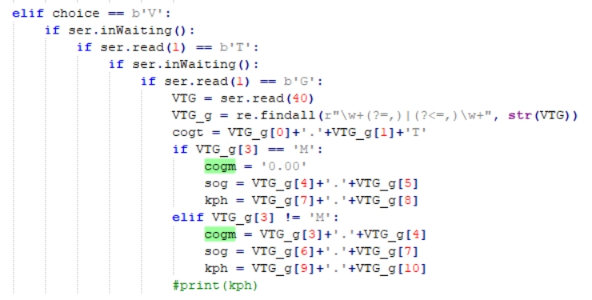
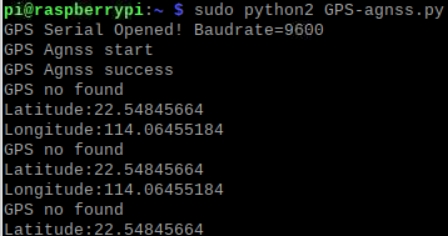
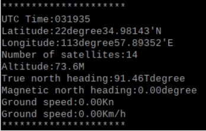
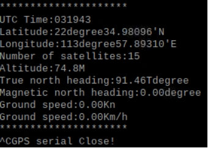

# Raspberry Pi : positionnement AGNSS

**1. Objectif d'apprentissage**

Dans cette leçon, nous allons principalement apprendre à réaliser la lecture et l'analyse des informations de position en signal faible à l'aide du Raspberry Pi, du module GPS et d'un serveur agnss.

**2. Explication de l'AGNSS**

2.1. **Pourquoi utiliser l'AGNSS**

• Les conditions de positionnement d'un récepteur GNSS autonome comprennent :

- l'acquisition et le suivi des signaux satellites, l'analyse du temps

- l'obtention du message de navigation à partir des satellites

• Dans un environnement à signal fort, un récepteur GNSS autonome peut effectuer un démarrage à froid et se positionner en environ 30 secondes ; mais dans un environnement à signal faible, l'acquisition des satellites par un récepteur sans assistance externe est très lente, et il est difficile d'obtenir le message de navigation à partir des satellites. Il faut donc très longtemps pour se positionner, voire impossible de se positionner.

• L'AGNSS peut fournir au récepteur les informations d'assistance nécessaires au positionnement, telles que le message de navigation, la position approximative et le temps. Que ce soit dans un environnement à signal fort ou faible, ces informations peuvent réduire considérablement le temps de première fixation.

2.2. **Solution AGNSS**

• Le serveur AGNSS acquiert et gère les informations d'assistance AGNSS à partir de plusieurs sources de données GNSS. Le serveur écoute et répond en permanence aux requêtes AGNSS des clients (nom d'utilisateur et mot de passe requis).

• L'utilisateur obtient les informations d'assistance auprès du serveur AGNSS via le protocole TCP/IP ; les informations d'assistance obtenues peuvent être transmises directement au récepteur GNSS.

• L'utilisateur peut également mettre en place son propre serveur proxy.

 

2.3. **Déroulement de l'AGNSS**

• Se connecter au serveur AGNSS

–L'adresse du serveur est 121.41.40.95 (nom de domaine : www.gnss-aide.com)

–Le numéro de port est 2621

• Envoyer une requête AGNSS

–Instruction de requête : (les champs nom d'utilisateur et mot de passe sont obligatoires)

–user=pm@juxi.com;pwd=juxi;cmd=full;gnss=gps+bd;lat=60.0;lon=55.0;alt=0;

• Obtenir les informations d'assistance AGNSS

• Envoyer les informations d'assistance AGNSS au récepteur

2.4. **Paramètres de la requête AGNSS**

• Le client envoie une requête au serveur AGNSS ; le format de l'instruction de requête est le suivant

–L'instruction de requête est une combinaison de plusieurs groupes key=value;, par exemple : key=value;key=value;

• Exemple : user=pm@juxi.com;pwd=juxi;cmd=full;gnss=gps+bd;lat=60.0;lon=55.0;alt=0;

• Les définitions concrètes de key et value sont données dans le tableau suivant

| Mot-clé (Key) | Valeur (value) | Caractère facultatif | Remarque                                                         |
| ----------- | ----------- | ------ | ------------------------------------------------------------ |
| **user**    | chaîne de caractères      | Obligatoire   | Nom d'utilisateur. Il est fortement recommandé que le nom d'utilisateur soit une adresse e-mail valide ; les informations de maintenance importantes du serveur AGNSS seront envoyées à cette adresse. |
| **pwd**     | chaîne de caractères      | Obligatoire   | Mot de passe de l'utilisateur                                                     |
| **gnss**    | chaîne de caractères      | Facultatif   | Liste de GNSS séparés par des virgules ; le GPS est actuellement pris en charge. Les valeurs valides sont : gps,bds,glo « gnss=gps; » signifie que des informations d'assistance GPS sont demandées ; gnss=gps,bds; » signifie que des informations d'assistance GPS et BDS sont demandées ; |
| **cmd**     | chaîne de caractères      | Facultatif   | full : toutes les informations, y compris les éphémérides, le temps et la position estimés ; eph : uniquement les informations d'éphémérides ; aid : informations d'assistance telles que le temps et la position. Si ce champ n'est pas renseigné, la valeur par défaut est full |
| **lat**     | valeur numérique        | Facultatif   | Estimation de la latitude de la position de l'utilisateur. Unité de la latitude : degré. Plage de valeurs : -90~90 degrés. Parmi les deux formats d'assistance de position, le format latitude/longitude/altitude et le format ECEF, choisissez l'un des deux. Un format d'assistance de position latitude/longitude/altitude valide est « lat=30;lon=120.3;alt=100; » ; les trois champs doivent être complets. |
| **lon**     | valeur numérique        | Facultatif   | Estimation de la longitude de la position de l'utilisateur. Unité de la longitude : degré. Plage de valeurs : -180~180 degrés. |
| **alt**     | valeur numérique        | Facultatif   | Estimation de l'altitude de la position de l'utilisateur. Unité : mètre.                              |
| **x**       | valeur numérique        | Facultatif   | Estimation de la position de l'utilisateur (X, Y, Z dans le système de coordonnées ECEF). Unité : mètre. Un format d'assistance de position ECEF valide est « x=30000;y=1111120.3;z=3345100; » ; les trois champs doivent être complets. |
| **y**       | valeur numérique        | Facultatif   | Estimation de la position de l'utilisateur (X, Y, Z dans le système de coordonnées ECEF). Unité : mètre.           |
| **z**       | valeur numérique        | Facultatif   | Estimation de la position de l'utilisateur (X, Y, Z dans le système de coordonnées ECEF). Unité : mètre.           |
| **pacc**    | valeur numérique        | Facultatif   | Précision de la position de l'utilisateur. Unité : mètre.                                 |

2.5. **Informations renvoyées par le serveur**

 

• Exemple de données renvoyées par le serveur AGNSS : en-tête de données + contenu des données d'assistance

• Les données binaires sont les données d'assistance nécessaires au récepteur GNSS ; ces données binaires intègrent chacune une vérification de données. Pour le format des données binaires, consultez la spécification du protocole du récepteur de Zhongke Micro.

• Si l'en-tête de données est également envoyé au récepteur GNSS, cela n'aura aucun impact sur le récepteur GNSS.

2.6. **Comparaison des performances de l'AGNSS**

• Par rapport aux récepteurs GNSS autonomes ordinaires, les récepteurs AGNSS présentent une amélioration significative des performances TTFF, en particulier dans des conditions de signal faible.

 

2.7. **Remarques**

• L'assistance de position approximative doit être obtenue par le client d'une autre manière, par exemple

–les modules de communication GSM/GPRS/3G ; ces modules peuvent obtenir la position approximative actuelle au moyen du CELL ID

–d'autres modules sans fil tels que le WiFi peuvent également effectuer une localisation approximative

• La précision de la position approximative doit être inférieure à 15km ; une assistance de position erronée affectera les performances du récepteur

• S'il est impossible d'obtenir une position approximative, ignorez les champs de position (lat,lon,alt,x,y,z) dans l'instruction de requête AGNSS ; le récepteur choisira automatiquement une position valide issue de la localisation historique

• Il n'est pas nécessaire d'utiliser la position fournie par le récepteur GNSS lui-même comme position approximative

2.8. **Quand l'AGNSS est nécessaire**

• Il n'est pas nécessaire de télécharger depuis le serveur à chaque démarrage, ce qui économise du trafic

–les puces de Zhongke Micro disposent en interne d'une SRAM de sauvegarde à batterie, ainsi que d'une FLASH de sauvegarde permanente, qui peuvent toutes deux enregistrer automatiquement les données d'éphémérides reçues, etc.

–pendant son fonctionnement normal, la puce télécharge en continu les dernières données d'éphémérides à partir des satellites

• En interrogeant l'état du récepteur, on décide s'il est nécessaire de télécharger les données AGNSS depuis le serveur

–le récepteur peut émettre une phrase d'état du message de navigation (non émise par défaut, elle ne l'est qu'après configuration)

2.9. **Présentation de la phrase d'état du message de navigation**

 

 

• Cette phrase émet le temps interne actuel du récepteur + l'état du message de navigation.

• La commande $PCAS03,,,,,,,,,,,1*1F peut être envoyée pour émettre une fois par seconde la phrase d'état du message de navigation

• La commande $PCAS03,,,,,,,,,,,0*1E peut être envoyée pour arrêter l'émission de la phrase d'état du message de navigation

• Remarque : chaque phrase doit se terminer par \r\n (0x0D,0x0A), et la phrase contient 11 virgules

• Si l'indicateur de temps est valide (différent de 0) et que le nombre d'éphémérides valides est élevé (supérieur à 8), il n'est pas nécessaire de télécharger les éphémérides AGNSS.

 

**3. Préparation**

**3.1. Câblage**

Le module GPS utilise la communication UART ou USB ; ici, la communication USB est prise comme exemple.

Connectez le Raspberry Pi et le module GPS avec un câble Type-C, exécutez la commande ls /dev | grep 'ttyUSB' ; vous pouvez voir que le module GPS est identifié comme USB0.

 

**3.2. Demande de l'ak Baidu Maps**

Veuillez consulter le document [Tutoriel de demande de l'API Baidu Maps](./RaspberryPi-Baidu-Map-API.md)

 

**4. Programme**

Pour le programme de cette leçon, veuillez vous référer à : GPS-agnss.py

Initialiser l'USB :

 

À l'emplacement ak, il faut saisir la valeur ak que vous avez vous-même demandée ; vous pourrez ensuite obtenir les informations approximatives de latitude et de longitude actuelles via Baidu Maps

 

Ici, les informations approximatives de latitude et de longitude obtenues via Baidu Maps sont envoyées au serveur. Le compte de connexion que nous utilisons est le compte officiel de Juxi ; une fois l'acquisition terminée, le paquet entier est envoyé au module

 

 

Fonction d'acquisition et d'analyse des informations de position ; dans l'illustration ci-dessous, les informations de position commençant par GNGGA sont filtrées parmi les informations de position, puis les données sont analysées et stockées dans les différentes variables globales.

 

 

De la même manière, les informations de cap de GNVTG sont acquises et analysées.

 

Les données analysées sont imprimées en boucle

 

**5.Exécuter le programme**

Saisissez dans le terminal sudo python2 GPS-agnss.py pour exécuter le programme.

**6.Résultat de l'expérience**

**Notez que le Raspberry Pi doit être connecté à Internet en positionnement assisté.**

Après la mise sous tension du module en signal faible, l'initialisation de l'USB commence ; en cas d'initialisation réussie, « GPS Serial Opened! Baudrate=9600 » s'affiche, sinon « GPS Serial Open Failed! ». En cas d'erreur, il faut vérifier le câblage ou le port USB.

Ensuite, « GPS Agnss start » s'affiche et l'envoi des informations de position assistée au serveur commence ; une fois l'envoi terminé, « GPS Agnss success » s'affiche

Si aucun signal GPS n'a été lu dans un certain laps de temps après l'envoi, « GPS no found » s'affiche et les informations approximatives de latitude et de longitude lues via Baidu Maps sont imprimées.

 

Après qu'un GPS a été reconnu au bout d'un certain temps, la position et les informations de cap sont imprimées en boucle.

 

Appuyez sur Ctrl+C pour quitter la lecture des informations.

<RelatedProducts slugs="gps-beidou-module" />
