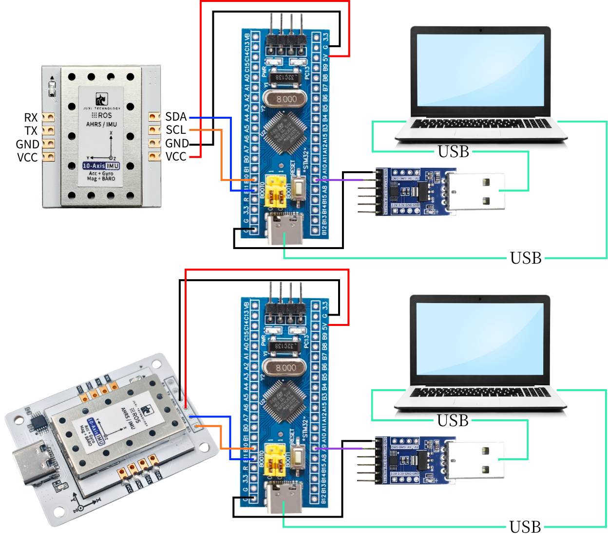

# STM32

Cet exemple utilise la carte cœur STM32F103C8T6, un PC Windows, plusieurs câbles de liaison et le capteur d'attitude IMU.

[STM32.zip](/downloads/STM32.zip)

Ouvrir USART.uvprojx avec keil5 et flasher le programme sur la carte cœur STM32F103C8T6

## 1. Connecter le périphérique



## 2. Explication du code clé


Le code concret se trouve dans le code source des documents.

```C++
//Analyser les données du tampon circulaire, extraire les trames complètes et mettre à jour le cache
//Process RX ring buffer, parse frames and update internal cache
void IMU_UART_Process()
{
    enum {
        RX_STATE_EXPECT_HEAD1 = 0,
        RX_STATE_EXPECT_HEAD2,
        RX_STATE_EXPECT_LENGTH,
        RX_STATE_EXPECT_FUNCTION,
        RX_STATE_COLLECT_DATA
    };

    static uint8_t  rx_state = RX_STATE_EXPECT_HEAD1;
    static uint8_t  frame_length = 0;
    static uint8_t  frame_function = 0;
    static uint8_t  frame_buffer[64]; //Section de données + somme de contrôle
    static uint16_t frame_index = 0;

    uint8_t current_byte = 0;

    //Traiter toutes les données du tampon circulaire
    while (_rxbuf_pop(&current_byte) == 0) {
        switch (rx_state) {
        case RX_STATE_EXPECT_HEAD1:
            //Rechercher l'en-tête de trame 1
            if (current_byte == FRAME_HEAD1) {
                rx_state = RX_STATE_EXPECT_HEAD2;
            }
            //Sinon, rester dans l'état actuel
            break;

        case RX_STATE_EXPECT_HEAD2:
            //Rechercher l'en-tête de trame 2
            if (current_byte == FRAME_HEAD2) {
                rx_state = RX_STATE_EXPECT_LENGTH;
            } else {
                //En-tête de trame non correspondant, recommencer la recherche
                rx_state = RX_STATE_EXPECT_HEAD1;
            }
            break;

        case RX_STATE_EXPECT_LENGTH:
            //Enregistrer la longueur de trame
            frame_length = current_byte;
            rx_state = RX_STATE_EXPECT_FUNCTION;
            break;

        case RX_STATE_EXPECT_FUNCTION:
            //Enregistrer le code de fonction
            frame_function = current_byte;
            frame_index = 0;
            rx_state = RX_STATE_COLLECT_DATA;
            break;

        case RX_STATE_COLLECT_DATA: {
            //Calculer la longueur des données (longueur de trame - 2 octets d'en-tête - 1 octet de longueur - 1 octet de code de fonction)
            uint16_t data_length = (frame_length >= 4) ? (uint16_t)(frame_length - 4) : 0;
            
            //Vérifier la validité de la longueur des données
            if (data_length == 0 || data_length > sizeof(frame_buffer)) {
                rx_state = RX_STATE_EXPECT_HEAD1;
                break;
            }

            //Stocker l'octet courant
            frame_buffer[frame_index++] = current_byte;
            
            //Vérifier si toutes les données ont été collectées
            if (frame_index >= data_length) {
                //Calculer la somme de contrôle
                uint8_t calculated_checksum = (uint8_t)(FRAME_HEAD1 + FRAME_HEAD2 + frame_length + frame_function);
                for (uint16_t i = 0; i < data_length - 1; ++i) {
                    calculated_checksum += frame_buffer[i];
                }

                //Vérifier la somme de contrôle
                uint8_t received_checksum = frame_buffer[data_length - 1];
                if (calculated_checksum == received_checksum) {
                    //Vérification réussie, analyser les données
                    _parse_frame_data(frame_function, frame_buffer);
                }
                
                //Réinitialiser l'état, se préparer à recevoir la trame suivante
                rx_state = RX_STATE_EXPECT_HEAD1;
            }
        } break;

        default:
            //État inconnu, réinitialiser
            rx_state = RX_STATE_EXPECT_HEAD1;
            break;
        }
    }
}

//Analyser la trame de données
static void _parse_frame_data(uint8_t frame_function, const uint8_t *frame_data)
{
    switch (frame_function) {
        case IMU_FUNC_RAW_ACCEL: {
            //Définir le facteur d'échelle constant
            const float ACCEL_RATIO = 16.0f / 32767.0f;
            const float DEG2RAD = 3.14159265358979323846f / 180.0f;
            const float GYRO_RATIO = (2000.0f / 32767.0f) * DEG2RAD;
            const float MAG_RATIO = 800.0f / 32767.0f;
            
            //Analyser les données d'accéléromètre
            s_ax = to_int16(&frame_data[0]) * ACCEL_RATIO;
            s_ay = to_int16(&frame_data[2]) * ACCEL_RATIO;
            s_az = to_int16(&frame_data[4]) * ACCEL_RATIO;

            //Analyser les données de gyroscope
            s_gx = to_int16(&frame_data[6]) * GYRO_RATIO;
            s_gy = to_int16(&frame_data[8]) * GYRO_RATIO;
            s_gz = to_int16(&frame_data[10]) * GYRO_RATIO;

            //Analyser les données du magnétomètre
            s_mx = to_int16(&frame_data[12]) * MAG_RATIO;
            s_my = to_int16(&frame_data[14]) * MAG_RATIO;
            s_mz = to_int16(&frame_data[16]) * MAG_RATIO;
            break;
        }
        case IMU_FUNC_EULER:
            s_roll = to_float(&frame_data[0]);
            s_pitch = to_float(&frame_data[4]);
            s_yaw = to_float(&frame_data[8]);
            break;
        case IMU_FUNC_QUAT:
            s_q0 = to_float(&frame_data[0]);
            s_q1 = to_float(&frame_data[4]);
            s_q2 = to_float(&frame_data[8]);
            s_q3 = to_float(&frame_data[12]);
            break;
        case IMU_FUNC_BARO:
            s_height = to_float(&frame_data[0]);
            s_temperature = to_float(&frame_data[4]);
            s_pressure = to_float(&frame_data[8]);
            s_pressure_contrast = to_float(&frame_data[12]);
            break;
        case IMU_FUNC_VERSION:
            s_version_high = frame_data[0];
            s_version_mid = frame_data[1];
            s_version_low = frame_data[2];
            break;
        case IMU_FUNC_RETURN_STATE:
            s_last_rx_function = frame_data[0];
            s_last_rx_state = (int16_t)frame_data[1];
            break;
        default:
            //Type de trame inconnu, ajouter une gestion d'erreur si nécessaire
            break;
    }
}
```

IMU_UART_Process() : lit les données du cache et appelle _parse_frame_data pour analyser les données conformes au protocole.

_parse_frame_data() : analyse la trame de données.

## 3. Lire les données IMU

Après avoir téléchargé le programme sur l'Arduino, ouvrir l'assistant série (paramètres comme ci-dessous) : les données du module IMU sont imprimées en continu. En changeant l'orientation du module IMU, les données changent.


Remarque : ce qui précède concerne un IMU 10 axes ; les 6 axes n'ont pas de magnétomètre ni de baromètre, les 9 axes pas de baromètre.
