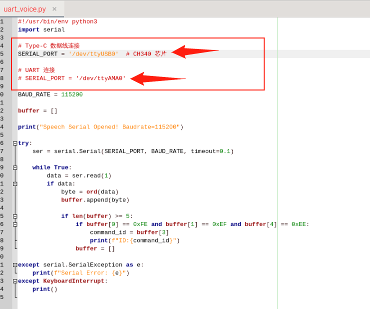
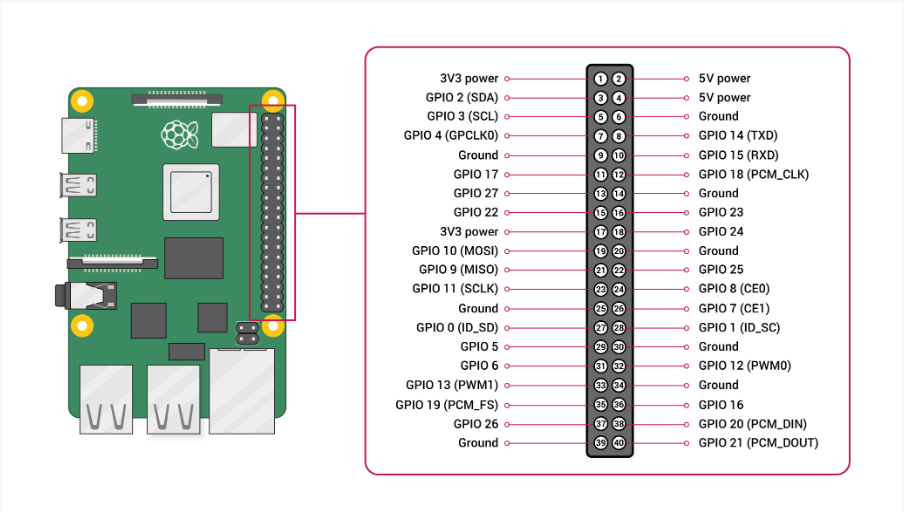
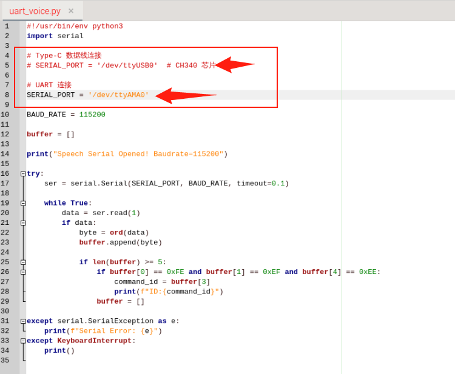

# Raspberry Pi: Comunicazione della porta seriale

## Installazione delle dipendenze

```Plain Text
sudo apt-get update
```

```Plain Text
sudo apt-get install -y python3-smbus python3-serial
```

## Posizione dei file

`~/UART_Voice/uart_voice.py`

## Abilitazione della porta seriale

Modificare `/boot/firmware/config.txt` o `/boot/config.txt` e assicurarsi della seguente configurazione:

```Plain Text
enable_uart=1
dtoverlay=disable-bt
```

Riavviare quindi il Raspberry Pi.

```Plain Text
sudo reboot
```

## Descrizione del cablaggio

Con il collegamento diretto del cavo Type al Raspberry Pi, rimuovere il commento da `SERIAL_PORT = '/dev/ttyUSB0'` e commentare `SERIAL_PORT = '/dev/ttyAMA0'`



Collegamento al Raspberry Pi tramite i pin UART



Commentare `SERIAL_PORT = '/dev/ttyUSB0'` e rimuovere il commento da `SERIAL_PORT = '/dev/ttyAMA0'`



## Esecuzione

```Plain Text
cd UART_Voice
```

```Plain Text
python3 uart_voice.py
```

## Formato dell'output

```Plain Text
Speech Serial Opened! Baudrate=115200
ID:4
ID:1
ID:10
```

<RelatedProducts slugs="ai-voice-module" />
