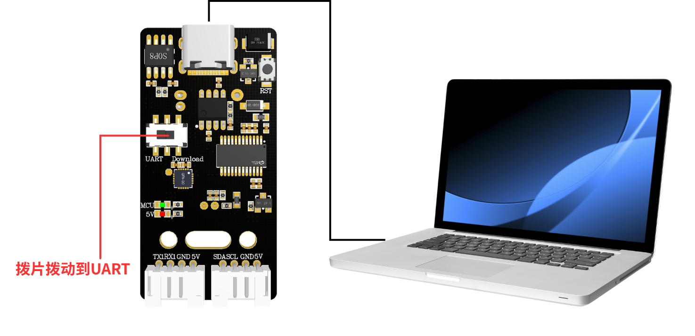

# Modifica della parola di attivazione e delle parole di comando

## 1. Precauzioni

Eseguire la modifica della parola di attivazione in un ambiente silenzioso; un ambiente rumoroso influisce sull'accuratezza del riconoscimento del modulo di interazione vocale.

Quando si pronuncia una voce, il volume deve essere alto e il ritmo non troppo veloce; si consiglia di rimanere entro 5 metri dal modulo.

## 2. Connessione del dispositivo

## 3. Modifica della parola di attivazione

Pronunciare “你好，小犀” al modulo di interazione vocale per attivarlo; quando il modulo risponde “我在”, significa che si trova nello stato di riconoscimento  pronunciare poi la voce “学习唤醒词” al modulo di interazione vocale, il modulo risponde “说出唤醒词” e si entra così nella modalità di apprendimento della parola di attivazione  pronunciare quindi al modulo di interazione vocale la parola di attivazione che si desidera impostare, mantenendola il più breve possibile; qui si prende come esempio l'impostazione di “你好，小犀”  quando il modulo di interazione vocale riconosce correttamente, riproduce “学习成功”, indicando che la modifica della parola di attivazione è riuscita; a questo punto è possibile utilizzare la voce “你好小犀” per attivare il modulo.

Nota: la parola di attivazione “你好，小犀” presente nel firmware di fabbrica è una parola di attivazione di base e non può essere modificata o eliminata tramite voce. La parola di attivazione modificata dall'utente tramite voce può esistere una sola alla volta e coesiste con la parola di attivazione di base

## 4. Modifica delle parole di comando

Nel firmware di fabbrica del modulo di interazione vocale sono preimpostate 8 parole di comando modificabili tramite voce, come mostrato di seguito:

Di seguito un esempio d'uso:

Pronunciare "你好，小犀" al modulo di interazione vocale per attivarlo; quando il modulo risponde “我在”, significa che si trova nello stato di riconoscimento  pronunciare poi la voce “学习停车指令” al modulo di interazione vocale, il modulo risponde “请说指令” e si entra così nella modalità di apprendimento delle parole di comando  pronunciare quindi al modulo di interazione vocale la parola di comando che si desidera impostare, che dovrebbe essere il più breve possibile; qui si prende come esempio l'impostazione di “前方停车”  quando il modulo di interazione vocale riconosce correttamente, riproduce “学习成功”, indicando che la modifica della parola di comando è riuscita; a questo punto è possibile utilizzare la voce “前方停车” per ottenere lo stesso effetto della parola di comando “停车”  se occorre eliminare la voce ”前方停车“, è sufficiente pronunciare ”删除停车指令“ e, quando il modulo risponde ”删除成功”, la voce viene eliminata (in questo caso viene eliminata solo “前方停车”, non ”停车“).

Nota: le parole di comando del firmware di fabbrica sono parole di comando di base e non possono essere modificate o eliminate tramite voce; la parola di comando modificata dall'utente tramite voce può esistere una sola alla volta e coesiste con le parole di comando di base.

