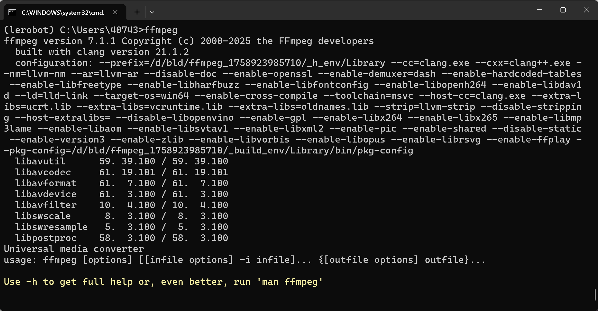
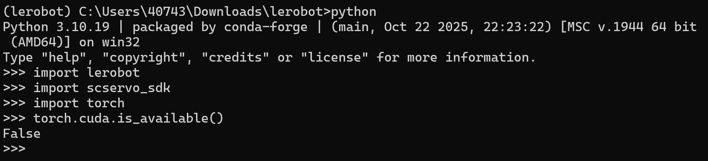

# Passo 1: Installare l'ambiente LeRobot (Windows)

Il braccio attivo nero utilizza un alimentatore 5V6A

Il braccio passivo bianco utilizza un alimentatore 12V5A

## Installare Miniconda

anaconda.com/download/success

Oppure clicca direttamente su questo link per scaricare il pacchetto di installazione

https://repo.anaconda.com/miniconda/Miniconda3-latest-Windows-x86_64.exe


## Cambiare il mirror di conda

```Shell
# Svuota prima la configurazione dei mirror esistente (per evitare conflitti)
conda config --remove-key channels

# Sostituisci i mirror predefiniti di conda e i comuni mirror di terze parti con il mirror di Tsinghua
# Aggiungi i mirror predefiniti dei pacchetti (main/r/msys2)
conda config --add channels https://mirrors.tuna.tsinghua.edu.cn/anaconda/pkgs/main/
conda config --add channels https://mirrors.tuna.tsinghua.edu.cn/anaconda/pkgs/r/
conda config --add channels https://mirrors.tuna.tsinghua.edu.cn/anaconda/pkgs/msys2/

# Aggiungi i comuni mirror di terze parti
conda config --add channels https://mirrors.tuna.tsinghua.edu.cn/anaconda/cloud/conda-forge/
conda config --add channels https://mirrors.tuna.tsinghua.edu.cn/anaconda/cloud/msys2/
conda config --add channels https://mirrors.tuna.tsinghua.edu.cn/anaconda/cloud/bioconda/
conda config --add channels https://mirrors.tuna.tsinghua.edu.cn/anaconda/cloud/menpo/
conda config --add channels https://mirrors.tuna.tsinghua.edu.cn/anaconda/cloud/pytorch/

# Attiva la visualizzazione dei mirror: durante l'installazione dei pacchetti verrà mostrato l'indirizzo di download specifico
conda config --set show_channel_urls yes

# Cancella la cache degli indici per rendere effettivi i nuovi mirror
conda clean -i

# Visualizza la configurazione attuale (per verificare che i mirror siano stati aggiunti correttamente)
conda config --show-sources
```

## Creare l'ambiente virtuale

```Shell
conda create -y -n lerobot python=3.12
```

## Attivare l'ambiente virtuale

```Shell
conda activate lerobot
```

## Installare ffmpeg

```Shell
conda install ffmpeg=7.1.1 -c conda-forge -y
```

Verificare che l'installazione sia riuscita

```Shell
ffmpeg
```




## Scaricare LeRobot

- Scarica il repository ufficiale di LeRobot

```Shell
git clone https://github.com/huggingface/lerobot.git
```

## Installare il repository del codice

```Shell
cd lerobot
```

```Plain Text
pip install -e ".[feetech]"
```


## Verificare che l'installazione sia riuscita

```Shell
python

import lerobot
import scservo_sdk
import torch
torch.cuda.is_available()
```



<RelatedProducts slugs="so-arm101" />
