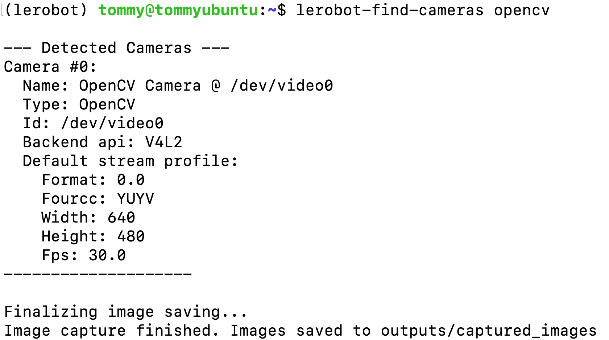

# Passo 5: Teleoperazione con telecamera (Ubuntu)

## Collegare la telecamera al computer

```Shell
lerobot-find-cameras opencv
```



## Teleoperazione e visualizzazione dell'immagine della telecamera

```Shell
lerobot-teleoperate \
    --robot.type=so101_follower \
    --robot.port=/dev/ttyACM0 \
    --robot.id=my_follower_arm \
    --robot.cameras="{ front: {type: opencv, index_or_path: 1, width: 1280, height: 720, fps: 30, fourcc: "MJPG"}}" \
    --teleop.type=so101_leader \
    --teleop.port=/dev/ttyACM1 \
    --teleop.id=my_leader_arm \
    --display_data=true
```

## Più telecamere: teleoperazione e visualizzazione dell'immagine della telecamera

```Shell
lerobot-teleoperate \
    --robot.type=so101_follower \
    --robot.port=/dev/ttyACM0 \
    --robot.id=my_follower_arm \
    --robot.cameras="{ front: {type: opencv, index_or_path: 0, width: 1280, height: 720, fps: 30, fourcc: "MJPG"}, side: {type: opencv, index_or_path: 1, width: 1280, height: 720, fps: 30, fourcc: "MJPG"}}" \
    --teleop.type=so101_leader \
    --teleop.port=/dev/ttyACM1 \
    --teleop.id=my_leader_arm \
    --display_data=true
```

<RelatedProducts slugs="so-arm101" />
