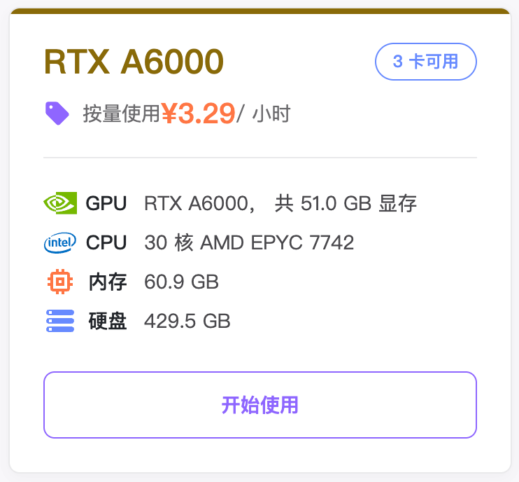
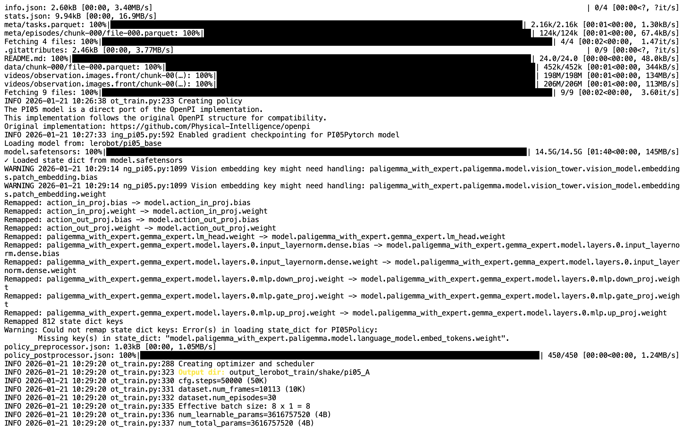

# Passo 7: Comando di addestramento pi0.5

## Prima di eseguire

- **Ambiente**: attiva prima un'istanza seguendo [Configurazione dell'ambiente di addestramento su GPU cloud](/it/tutorials/robot-arms/so-arm101/lerobot/07-Training/Cloud-GPU) e carica il dataset, poi torna a questo capitolo per eseguire le sezioni "Installare l'ambiente" e "Comandi"
- **Dataset**: `--dataset.root=~/lerobot_my_dataset_shake_hands` nel comando punta al dataset di stretta di mano acquisito nel sesto passo. Se stai addestrando un tuo task, sostituiscilo con il nome del tuo dataset
- **Directory di output**: se `--output_dir` esiste già, eliminala prima con il comando `sudo rm -rf` indicato sopra, oppure usa un nuovo nome
- **Durante l'addestramento puoi in qualsiasi momento visualizzare le curve su wandb**, vedi [Visualizzare le curve di addestramento in tempo reale con wandb](/it/tutorials/robot-arms/so-arm101/lerobot/07-Training/WandB-Curves)

## Documentazione di riferimento

https://github.com/huggingface/lerobot/blob/46e19ae579f80ce66211afafd1c3c649c569131f/docs/source/pi0.mdx

https://www.pi.website/blog/pi05

## Istanza GPU cloud consigliata



## Installazione dell'ambiente

```Shell
cd lerobot
pip install -e ".[pi0]"
```

## Comandi

- Eliminare i file presenti nella directory output di un addestramento precedente interrotto

```Shell
sudo rm -rf output_lerobot_train/shake/pi05_A
```

- Addestramento

```Shell
lerobot-train \
    --dataset.repo_id=<用户名>/lerobot_my_dataset_shake_hands \
    --dataset.root=~/lerobot_my_dataset_shake_hands \
    --dataset.revision=v0.1.0 \
    --policy.type=pi05 \
    --output_dir=~/output_lerobot_train/shake/pi05_A \
    --job_name=shake_pi05_A \
    --policy.pretrained_path=lerobot/pi05_base \
    --policy.compile_model=true \
    --policy.gradient_checkpointing=true \
    --policy.dtype=bfloat16 \
    --policy.freeze_vision_encoder=false \
    --policy.train_expert_only=false \
    --steps=50000 \
    --policy.device=cuda \
    --policy.push_to_hub=false \
    --wandb.enable=true \
    --wandb.project=Lerobot_my_Project \
    --batch_size=8
```




L'addestramento inizia davvero solo dopo 20 minuti dall'esecuzione del comando

L'archivio del modello è di circa 5 GB, che diventano 7 GB una volta decompresso

<RelatedProducts slugs="so-arm101" />
