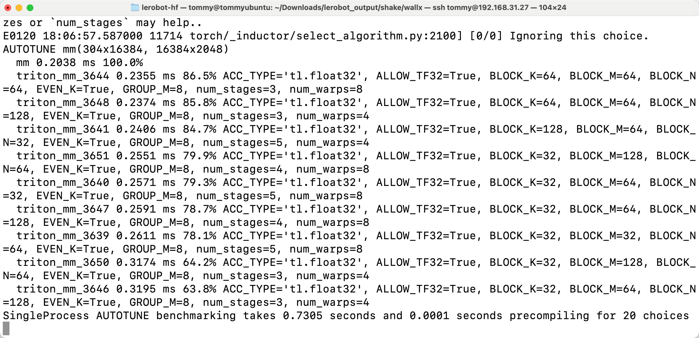
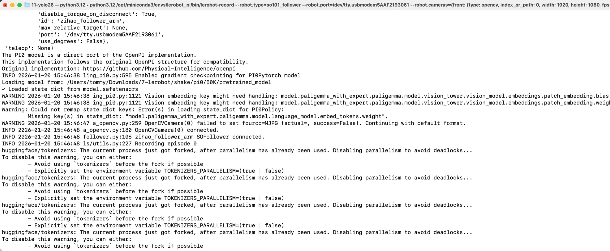

# Passo 8: Comando di deployment pi0

> Per il deployment si usa uniformemente `lerobot-rollout`; per l'uso e i parametri vedi [Descrizione dei comandi](/it/tutorials/robot-arms/so-arm101/lerobot/08-Inference/CLI-Reference).

## Ubuntu

- Eliminare il dataset esistente (se presente)

```Shell
sudo chmod 666 /dev/ttyACM*
sudo rm -rf /home/<nome-utente>/.cache/huggingface/lerobot/<nome-utente>/rollout_lerobot_my_dataset_shake_hands
export TOKENIZERS_PARALLELISM=false
```

- Comando di deployment

```Shell
lerobot-rollout  \
  --strategy.type=base \
  --robot.type=so101_follower \
  --robot.port=/dev/ttyACM0 \
  --robot.cameras="{ front: {type: opencv, index_or_path: 0, width: 1280, height: 720, fps: 30, fourcc: "MJPG"}}" \
  --robot.id=my_follower_arm \
  --policy.path=/home/<nome-utente>/Downloads/lerobot_output/shake/pi0/50K/pretrained_model \
  --task="Shake Hands" \
  --duration=60 \
  --display_data=false
```




## Mac

- Eliminare il dataset esistente (se presente)

```Shell
sudo rm -rf /Users/<nome-utente>/.cache/huggingface/lerobot/<nome-utente>/rollout_lerobot_my_dataset_shake_hands
```

- Comando di deployment

```Shell
lerobot-rollout  \
  --strategy.type=base \
  --robot.type=so101_follower \
  --robot.port=/dev/tty.usbmodem5AAF2193061 \
  --robot.cameras="{front: {type: opencv, index_or_path: 0, width: 1280, height: 720, fps: 30, fourcc: "MJPG"}}" \
  --robot.id=my_follower_arm \
  --policy.freeze_vision_encoder=false \
  --policy.dtype=bfloat16 \
  --policy.compile_model=true \
  --policy.device=cpu \
  --policy.path=/Users/<nome-utente>/Downloads/7-lerobot/shake/pi0/50K/pretrained_model \
  --task="Shake Hands" \
  --duration=60 \
  --display_data=false
```




## Motivi dei movimenti a scatti del braccio robotico durante l'inferenza su Mac

- Il dataset è troppo piccolo

- La VRAM della scheda grafica non è sufficiente: serve una scheda della serie 50

<RelatedProducts slugs="so-arm101" />
