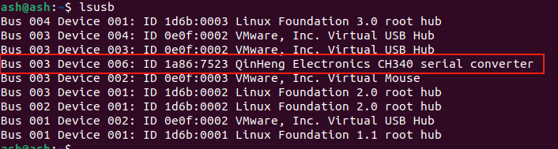

# ROS: preparazione

#### 1、Compilazione del modulo GPS

（1）Dopo aver creato lo spazio di lavoro, copiare il contenuto della cartella gps_src nella directory src dello spazio di lavoro, quindi compilare con colcon build; se non compaiono errori la compilazione è andata a buon fine;

Eseguire nella directory ~/gps_ros2

```
colcon build
```

Eseguire nella directory ~/gps_ros2 

```
source install/setup.bash
```

（2）Descrizione del contenuto dei pacchetti:

- nmea_navsat_driver: funzioni quali avvio del modulo GPS, lettura dei dati del modulo GPS e tracciamento dei dati GPS;
- nmea_msgs: contiene alcuni file msg dei messaggi GPS
- imu_gps_localization: funzione di fusione dei dati IMU e GPS
- gps_goal: converte i dati di latitudine e longitudine in dati di navigazione di destinazione Nav2

#### 2、Associazione della porta del GPS

Il modulo GPS si collega al computer o al controllore principale tramite la porta seriale, pertanto è necessario associare correttamente la porta del GPS per evitare che problemi legati al numero di porta impediscano al computer o al controllore principale di riconoscere il modulo GPS.

（1）Controllare i dispositivi USB collegati, individuare il modulo GPS e digitare **lsusb** nel terminale per cercare l'ID del dispositivo a cui è collegato il GPS; come mostrato nella figura seguente, questo è l'ID di identificazione del modulo GPS,



（2）Una volta noto l'ID del dispositivo, occorre scrivere il file rules e associare la porta; digitare nel terminale,

```
sudo gedit /etc/udev/rules.d/my_serial.rules 
```

Copiare il seguente contenuto all'interno:

```
KERNEL=="ttyUSB*", ATTRS{idVendor}=="1a86", ATTRS{idProduct}=="7523", MODE:="0777", SYMLINK+="myserial"
```

Salvare e uscire, quindi assegnare i permessi di esecuzione digitando nel terminale,

```
sudo chmod 777 /etc/udev/rules.d/my_serial.rules 
```

（3）Ricollegare il modulo GPS e digitare ll /dev/myserial nel terminale per verificare se l'associazione è riuscita; se compare la schermata seguente l'associazione è riuscita,

```
ll /dev/myserial
```


<RelatedProducts slugs="gps-beidou-module" />
