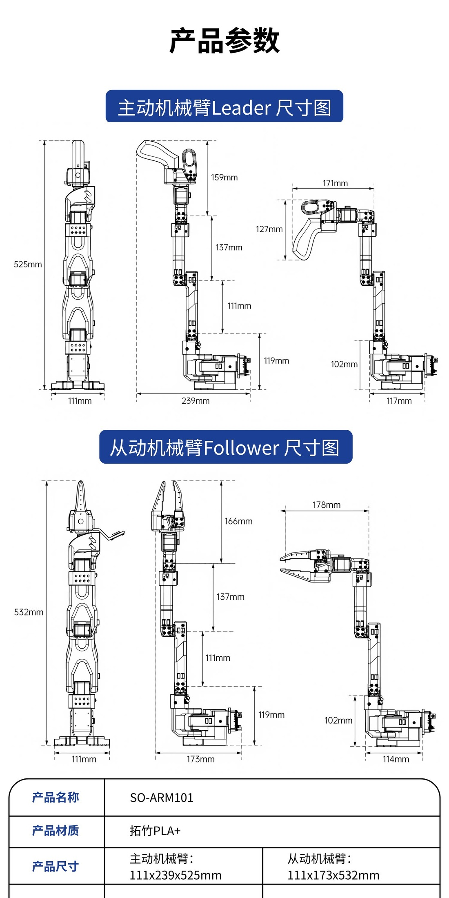

# SO-ARM101 開発キット

> **[ストアで購入](https://www.juxitech.com/ja/products/so-arm101-developers-kit)**

## 製品概要

SO-ARM101 はJuxi Technologyがオープンソースで提供する 6-DOF 双腕ロボット開発キットです。**LeRobot** エコシステムに深く統合され、leader-follower 遠隔操作、模倣学習データ収集、ポリシー訓練に対応します。黒色のリーダーアーム + 白色のフォロワーアームで、開封後すぐに使用可能です。

**主な特長**:

- 両腕各 6 DOF、バスサーボ駆動
- LeRobot(HuggingFace)に深く対応、ACT/Diffusion/Pi0 などのポリシーをサポート
- Jetson / PC(Linux)プラットフォーム対応
- ハードウェア完全オープンソース(回路図/CAD/ファームウェア)

## 一、ハードウェア設計：高性能でモジュール化、組み立てやすくカスタマイズ可能

- **構造材質**：コア構造は 3D プリント部品と補強された耐荷重部品を組み合わせており、配線と関節の設計を最適化して動作干渉を防ぎ、軽量化と耐久性を両立しています。ユーザーは構造部品を自分でプリントして交換・拡張できます。

- **駆動構成**：フォロワーアームには**6 個の 12V 30KG 大トルク磁気エンコーダサーボ**を搭載し、360° 磁気エンコーダフィードバックと PID 制御アルゴリズムを組み合わせることで、動きは滑らかでブレがなく、繰り返し位置決め精度が高く、パワフルかつ動作が正確です。リーダーアームには**6 個の 7.4V サーボ**を採用し、関節の負荷に応じて異なる減速比を割り当てており、手動でのドラッグ教示が容易です。

- **視覚システム**：デュアルカメラのスマートビジョンシステムに対応し、先端カメラが近距離の把持の細部を捉え、グローバルカメラが作業環境をカバーします。2 台のカメラのデータを融合して立体的なモデルを構築し、模倣学習に豊富なデータを提供します。

- **制御接続**：サーボドライバ基板を備え、USB-C インターフェースでパソコンや Raspberry Pi に直接接続でき、プラグアンドプレイでハードウェア接続の手順を簡素化し、制御環境を素早く構築できます。

## 二、ソフトウェアエコシステム：LeRobot を深く統合し、AI 開発の敷居はゼロ

- **コアフレームワーク互換**：Hugging Face の **LeRobot オープンソースロボット ML フレームワーク**に深く適合し、PyTorch をベースに構築されており、事前学習済みモデル、多様なシーンのデータセット、シミュレーション環境を内蔵し、Stanford ALOHA などの有名なオープンソースデータセットと互換性があります。

- **低遅延通信**：**DORA 分散データフローエンジン**を採用し、ハードウェアとアルゴリズムの低遅延な連携を実現します。Python の実行性能は ROS2 より 17 倍速く、コードのホットリロードに対応し、再起動なしでポリシーをリアルタイムに調整できます。

- **フルスタックオープンソース**：ハードウェアの 3D プリントファイル、ソフトウェアの制御コード、AI 学習スクリプト、およびチュートリアル一式が**完全にオープンソース**で、ユーザーは自由に改変・二次開発でき、個別の機能拡張を素早く実現できます。

## 三、主な応用シーン：入門から実装まで、あらゆるシーンに対応

1. **ロボット教育入門**：ロボットアームの組み立て、基礎プログラミングから AI ポリシーのデプロイまでの全工程チュートリアルを提供し、可視化された操作インターフェースとサンプルコードを用意しています。初心者でもロボット制御と AI 応用のスキルを素早く習得できます。

2. **研究アルゴリズムの検証**：**模倣学習、強化学習**の研究に注力し、VR で人間の操作データを記録してロボットを学習させることをサポートします。代表的な事例：50 本の 15 秒の操作動画をもとに、2 時間の学習で服たたみ、鍵の挿入、部品の仕分けなどのタスクを習得できます。

3. **軽量な産業プロトタイプ**：低コストで自動化方案を検証し、**資材運搬、精密組立、部品の仕分け**などのシーンに対応します。千元クラスのコストで産業グレードのロボットアームの中核機能を実現し、プロトタイプ検証を素早く実装します。

## 仕様

| カテゴリ | 仕様 |
|------|------|
| タイプ | 双腕遠隔操作ロボット |
| 自由度 | 各腕 6 DOF |
| 駆動 | Feetech バスサーボ |
| ホスト | PC (Linux) / Jetson |
| エコシステム | LeRobot, ROS 2, ROS 1 |
| 電源 | リーダー 5V6A / フォロワー 12V5A |
| ペイロード | 500g |
| 繰り返し位置決め精度 | ±0.1mm |
| 作業半径 | 520mm |
| 通信方式 | USB-C |
| 材質 | Bambu Lab PLA+ |
| 寸法(リーダー / フォロワー) | 111×239×525 mm / 111×173×532 mm |



## クイックスタート

```bash
git clone https://github.com/Juxi-Technology/lerobot.git
cd lerobot && pip install -e ".[feetech]"

lerobot-calibrate --robot.type=so101_follower --robot.port=/dev/ttyACM0

lerobot-teleoperate --robot.type=so101_follower --robot.port=/dev/ttyACM0 \
  --teleop.type=so101_leader --teleop.port=/dev/ttyACM1
```

## 関連チュートリアル

- [SO-ARM101 チュートリアル](/ja/tutorials/robot-arms/so-arm101/SO-ARM101-Tutorial)
- [SO-ARM101 組み立てチュートリアル](/ja/tutorials/robot-arms/so-arm101/SO-ARM101-Assembly)
- [ロボットアーム選定ガイド](/ja/tutorials/robot-arms/select-guide)
- [具身知能入門(LeRobot)](/ja/topics/embodied-ai-intro)

## サポート

- 📧 メール: support@juxitech.com
- 🌐 公式サイト: [www.juxitech.com](https://www.juxitech.com)
