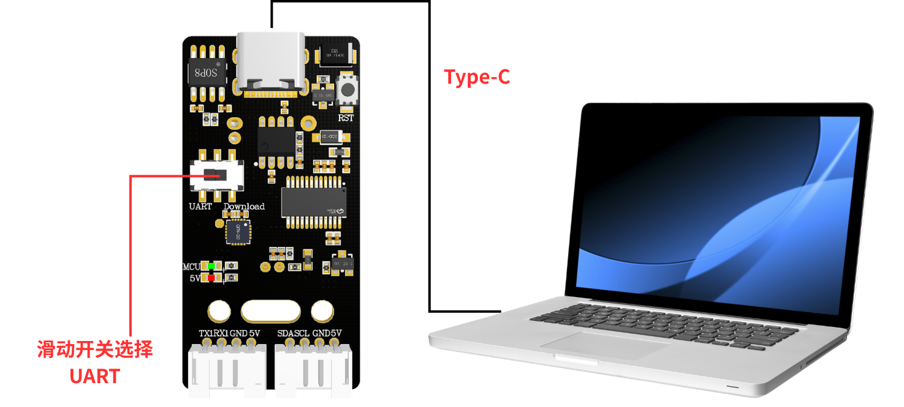
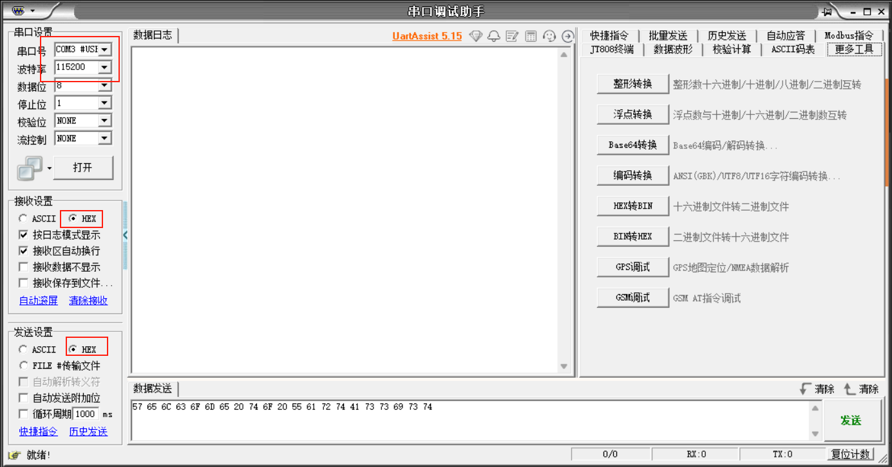
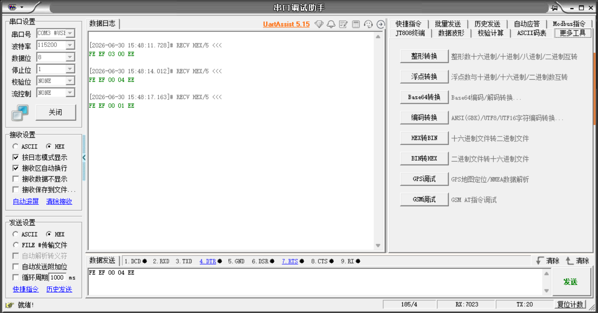
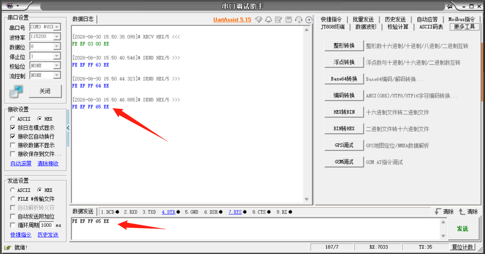

# PC 通信

## デバイスの接続

スライドスイッチを STC8 シリアルモードに移動します

## シリアルデバッグアシスタントを開く

- Uart Assistant を開き、対応するシリアルポート番号とボーレート 115200 を選択します

- 圧縮ファイル内の命令词播报词协议列表V1_中文ファイルを参照します

- “小车前进” と発話すると、シリアルデバッグアシスタントに対応するプロトコルが出力されます

- 命令词播报词协议列表V1_中文ファイルに従って対応するコマンドを入力すると、音声モジュールが対応するプロトコルの文字を再生します

音声モジュールが正常に再生されるのを聞くことができます。

<RelatedProducts slugs="ai-voice-module" />
