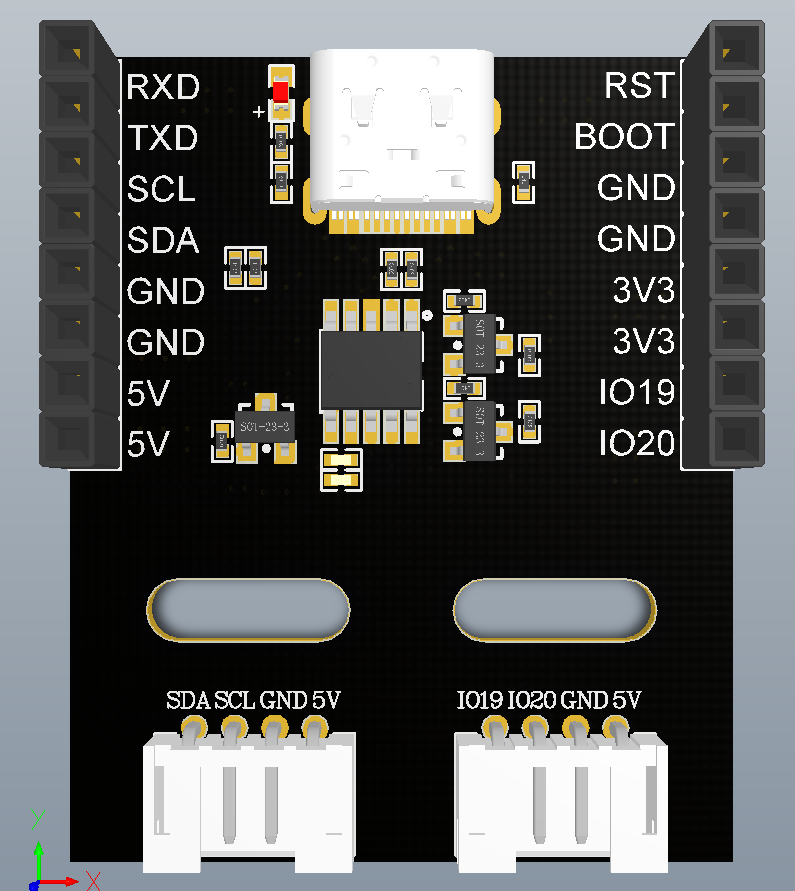

# ESP32-NanoCam クイックスタート

> **[ストアで購入](https://www.juxitech.com/ja/products/esp32-s3-wifi-video-module)**

---

## 事前準備

- NanoCam コアボード + ベースボード (ESP32-S3 N16R8 + CH340K)
- USB Type-C データケーブル (データ転送対応)
- パソコン(Windows / Mac / Linux)
- GC2145 カメラモジュール(出荷時に接続済み)




---

## ステップ 1:ファームウェアの書き込み(3 分)

### 方法 A:開発環境不要(推奨)

1. ブラウザで [esptool-js](https://espressif.github.io/esptool-js/) にアクセス
2. Type-C ケーブルで NanoCam をパソコンに接続
3. シリアルポートを選択、ボーレート 115200
4. 解凍したアーカイブ内にあるファームウェアファイル `nanocam_xxx.bin` を確認
5. ファームウェアファイル `nanocam_xxx.bin` を選択、アドレス `0x0`
6. "START" をクリックし、完了を待つ

### 方法 B:コマンドライン(上級者向け)

```Bash
pip install esptool
esptool.py --chip esp32s3 --port COM3 write_flash 0x0 nanocam.bin
```

---

## ステップ 2:WiFi に接続(2 分)

NanoCam はデフォルトで **AP+STA デュアルモードが同時に動作**し、切替は不要です:
- **AP ホットスポット**は常時有効。スマホから `NanoCam-AP`(パスワード `12345678`)に直接接続し、ブラウザで `http://192.168.4.1` を開きます
- **STA ルーター接続**は WiFi を一度設定する必要があります:
シリアルツール(ボーレート **115200 8N1**)で NanoCam の Type-C ポートに接続します:

```Plaintext
sta_ssid:あなたのWiFi名
sta_pd:あなたのWiFiパスワード
```

> `OK` を受信すると設定成功です。パスワード変更後は自動的に再起動します。
WiFi モードを切り替えたい場合(通常は不要):

|指令|モード|説明|
|---|---|---|
|`wifi_mode:0`|AP のみ|STA を停止し、ホットスポットのみ維持|
|`wifi_mode:1`|STA のみ|ホットスポットを停止し、ルーターのみ接続|
|`wifi_mode:2`|AP+STA|デフォルト。両方が同時に動作|

---

## ステップ 3:映像を開く(1 分)

1. シリアルで `sta_ip` を送信して STA IP を取得
2. ブラウザで `http://<IPアドレス>` を入力(または AP モードでは `http://192.168.4.1`)
3. Web ページでリアルタイム映像を確認できます

---

## ステップ 4:AI を使いこなす(2 分)

シリアルで以下のコマンドを送信してモードを切り替えます:

|指令|モード|効果|
|---|---|---|
|`ai_mode:0`|通常動画転送|リアルタイム MJPEG 映像|
|`ai_mode:1`|猫顔検出|映像に猫顔の検出枠を表示|
|`ai_mode:2`|顔検出|映像に顔の検出枠を表示|
|`ai_mode:3`|色認識|色を枠で選択→リアルタイム追跡|
|`ai_mode:4`|顔認証|登録→識別→削除|
|`ai_mode:5`|QRコードスキャン|QR コードを合わせる→シリアルに内容を出力|
|`ai_mode:6`|LLM エージェント|音声ウェイク「你好小智」(XiaoZhi AI)|
|`ai_mode:7`|ESP-Claw|ESP-Claw AI Agent (Espressif 公式フレームワーク)|

> モード切替のたびに手動での再起動が必要です。モジュールの RST ボタンを押して再起動すると、新しいモードが有効になります。

---

## ステップ 5:プロジェクトへの統合

### Arduino での制御

```C++
Serial.begin(115200);
Serial.print("ai_mode:2");  // 顔検出に切り替え
```

### Python での制御

```Python
import serial
ser = serial.Serial("COM3", 115200)
ser.write(b"ai_mode:1\r\n")  # 猫顔検出に切り替え
```

### 完全なコマンドを確認

→ シリアルプロトコルマニュアル

---

## よくある質問

|問題|解決方法|
|---|---|
|書き込みに失敗する|Type-C ケーブルがデータ転送に対応しているか確認し、ベースボードの S2(BOOT)を押しながら電源を再投入|
|映像が表示されない|シリアルで `sta_ip` を送信して IP を確認し、同じネットワークセグメントか確認|
|カメラが映らない|FPC ケーブルの金属接点を下向きにして確実に差し込み、PWDN(IO12)/RESET(IO14)を確認|
|WiFi に接続できない|`wifi_reset` を送信して工場出荷状態に戻し、再設定|

その他の質問 → [FAQ](https://FAQ.md)

---

## 次のステップ

- 📖 [シリアルプロトコルマニュアル](./ESP32-NanoCam-Serial-Protocol.md) — 完全な AT コマンドリファレンス
- 🎓 [チュートリアル概要](./Ch01-Environment-Setup.md) — 段階的チュートリアル(本 wiki では 11 章を収録)
- 🔧 [ハードウェア仕様書](./ESP32-NanoCam-Hardware-Spec.md) — GPIO ピン全マッピング
- 🤖 [ROS2 統合ガイド](/ja/tutorials/robot-arms/so-arm101/SO-ARM101-NanoCam-Wireless-Teleop) — micro-ROS ワイヤレス遠隔操作チュートリアル

<RelatedProducts slugs="esp32-s3-wifi-module" />
