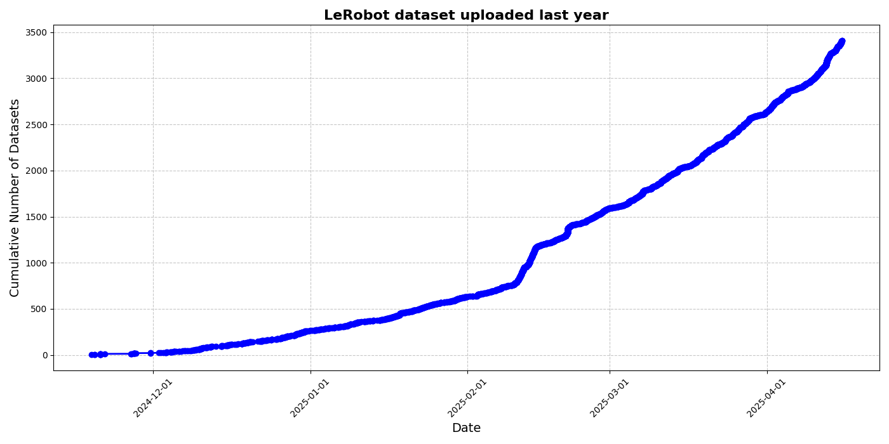
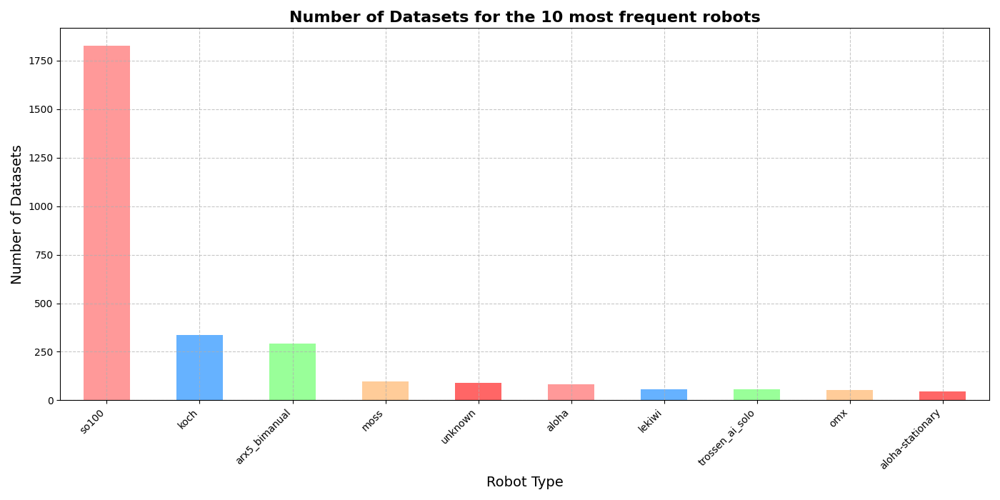

# HuggingFace上のLeRobotデータセット

## LeRobot形式のオープンソースデータセット

https://huggingface.co/blog/lerobot-datasets#what-makes-a-good-dataset

## いくつか興味深いLeRobotデータセット

異なる色のキャンディ豆を選別する

https://huggingface.co/spaces/lerobot/visualize_dataset?path=%2FMarkusWuenstel%2Fso101-sort-color-joint-angles-preprocessed%2Fepisode_0

レゴブロックを箱に入れる

https://huggingface.co/spaces/lerobot/visualize_dataset?path=%2Flerobot%2Fsvla_so101_pickplace%2Fepisode_0

机の上を片付ける

https://huggingface.co/spaces/lerobot/visualize_dataset?path=%2Fyouliangtan%2Fso101-table-cleanup%2Fepisode_0

積み木を押す

https://huggingface.co/spaces/lerobot/visualize_dataset?path=%2FIPEC-COMMUNITY%2Flanguage_table_lerobot%2Fepisode_17

T字型の部品を正しい位置に置く（シミュレーションデータ）

https://huggingface.co/spaces/lerobot/visualize_dataset?path=%2Flerobot%2Fpusht%2Fepisode_15

引き出しを閉める

https://huggingface.co/spaces/lerobot/visualize_dataset?path=%2Flirislab%2Fclose_top_drawer_teabox%2Fepisode_1

チェスの対局で、駒をハイライトされたマスに置く

https://huggingface.co/spaces/lerobot/visualize_dataset?path=%2FChojins%2Fchess_game_001_blue_stereo%2Fepisode_1

動物の積み木を並べる

https://huggingface.co/spaces/lerobot/visualize_dataset?path=%2Fpierfabre%2Fchicken%2Fepisode_6

さまざまな家事

https://huggingface.co/spaces/lerobot/visualize_dataset?path=%2Fcadene%2Fdroid_1.0.1%2Fepisode_13

<RelatedProducts slugs="so-arm101" />
