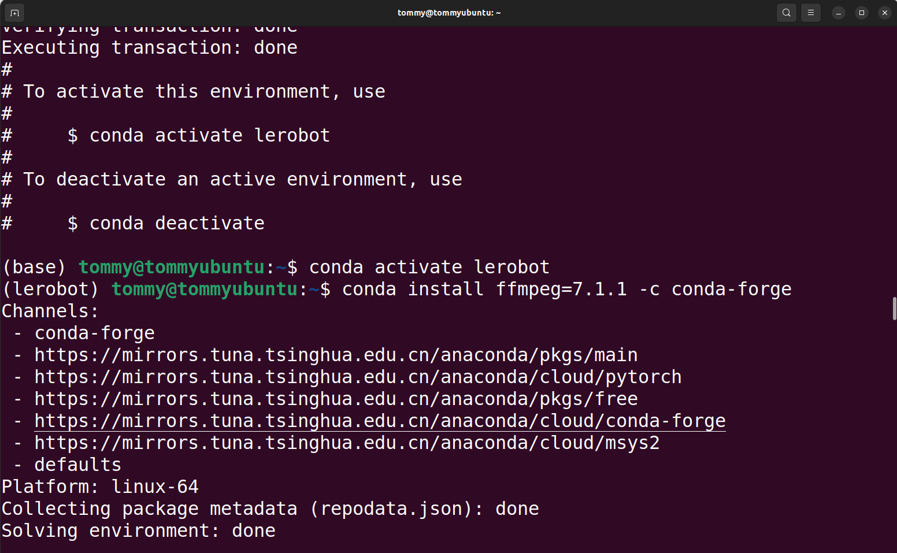
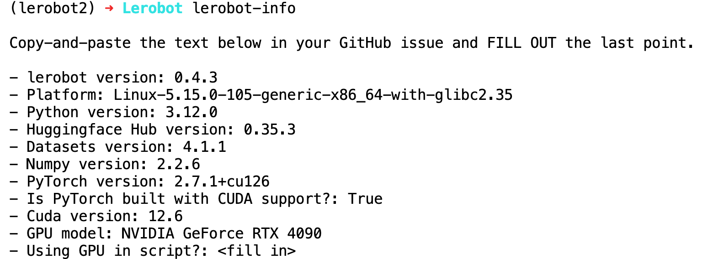
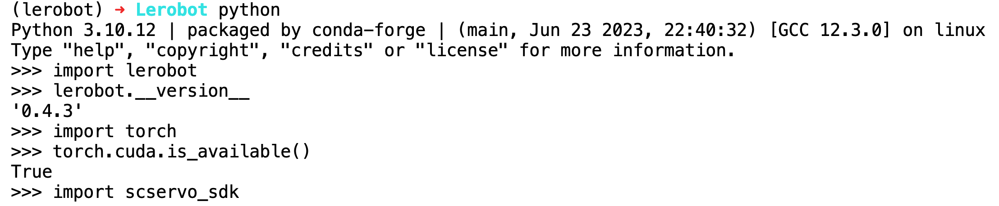

# ステップ1:LeRobot環境のインストール（Ubuntu）

黒色のリーダーアーム（Leader）は 5V6A 電源アダプターを使用します

白色のフォロワーアーム（Follower）は 12V5A 電源アダプターを使用します

## Minicondaのインストール

https://www.anaconda.com/download

## pipのソース変更

```Shell
pip config set global.index-url https://mirrors.aliyun.com/pypi/simple
```

## condaのソース変更

```Shell
# 既存の .condarc 設定をクリア（任意、競合を回避）
echo "" > ~/.condarc

# 清華ミラーの設定を書き込む
cat << EOF > ~/.condarc
channels:
  - defaults
show_channel_urls: true
default_channels:
  - https://mirrors.tuna.tsinghua.edu.cn/anaconda/pkgs/main
  - https://mirrors.tuna.tsinghua.edu.cn/anaconda/pkgs/r
  - https://mirrors.tuna.tsinghua.edu.cn/anaconda/pkgs/msys2
custom_channels:
  conda-forge: https://mirrors.tuna.tsinghua.edu.cn/anaconda/cloud
  msys2: https://mirrors.tuna.tsinghua.edu.cn/anaconda/cloud
  bioconda: https://mirrors.tuna.tsinghua.edu.cn/anaconda/cloud
  menpo: https://mirrors.tuna.tsinghua.edu.cn/anaconda/cloud
  pytorch: https://mirrors.tuna.tsinghua.edu.cn/anaconda/cloud
  pytorch-lts: https://mirrors.tuna.tsinghua.edu.cn/anaconda/cloud
  simpleitk: https://mirrors.tuna.tsinghua.edu.cn/anaconda/cloud
EOF

# キャッシュをクリアして設定を反映させる
conda clean -i
```

## 仮想環境の作成

```Shell
conda create -y -n lerobot python=3.12 -y
```

## 仮想環境への移行

```Shell
conda activate lerobot
```

## ffmpegのインストール

```Shell
conda install ffmpeg=7.1.1 -c conda-forge -y
```

インストール成功の確認

```Shell
ffmpeg
```




## LeRobot公式コードリポジトリのダウンロード

```Shell
git clone https://github.com/huggingface/lerobot.git
```

## コードリポジトリのインストール

```Shell
#cd lerobot-main
cd lerobot

pip install -e ".[feetech]"
```


## インストール成功の確認

```Shell
lerobot-info

python

import lerobot
lerobot.__version__

import torch
torch.cuda.is_available()
import scservo_sdk
```

## 4090ホストでの実行結果





## NVIDIA DGX Spark での実行結果


<RelatedProducts slugs="so-arm101" />
