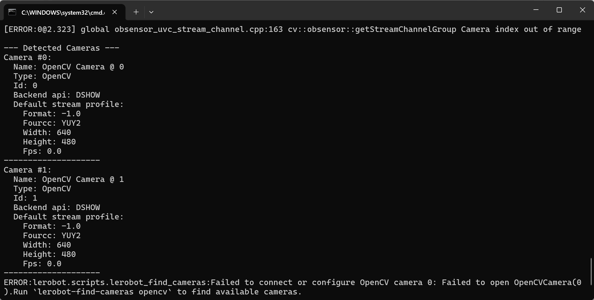
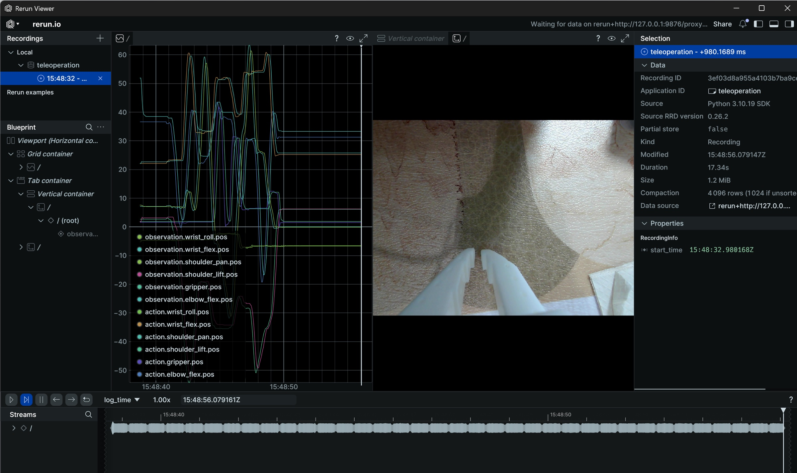
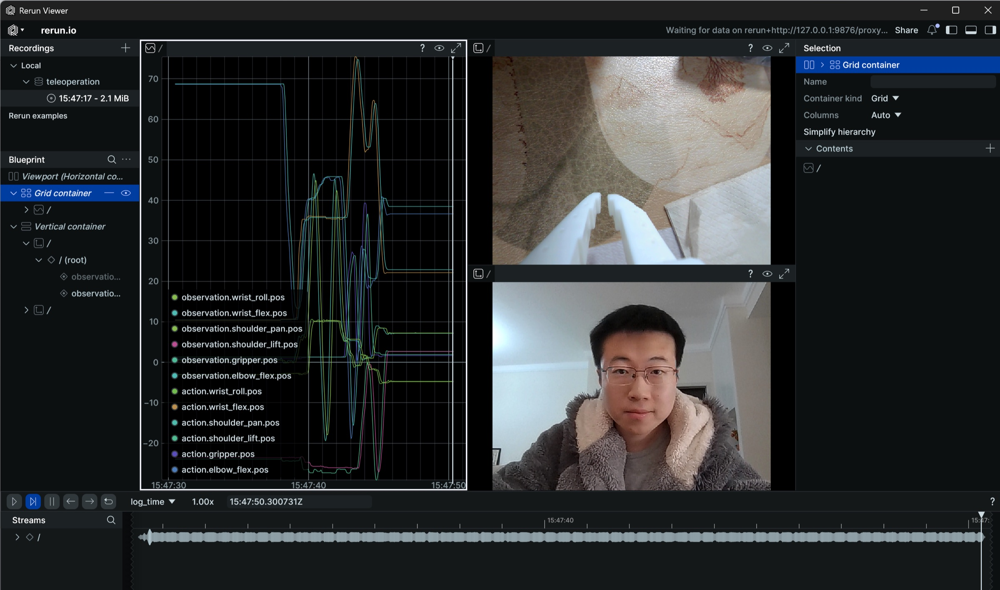

# ステップ5:カメラ付きテレオペレーション（Windows）

## カメラとパソコンの接続

```Shell
lerobot-find-cameras opencv
```



## テレオペレーションとカメラ映像の表示

```Shell
lerobot-teleoperate --robot.type=so101_follower --robot.port=COM6 --robot.id=my_follower_arm --robot.cameras="{ front: {type: opencv, index_or_path: 1, width: 1280, height: 720, fps: 30, fourcc: "MJPG"}}" --teleop.type=so101_leader --teleop.port=COM7 --teleop.id=my_leader_arm --display_data=true
```

rerun.ioの画面が開き、各サーボ関節の軌跡、およびカメラのリアルタイム映像がリアルタイムに表示されます

また、画像は`C:\Users\<Windows-ユーザー名>\outputs\captured_images`ディレクトリに保存されます



## 以下のようなエラーが発生した場合

カメラに接続できませんが、Tencent Meetingでカメラを切り替えると、正常に起動できます


`lerobot\src\lerobot\cameras\utils.py`ファイルを修正し、OpenCVのバックエンドを`cv2.CAP_DSHOW`に変更します


> これはDoubaoですら解決できないbugで、lerobotライブラリのカプセル化が深すぎるのが原因です。初心者にはdubugが非常に困難です
> 
> 

[wx_camera_1768139334330.mp4](/downloads/wx_camera_1768139334330.mp4)

## カメラを複数台接続してテレオペレーションし、カメラ映像を表示する

```Shell
lerobot-teleoperate --robot.type=so101_follower --robot.port=COM6 --robot.id=my_follower_arm --robot.cameras="{ front: {type: opencv, index_or_path: 0, width: 1280, height: 720, fps: 30, fourcc: "MJPG"}, side: {type: opencv, index_or_path: 1, width: 1280, height: 720, fps: 30, fourcc: "MJPG"}}" --teleop.type=so101_leader --teleop.port=COM7 --teleop.id=my_leader_arm --display_data=true
```



<RelatedProducts slugs="so-arm101" />
