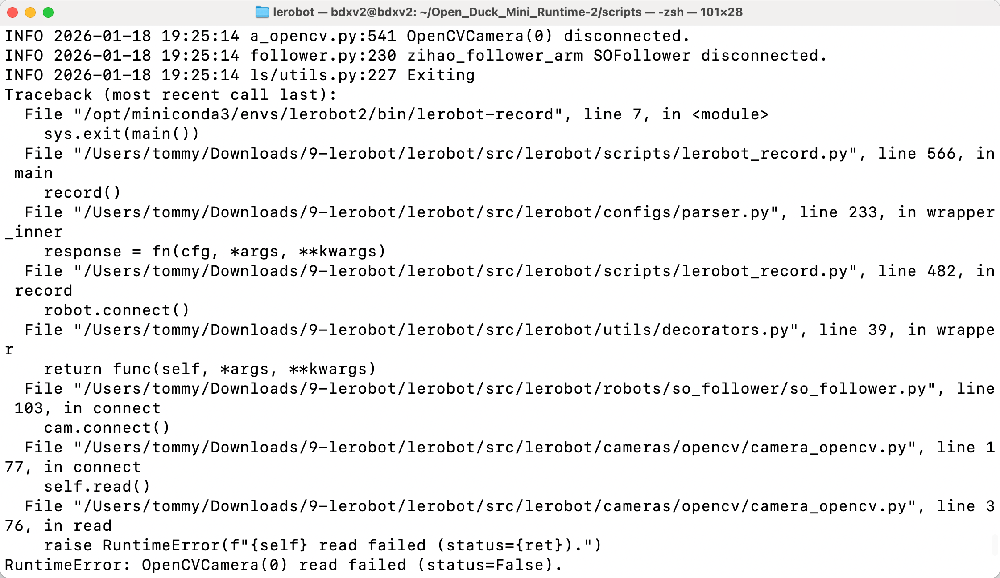
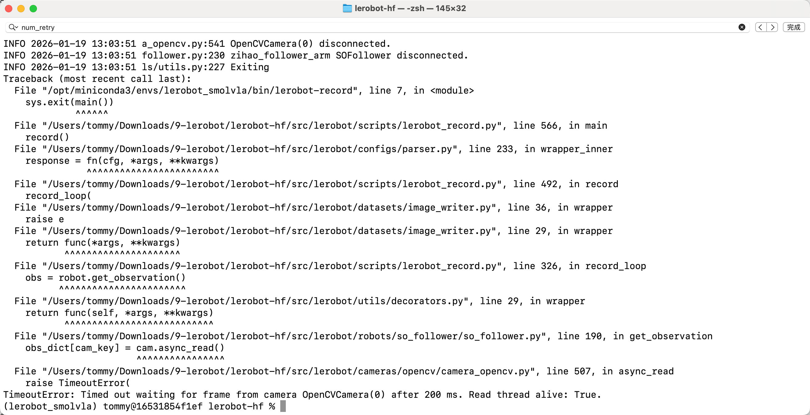
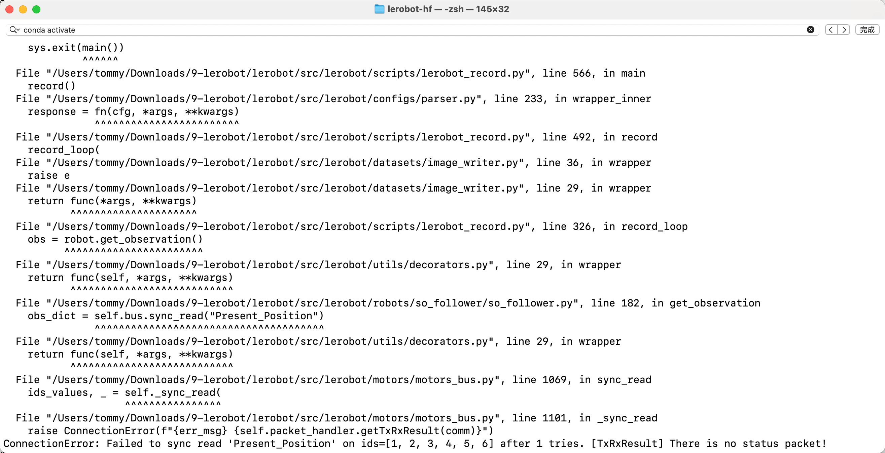
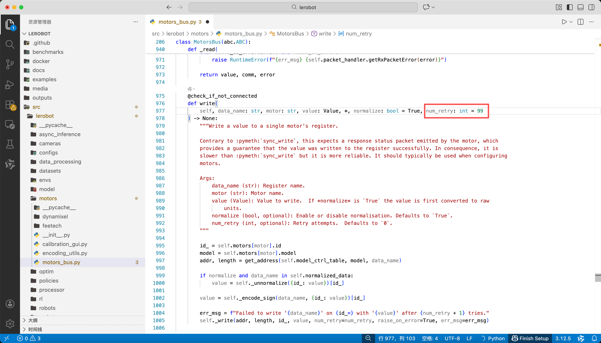
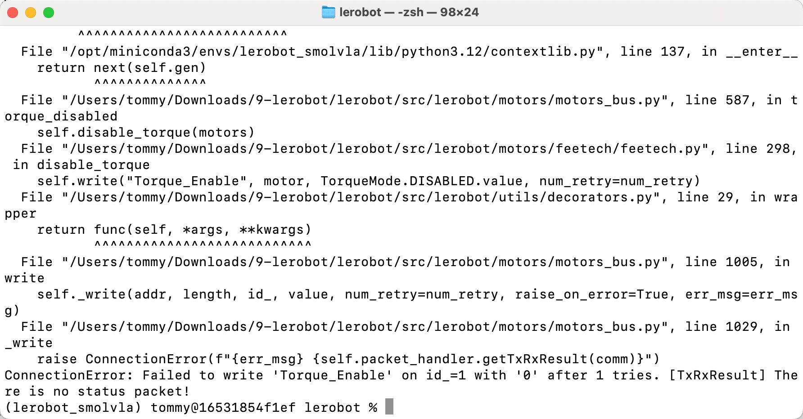

# ステップ8:よくあるBugと解決方法

## カメラの取得に失敗する

手首カメラの配線が緩んでいないか確認してください。特にカメラに近い側の配線は非常に接触不良を起こしやすいです

## カメラが切断される

コマンドラインを再起動してください

## サーボ通信の問題1

ConnectionError: Failed to sync read 'Present_Position' on ids=[1, 2, 3, 4, 5, 6] after 1 tries. [TxRxResult] There is no status packet!

解決方法：`lerobot/src/lerobot/motors/motors_bus.py` のコード内のすべての `num_retry` を99に変更します。特にエラー行に対応するものです

## サーボ通信の問題2

ConnectionError: Failed to write 'Torque_Enable' on id_=1 with '0' after 6 tries. [TxRxResult] There is no status packet!

解決方法：ロボットアームを再キャリブレーションする

<RelatedProducts slugs="so-arm101" />
