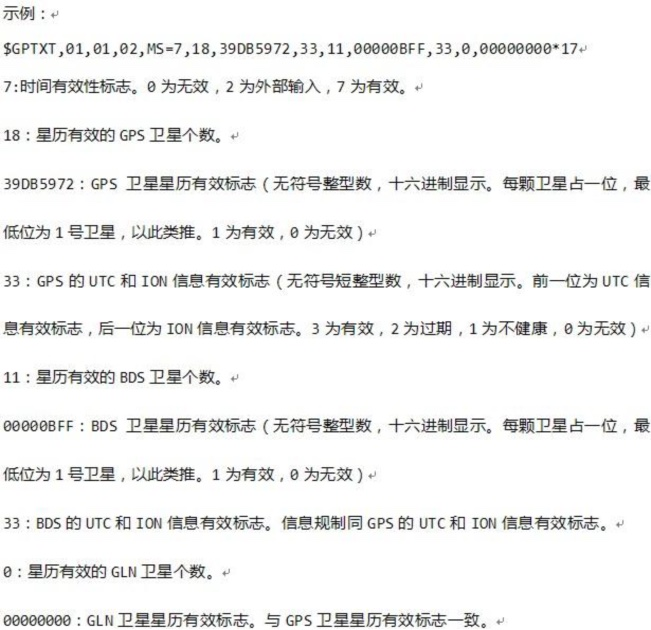

# ラズベリーパイ:AGNSS 支援測位

**1. 学習目標**

今回の講座では、主にRaspberry PiとGPSモジュールおよびagnssサーバーを使用して、弱信号下での位置情報の読み取りと解析を実装する方法を学びます。

**2. AGNSS説明**

2.1. **なぜAGNSSを使うのか**

• 自律型GNSS受信機が測位するための条件には次が含まれます：

- 衛星信号を捕捉して追尾し、時間を解析する

- 衛星から航法メッセージを取得する

• 強い信号環境では、自律型GNSS受信機は30秒程度でコールドスタート測位が可能です。しかし弱い信号環境では、外部補助のない受信機は衛星の捕捉が非常に遅く、衛星から航法メッセージを取得することが難しいため、測位に非常に長い時間がかかり、測位できないことさえあります。

• AGNSSは受信機に測位に必要な補助情報、例えば航法メッセージ、概略位置、時刻を提供できます。強信号環境でも弱信号環境でも、これらの情報は初回測位時間を大幅に短縮できます。

2.2. **AGNSSソリューション**

• AGNSSサーバーは複数のGNSSデータソースからAGNSS補助情報を取得して管理します。サーバーは常時クライアントのAGNSSリクエストを監視し応答します（ユーザー名とパスワードが必要です）。

• ユーザーはTCP/IPプロトコルを通じてAGNSSサーバーから補助情報を取得し、取得した補助情報はそのままGNSS受信機に送信できます。

• ユーザーは自分自身のプロキシサーバーを構築することもできます。

 

2.3. **AGNSSの流れ**

• AGNSSサーバーに接続する

–サーバーのアドレスは121.41.40.95（ドメイン名：www.gnss-aide.com）

–ポート番号は2621

• AGNSSリクエストを送信する

–リクエスト文：（ユーザー名とパスワードのフィールドは必須項目です）

–user=pm@juxi.com;pwd=juxi;cmd=full;gnss=gps+bd;lat=60.0;lon=55.0;alt=0;

• AGNSS補助情報を取得する

• AGNSS補助情報を受信機に送信する

2.4. **AGNSSリクエストパラメータ**

• ユーザー側はAGNSSサーバーにリクエストを送信します。リクエスト文のフォーマットは以下のとおりです

–リクエスト文は複数のkey=value;の組み合わせです。例：key=value;key=value;

• 例：user=pm@juxi.com;pwd=juxi;cmd=full;gnss=gps+bd;lat=60.0;lon=55.0;alt=0;

• 具体的なkeyとvalueの定義は以下の表のとおりです

| キーワード(Key) | 値(value)   | 必須/任意 | 備考                                                         |
| ----------- | ----------- | ------ | ------------------------------------------------------------ |
| **user**    | 文字列      | 必須   | ユーザー名。ユーザー名は有効なメールアドレスとすることを強く推奨します。重要なAGNSSサーバーメンテナンス情報がそのメールアドレスに送信されます。 |
| **pwd**     | 文字列      | 必須   | ユーザーパスワード                                           |
| **gnss**    | 文字列      | 任意   | カンマで区切られたGNSSリストで、現在はGPSをサポートしています。有効な値は：gps,bds,glo ”gnss=gps;”はGPS補助情報を要求することを示します；gnss=gps,bds;”はGPSとBDSの補助情報を要求することを示します； |
| **cmd**     | 文字列      | 任意   | full:すべての情報。エフェメリス、推定時刻と位置を含むeph:エフェメリスのみを提供aid:補助時刻、位置などの情報この項目を記入しない場合、デフォルトはfull |
| **lat**     | 数値        | 任意   | ユーザー位置の緯度の推定値。緯度の単位：度。値の範囲は-90～90度です。二つの位置補助フォーマット、緯度経度高フォーマットとECEFフォーマットのうち、いずれか一方を選択します。有効な緯度経度高位置補助フォーマットは”lat=30;lon=120.3;alt=100;”で、三つのフィールドがすべて完全でなければなりません。 |
| **lon**     | 数値        | 任意   | ユーザー位置の経度の推定値。経度の単位：度。値の範囲は-180～180度です。 |
| **alt**     | 数値        | 任意   | ユーザー位置の高度の推定値。単位:メートル。                  |
| **x**       | 数値        | 任意   | ユーザー位置（ECEF座標系におけるX,Y,Z）の推定値。単位:メートル。有効なECEF位置補助フォーマットは”x=30000;y=1111120.3;z=3345100;”で、三つのフィールドがすべて完全でなければなりません。 |
| **y**       | 数値        | 任意   | ユーザー位置（ECEF座標系におけるX,Y,Z）の推定値。単位:メートル。 |
| **z**       | 数値        | 任意   | ユーザー位置（ECEF座標系におけるX,Y,Z）の推定値。単位:メートル。 |
| **pacc**    | 数値        | 任意   | ユーザー位置の精度。単位はメートルです。                     |

2.5. **サーバーが返す情報**

 

• AGNSSサーバーが返すデータの例：データヘッダ＋補助データ内容

• バイナリデータはGNSS受信機が必要とする補助データであり、これらのバイナリデータにはいずれもデータチェックが含まれています。バイナリデータのフォーマットは中科微の受信機プロトコル仕様を参照してください。

• データヘッダもGNSS受信機に送信しても、GNSS受信機に影響を与えません。

2.6. **AGNSS性能比較**

• 通常のスタンドアロン型GNSS受信機と比較して、AGNSS受信機はTTFF性能が著しく向上しており、特に弱信号条件下で顕著です。

 

2.7. **注意事項**

• 概略位置補助はユーザー側が他の方法で取得する必要があります。例えば

–GSM/GPRS/3G通信モジュール。これらのモジュールはいずれもCELL IDの方式を利用して現在の概略位置を取得できます

–WiFiなどの他の無線モジュールでも、概略測位が可能です

• 概略位置の精度は15km以内が要求され、誤った位置補助は受信機の性能に影響します

• 概略位置を取得できない場合、AGNSSリクエスト文で位置のフィールド（lat,lon,alt,x,y,z）を省略すると、受信機は過去の測位の有効な位置を自動的に選択します

• GNSS受信機自身が出力する位置を概略位置とする必要はありません

2.8. **いつAGNSSが必要か**

• 毎回起動するたびにサーバーからダウンロードする必要はなく、通信量を節約できます

–中科微のチップ内部にはバッテリバックアップSRAM、および永久バックアップFLASHがあり、いずれも受信したエフェメリスデータなどを自動的に保存できます

–チップは正常動作中、絶えず衛星から最新のエフェメリスデータをダウンロードします

• 受信機の状態を照会することで、サーバーからAGNSSデータをダウンロードする必要があるかどうかを判断します

–受信機は航法メッセージ状態文を出力できます（デフォルトでは出力されず、設定が必要です）

2.9. **航法メッセージ状態文の紹介**

 

 

• この文が出力するのは、現在の受信機内部の時刻＋航法メッセージ状態です。

• コマンド$PCAS03,,,,,,,,,,,1*1Fを送信すると、毎秒1回航法メッセージ状態文を出力します

• コマンド$PCAS03,,,,,,,,,,,0*1Eを送信すると、航法メッセージ状態文の出力を停止します

• 注意：各文の後ろは必ず\r\nで終わる必要があります(0x0D,0x0A)。文中には11個のカンマがあります

• 時間フラグが有効（0以外）で、かつ有効なエフェメリスの数が多い（8個より大きい）場合、AGNSSエフェメリスをダウンロードする必要はありません。

 

**3. 事前準備**

**3.1. 配線**

GPSモジュールはUART通信またはUSB通信を採用しており、ここではUSB通信を例とします。

type-cケーブルでRaspberry PiとGPSモジュールを接続し、コマンド ls /dev | grep 'ttyUSB' を実行すると、GPSモジュールがUSB0として認識されるのが確認できます

 

**3.2. 百度地图akの申請**

ドキュメント [百度地图api申請チュートリアル](./RaspberryPi-Baidu-Map-API.md) を参照してください

 

**4. プログラム**

今回の講座のプログラムは次を参照してください：GPS-agnss.py

USBを初期化します：

 

資料のakには自分で申請したak値を記入する必要があります。そうすれば百度地图を通じて現在の概略の緯度経度情報を取得できます

 

ここでは百度地图で取得した概略の緯度経度情報をサーバーに送信します。私たちが使用するログインアカウントは钜犀公式のアカウントです。取得完了後、パッケージ全体をモジュールに送信します

 

 

位置情報の取得と解析関数です。下図では、位置情報の中からGNGGAで始まる位置情報を抽出し、その後データを解析して各グローバル変数に格納します。

 

 

同様の方法でGNVTGの方位情報を取得して解析します。

 

解析後のデータを繰り返し出力します

 

**5.プログラムの実行**

ターミナルでsudo python2 GPS-agnss.pyを入力してプログラムを実行します。

**6.実験現象**

**注意、補助測位ではRaspberry Piは必ずネットワークに接続する必要があります。**

モジュールは弱信号下で通電すると、USBの初期化を開始し、初期化に成功すると「GPS Serial Opened! Baudrate=9600」と表示され、そうでなければ「GPS Serial Open Failed!」と表示されます。エラーの場合は配線またはUSBポートを確認する必要があります。

その後"GPS Agnss start"が表示され、補助測位情報をサーバーに送信し始め、送信完了後に"GPS Agnss success"が表示されます

送信後のしばらくの間まだGPS信号を読み取れていない場合、このとき"GPS no found"が表示され、百度地图で読み取った概略の緯度経度情報が出力されます。

 

しばらくしてGPSを認識した後、認識は位置と方位情報を繰り返し出力します。

 

Ctrl+Cを押して情報の読み取りを終了します。

<RelatedProducts slugs="gps-beidou-module" />
