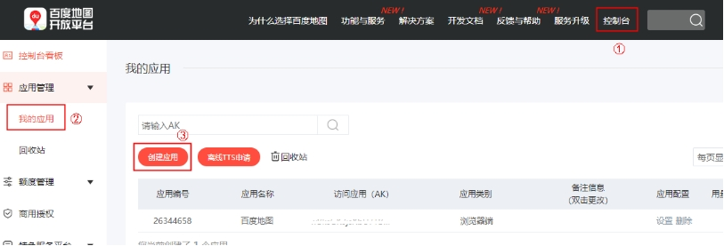
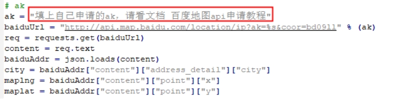

# ラズベリーパイ:百度地図 API 申請

**1.** **登録方法**

百度地图開放プラットフォーム https://lbsyun.baidu.com/ にアクセスします

ページの最下部までスクロールします

今すぐ登録をクリックします

 

個人開発者になることをお勧めします（当日申請すればすぐに使用できるためです）

プロンプトに従って順番に完了するだけです

 

**2. akの取得**

私たちが使用するのはwebサービスの中の 普通IP定位 です。ドキュメントは以下のリンクで確認できます。

https://lbsyun.baidu.com/index.php?title=webapi/ip-api

コンソール をクリックし、マイアプリ を選択し、アプリの作成 を選択します。

 

アプリ名は自由に記入し、アプリの種類は サーバーサイド を選択し、サービスを有効化し、ホワイトリストに 0.0.0.0/0 を入力します。

 

送信 をクリックするとアプリが生成されます。

 

私たちのアプリのak値をコピーします

 

プログラムに貼り付けて保存すれば、百度地图を通じて位置情報を読み取ることができます。

<RelatedProducts slugs="gps-beidou-module" />
