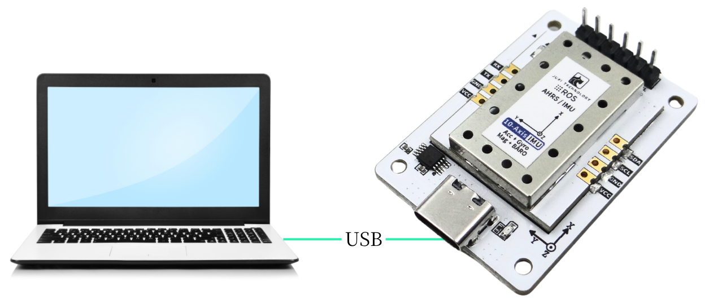
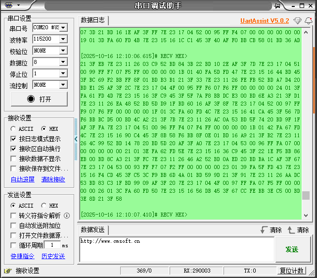

# PC 通信

**注意：シリアルポートが認識できない場合は、ch34xドライバをインストールしてください**

1. IMU姿勢センサーをType-CケーブルでPCに接続

2. シリアルデータを確認

シリアルアシスタントを下図のように設定します

シリアルで出力されるのは未処理のデータです。データの意味は「**通信プロトコル**」ドキュメントを参照してください。

IMUモジュール-シリアルとI2C通信プロトコル.xlsx

