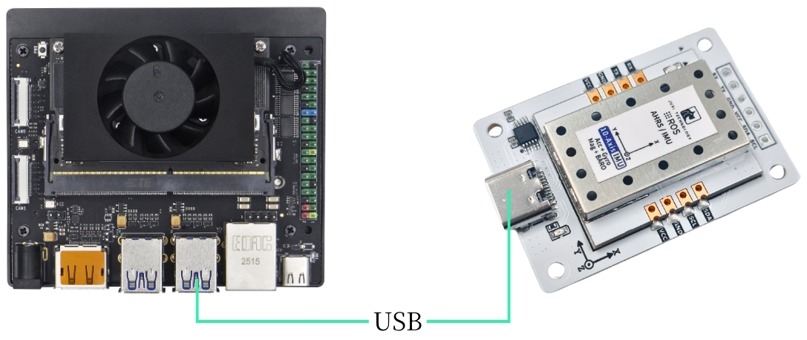
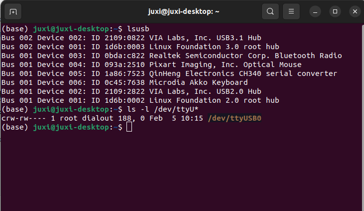
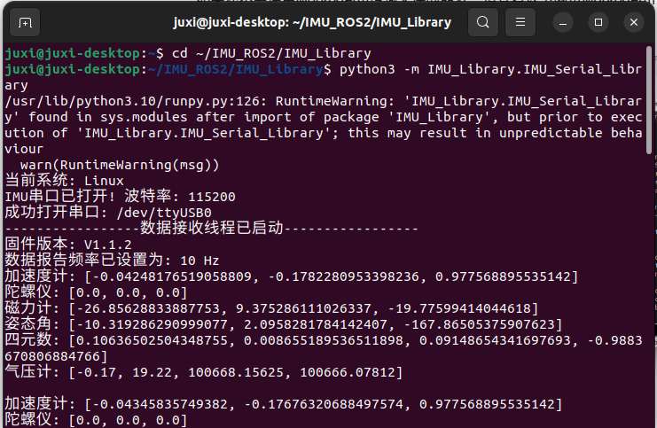
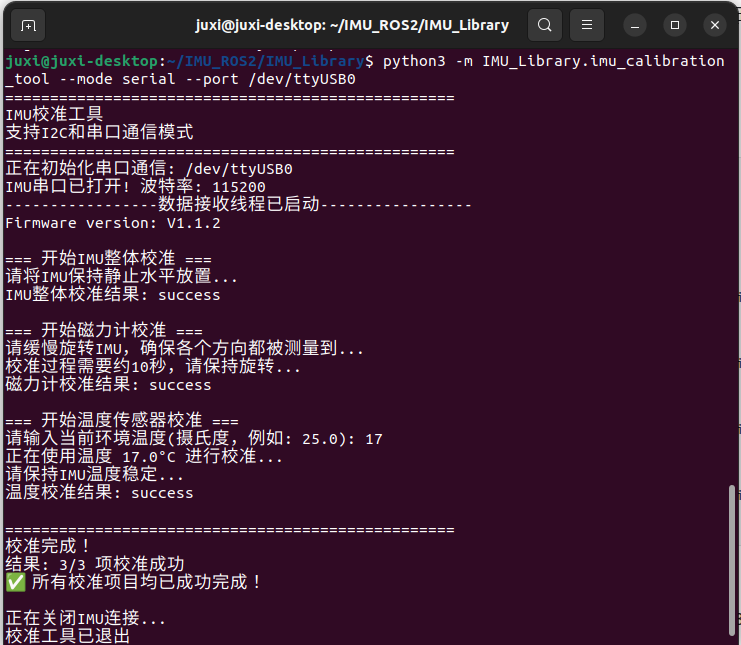

# Jetson

## 1. デバイスの接続

本チュートリアルはJetson orin nxマザーボードを例にしています。

IMU姿勢センサーをType-CケーブルでホストのUSBに挿します。



## 2. デバイス状態の確認

デバイスIDの確認

```PowerShell
lsusb
```

デバイス番号の確認

```PowerShell
ls -l /dev/ttyU*
```



ポートマッピングの設定

```Bash
# 防止插拔后端口变更，请设置端口映射
sudo gedit /etc/udev/rules.d/99-serial-imu.rules
# 如出现没有gedit命令相关内容，请先下载安装
sudo apt install gedit
# 填写映射内容
KERNEL=="ttyUSB*", ATTRS{idVendor}=="1a86", ATTRS{idProduct}=="7523", MODE:="0777", SYMLINK+="imu-serial"
# 参数说明
`--mode`: 通信模式，可选值为`serial`(串口)或`i2c`
`--port`: 串口名(如`/dev/ttyUSB0`)或I2C端口号(如`7`)
`--rate`: 数据打印频率(Hz)，默认10Hz
`--debug`: 启用调试模式，显示详细信息
# 保存退出，运行命令使规则生效
sudo udevadm trigger
sudo service udev reload
sudo service udev restart
# 验证
ll /dev/imu-serial
# 输出示例
lrwxrwxrwx 1 root root 7 1月 22 10:00 /dev/imu-serial -> ttyUSB0
```

## 3. ドライバライブラリのインストール

3.1 **コードに必要なpythonライブラリのインストール**

```PowerShell
sudo apt update
sudo apt install -y python3-serial
sudo apt install -y python3-smbus2
```

3.2 **ファイルの転送**

IMU_ROS2.zip

MobaXterm を使ったファイル転送にまだ慣れていない方は、以下のページで MobaXterm の詳しいインストール方法と操作方法をご確認ください: [文件远程传输](https://juxitech.feishu.cn/wiki/KB0Jw2o6Wis9f0ksyeFceVmgnfd)

MobaXtermソフトで解凍したファイルを Jetson orin nx にドラッグします。


## 4. imuデータの確認

**~/IMU_Library ディレクトリに入り、IMU_Serial_Library.py ファイルを実行**

```PowerShell
cd ~/IMU_ROS2/IMU_Library
# 运行 IMU 数据打印文件
python3 -m IMU_Library.IMU_Serial_Library
```



注意：上記は10軸IMUのデータ読み取りです。6軸は磁力計（Magnetometer）と気圧計（Barometer）データがなく、9軸は気圧計（Barometer）データがありません。

## **5. IMUキャリブレーション**

**~/IMU_Library ディレクトリに入り、imu_calibration_tool.py ファイルを実行**

```PowerShell
cd ~/IMU_Library
# 运行 IMU 校准代码文件 --串口通讯校准
# 执行所有校准（整体、磁力计、温度）
python3 -m IMU_Library.imu_calibration_tool --mode serial --port /dev/imu-serial
# 仅整体校准
python3 -m IMU_Library.imu_calibration_tool --mode serial --port /dev/imu-serial --calibrate imu
# 仅磁力计校准
python3 -m IMU_Library.imu_calibration_tool --mode serial --port /dev/imu-serial --calibrate mag
# 仅温度校准
python3 -m IMU_Library.imu_calibration_tool --mode serial --port /dev/imu-serial --calibrate temp
```



## 6. 注意事項

デバイスIDは確認できたがデバイス番号を確認できない場合、以下のコマンドでch34xドライバをインストールできます

```PowerShell
sudo apt remove brltty
git clone https://github.com/clhchan/CH341SER.git
cd CH341SER
make -j6
sudo make install
sudo modprobe ch34x
```
