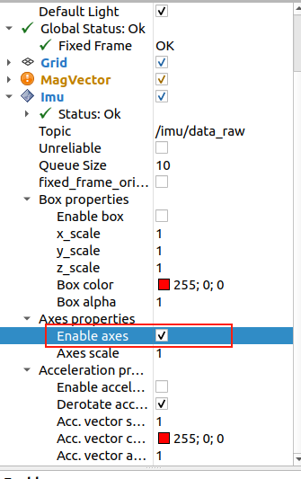

# ROS1 応用

> **[ストアで購入](https://www.juxitech.com/ja/products/imu-module-ahrs-attitude-and-heading-angle-sensor)**


**システム構成：ubuntu20.04**

**ROS1バージョン：noetic**

### ROS1環境設定

1. **ROS1インストールソースの設定**

```PowerShell
sudo sh -c '. /etc/lsb-release && echo "deb http://mirrors.tuna.tsinghua.edu.cn/ros/ubuntu/ `lsb_release -cs` main" > /etc/apt/sources.list.d/ros-latest.list'
```

2. **Keyの設定**

```PowerShell
sudo apt-key adv --keyserver 'hkp://keyserver.ubuntu.com:80' --recv-key C1CF6E31E6BADE8868B172B4F42ED6FBAB17C654
```

```Plain Text
sudo apt update
```

3. **ROS1のインストール（公式ダウンロード）**

```PowerShell
sudo apt install ros-noetic-desktop-full
```

プロキシ加速ダウンロードでROS1をインストール
wget http://fishros.com/install -O fishros && . fishros

4. **環境変数の設定**

```Plain Text
echo "source /opt/ros/noetic/setup.bash" >> ~/.bashrc
```

```PowerShell
source ~/.bashrc
```

### デバイスを仮想マシンに接続

1. **デバイスの確認**

```PowerShell
ll /dev/ttyUSB*
```

2. **ポートマッピングの作成**

```PowerShell
sudo gedit /etc/udev/rules.d/99-serial-imu.rules
```

3. **マッピングファイルの内容を記入**

```PowerShell
KERNEL=="ttyUSB*", ATTRS{idVendor}=="1a86", ATTRS{idProduct}=="7523", MODE:="0777", SYMLINK+="imu-serial"
```

4. **保存して終了、コマンドを実行してルールを有効化**

```PowerShell
sudo udevadm trigger
```

```Plain Text
sudo service udev reload
```

```Plain Text
sudo service udev restart
```

5. **検証**

```PowerShell
ll /dev/imu-serial
```

```Bash
sudo usermod -aG dialout ash
```

### 準備済みの圧縮パッケージのインポート

1. **飞书の同级ディレクトリにあります**[IMU_ROS1.zip](https://juxitech.feishu.cn/wiki/BcWGwW2yDiXex9k6qjTcleTvnPb)

2. **解凍後、ファイル転送ソフトで仮想マシンに転送します**

3. **IMU_Libraryライブラリのインストール**

```PowerShell
cd IMU_ROS1
# IMU_ROS1 圧縮ファイルをダウンロードして解凍後、IMU_Library ディレクトリに移動し、以下のコマンドを実行
cd IMU_Library
# ライブラリとその依存をインストール
pip install -e .
# または setup.py でインストール
python setup.py install
```

### python関連ライブラリのインストール

```PowerShell
sudo pip3 install pyserial
sudo pip3 install smbus2
```

**レンダリングに問題が発生した場合は、以下のコマンドを実行してください**

```PowerShell
sudo apt-get install ros-noetic-imu-filter-madgwick
sudo apt-get install ros-noetic-rviz-imu-plugin
```

### ROS1プロジェクトの構築

1. **/homeディレクトリで新しいターミナルを開き、ros1ワークスペースを作成**

```PowerShell
mkdir imu_ros1
cd imu_ros1
mkdir src
cd src/
catkin_init_workspace
```

2. **転送したファイルIMU_ROS1フォルダを~/imu_ros1/src/ディレクトリにコピー**

```PowerShell
# IMU_ROS1 フォルダを新規作成した src ディレクトリにコピー
cp -r ~/IMU_ROS1 ~/imu_ros1/src
cd ~/imu_ros1
catkin_make
```

3. **作業ディレクトリ~/imu_ros1を環境変数に書き込む**

```PowerShell
# ~/.bashrc を編集
sudo gedit ~/.bashrc
# 以下のコマンドを末尾に追記
source ~/imu_ros1/devel/setup.bash
source ~/.bashrc
```

### ROS1ノードの起動

1. **ターミナルを開き、roscoreを入力してノードを起動**

```PowerShell
# roscore を起動
roscore
# 新しいターミナルを開き、環境を設定してノードを起動
source ~/imu_ros1/devel/setup.bash
```

2. **Pythonスクリプトに実行権限を付与（重要）**

スクリプトがある `scripts` ディレクトリに入り、`chmod +x` コマンドで実行権限を付与します（`+x` は実行権限の追加）：

```PowerShell
# imu_driver.py のあるディレクトリに移動（実際のパスに合わせて）
cd ~/imu_ros1/src/IMU_ROS1/scripts/
# 実行権限を付与（1 回のみ実行すれば永続的に有効）
chmod +x imu_driver.py
chmod +x mag_visualizer.py
```

imu_ros1フォルダに戻ってimu_driver.pyを実行
```Plain Text
cd ~/imu_ros1
```

```Plain Text
rosrun IMU_ROS1 imu_driver.py
```

### IMUデータの出力

1. **新しいターミナルを開き、imuトピックを確認**

```PowerShell
# 現在配信されているすべてのトピックを確認
rostopic list
```

2. **トピックデータを出力**

```PowerShell
# IMU の生データを出力
rostopic echo /imu/data_raw
# 磁力計データを出力
rostopic echo /imu/mag
```

### RViz可視化

1. **コマンドを実行してrvizを起動**

```PowerShell
roslaunch IMU_ROS1 imu_display.launch
```

### よくある質問

1. ノード起動時に失敗する場合は、以下のコマンドを試してください

```PowerShell
# ~/imu_ros1 ディレクトリで実行
source devel/setup.bash
# ポート番号の問題
sudo chmod 666 /dev/imu-serial
```

2. RVIZ可視化で三軸の表示が非常に小さい場合、Enable axes を再チェックしてください


