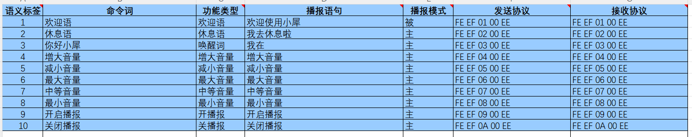
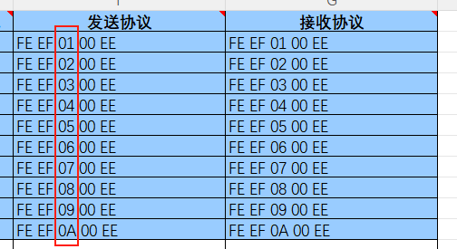
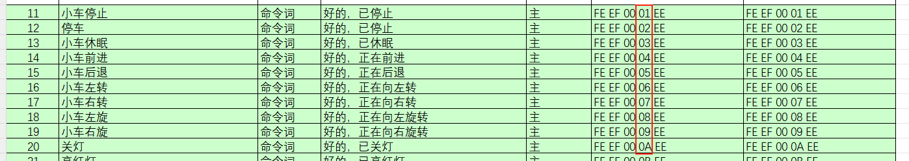
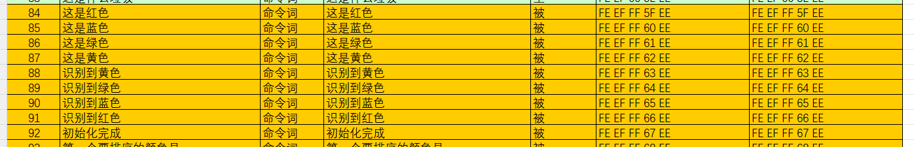

# 시리얼 포트 프로토콜

첨부 파일의 命令词播报词协议列表V1_中文 파일을 열면 전송 프로토콜과 수신 프로토콜을 확인할 수 있습니다,

## 1.기능성 항목 해석

파일에 따르면 10 개의 기능성 항목의 전송 및 수신 프로토콜을 확인할 수 있습니다,

기능성 항목은 프로토콜의 세 번째 바이트를 해석하여 구분할 수 있습니다

그중 첫 번째와 두 번째 바이트(EF EF)는 프레임 헤더를 나타내고, 세 번째 바이트는 기능어의 ID 를 나타내며, 네 번째 바이트는 명령어의 ID 를 나타내고, 다섯 번째 바이트(EE)는 프레임 끝을 나타냅니다

## 2.명령 항목

명령 항목의 예시는 다음과 같으며, 명령어의 네 번째 바이트가 ID 를 나타냅니다

예:

예를 들어 모듈에 小车停止 라고 말하면 모듈이 시리얼 포트를 통해 FE EF 00 01 EE 다섯 바이트를 전송하며, 우리는 호스트 컨트롤러의 시리얼 포트 서비스 함수를 통해 이 데이터 그룹을 얻은 후 네 번째 바이트를 해석하여 ID:01 을 알아낼 수 있습니다. 이때 현재 小车停止 임을 알 수 있습니다.

## 3.재생 문구 항목

재생 문구 항목은 능동적으로 재생되지 않으며, 반드시 호스트 컨트롤러가 시리얼 포트를 통해 명령을 전송해야 재생됩니다 (명령 항목의 재생 문구도 재생할 수 있습니다).

그중 첫 번째와 두 번째 바이트(FE EF)는 프레임 헤더를 나타내고, 세 번째 바이트는 재생 기능 FF 를 나타내며, 네 번째 바이트는 재생할 내용의 ID 를 나타내고, 다섯 번째 바이트(EE)는 프레임 끝을 나타냅니다

예:

“初始化完成” 를 재생해야 할 때, 호스트 컨트롤러는 시리얼 포트를 통해 음성 인터랙션 모듈에 FE EF FF 67 EE 를 전송해야 하며, 전송이 완료되면 음성 인터랙션 모듈이 “初始化完成” 를 재생할 수 있습니다

