# ⚒️ 키트 조립

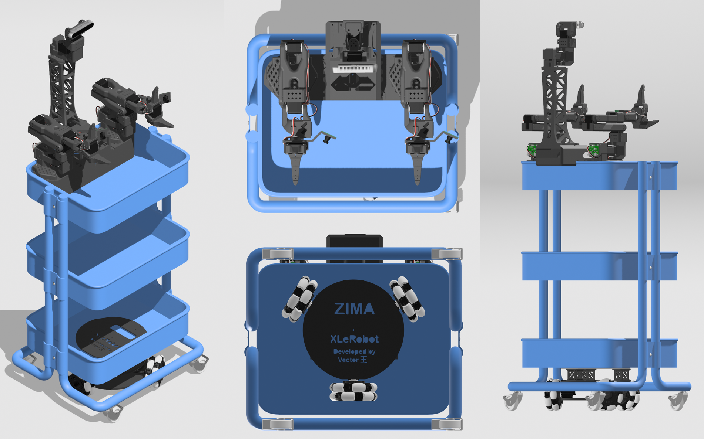

팁

나사 조이기의 즐거움을 건너뛰고 싶다면, Xlerobot 에 호환되는 SO101 팔로워 암의 [사전 조립 키트](https://item.taobao.com/item.htm?ft=t&id=1002551208989&spm=a21dvs.23580594.0.0.47b32c1bwUlxLA&skuId=6088534920039)를 구매할 수도 있습니다.


## 🦾 SO101 로봇 암

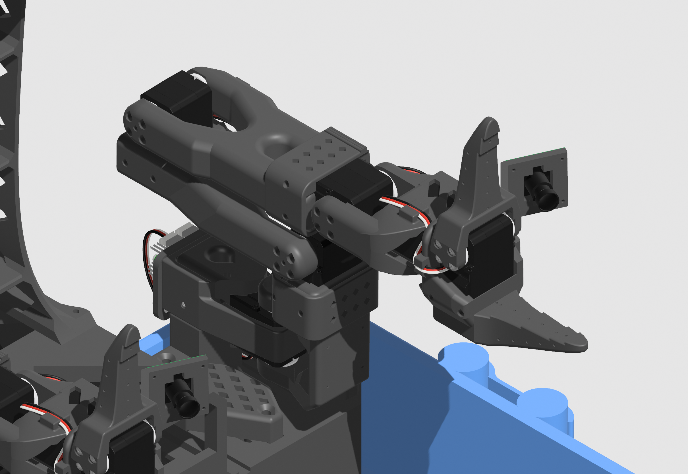

> 이미 서보가 구성된 조립 완료된 SO101 로봇 암 2 개가 있다면 건너뛰십시오。
> 
> 

- [SO101 단계별 조립 설명](https://juxitech.feishu.cn/wiki/HllBwhjJ1iayMdkUTGgcyKbgn8g) 에 따라 2 개의 SO101 로봇 암을 구성하여, 2 개의 동일한 팔로워 암을 만들고, 2 개의 서보 드라이버 보드용으로 2 세트의 서보 (이전에는 모두 ID 가 1-6) 를 갖춥니다。

- 이 [설치 가이드](https://juxitech.feishu.cn/wiki/LjJywf5ILihuwkkOboGcFx1Qnkc) 에 따라 손목 카메라를 추가합니다。

- 미끄럼 방지 패드가 있다면 그리퍼에 붙일 수 있습니다。

## 一、서보 구성

||수량|서보 ID|용도|
|---|---|---|---|
|Feetech STS3215-C018 서보|3|7、8、9|전방향 바퀴 섀시 카|
|Feetech STS3215-C018 서보|2|7、8|상지 키트-카메라 타워|
|서보 연장 케이블 90CM|2||섀시 카와 카메라 타워를 서보 드라이버 보드에 연결|

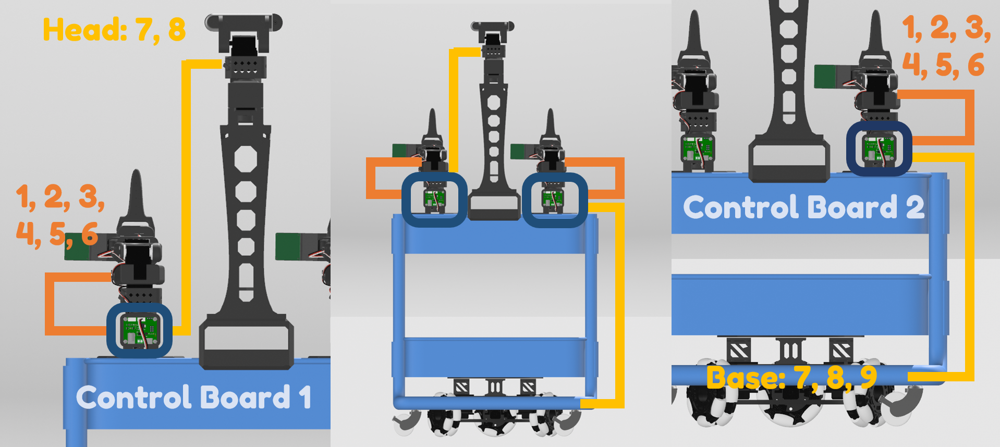

> 공식 lerobot 코드 저장소는 현재 로봇 암 외의 서보 구성을 지원하지 않으므로, 대신 [Bambot](https://bambot.org/) 을 사용합니다 (Windows 와 Mac 에서 작동하며, Linux 에서는 먼저 sudo chmod 666 /dev/ttyACM0 을 실행해야 합니다)。
> 
> 

```Plain Text
sudo chmod 666 /dev/ttyACM0
```

- 구성하려는 서보를 (하나씩) 서보 드라이버 보드에 연결하고, 서보 드라이버 보드를 컴퓨터에 직접 연결합니다。

- [Bambot 서보 구성 페이지](https://bambot.org/feetech.js) 로 이동하여 연결을 설정하고 서보를 스캔합니다。 

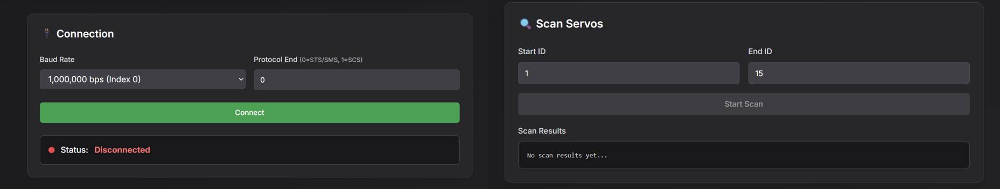

- 아래 설명에 따라 서보 ID 를 이름을 변경합니다。 

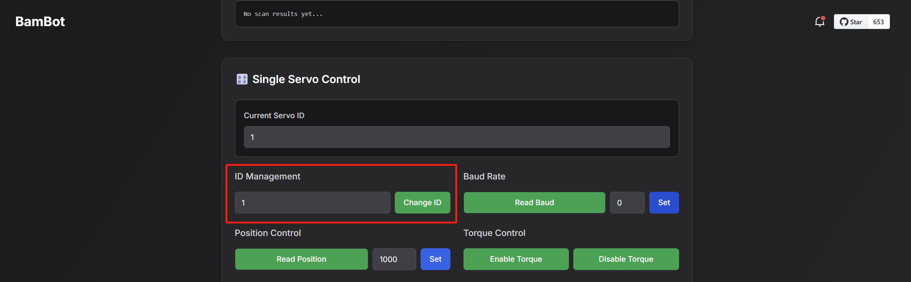

- SO101 로봇 암 외에도 2 개의 서보 드라이버 보드용으로 두 세트의 서보를 구성해야 합니다:

    - 한 세트는 **카메라 타워** 용 (서보 id: 7, 8)

    - 다른 한 세트는 **전방향 바퀴 섀시 카** 용 (서보 id: 7, 8, 9)。

- 팁: 마커펜으로 서보에 숫자를 적고, 서로 다른 보드의 서보를 구분합니다 (예: L1-L8 과 R1-R9)。

## 🛒 카트

- 실수로 설명서를 버렸다면 [여기에 사본이 있습니다](https://github.com/Vector-Wangel/XLeRobot/blob/main/others/Manuals_raskog_utility_cart.pdf)。

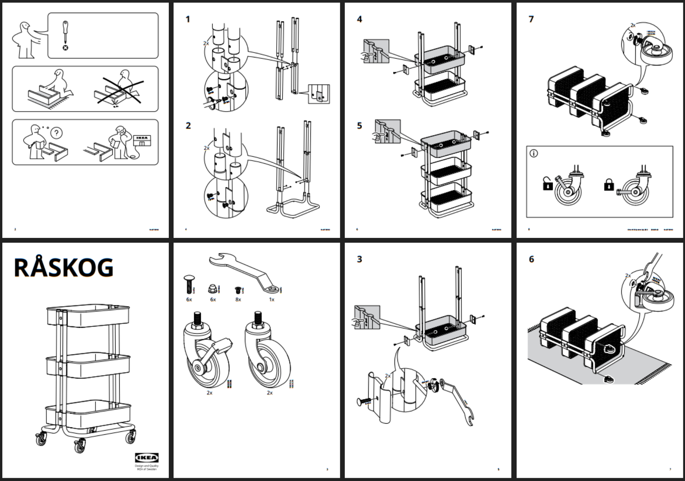

## 🧑‍🦼‍➡ 바퀴형 베이스

> 이미 Lekiwi 베이스가 있다면 배터리, 서보 브래킷 등을 분리하십시오. 하판에는 바퀴가 달린 서보 3 개만 설치하면 됩니다 (배선은 유지)。
> 
> 

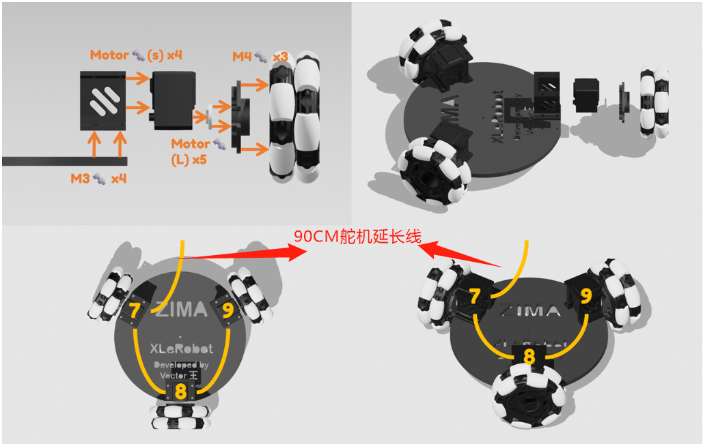

**참고**

보드를 잘못 선택하지 마십시오. 각 보드에는 특정한 순서가 있습니다。

- 위 그림에 따라 전방향 바퀴를 보드에 설치합니다。

    - 해당하는 특정 서보 id 를 설치해야 합니다。

- 전방향 바퀴의 커넥터에는 M4 나사 3 개가 필요합니다。

- [튜토리얼](https://github.com/SIGRobotics-UIUC/LeKiwi/blob/main/Assembly.md#2-bottom-plate-assembly) 에 따라 서보를 정상적으로 배선한 후, 서보 케이블을 서보 드라이버 보드에 연결하지 말고 **90CM 서보 연장 케이블** 을 사용하여 서보 드라이버 보드에 연결합니다。

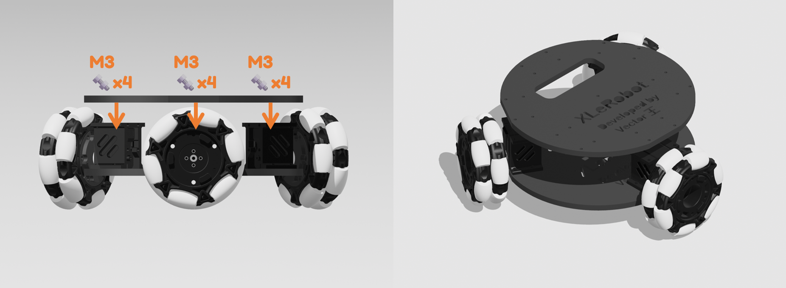

- 위 그림에 따라 상판을 설치합니다。

- **90CM 서보 연장 케이블** 을 늘어뜨려 두고, 당분간 상판 구멍에서 빼내지 마십시오。

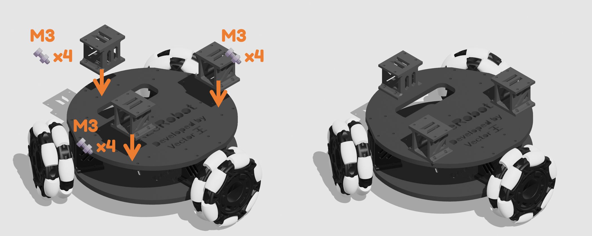

- 위 그림에 따라 상판에 커넥터(라이저) 3 개를 설치합니다。

팁

커넥터가 달린 Lekiwi 베이스를 카트 아래에 놓고, 카트에 충분한 압력을 가하면서 카트의 네 바퀴가 여전히 지면에 닿는지 확인합니다. 그렇지 않다면 슬라이싱 소프트웨어에서 z 축 비율을 직접 약간 조정하여 (xy 축 비율은 변경하지 않고) 커넥터의 3D 모델을 수정하고 다시 인쇄해 보십시오。

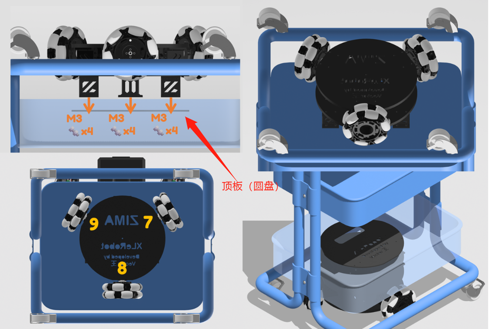

팁

카트를 뒤집어 다음 조립을 진행합니다。

- 이제 커넥터가 달린 Lekiwi 베이스를 카트의 하단에 설치하며, 더 얇은 판은 반대쪽에 둡니다。

- 그림을 참고하여 서보 인덱스에 따라 필요한 조립 방향을 찾습니다。

참고

이 새로운 하드웨어 버전은 카트의 금속 메시와 호환되며, 12 개의 M3 나사 모두 쉽게 체결되어야 합니다。

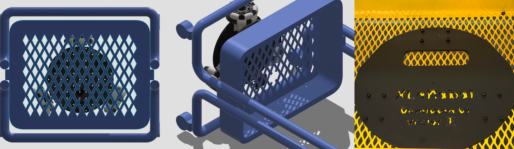

- 그런 다음 이전에 연장한 케이블을 아래에서 카트를 통과시켜 위로 배선합니다。

## 🦾 로봇 암 베이스

### 상단 베이스 조립

14 개의 M3\*12 육각 나사

4 개의 M3\*16 육각 나사

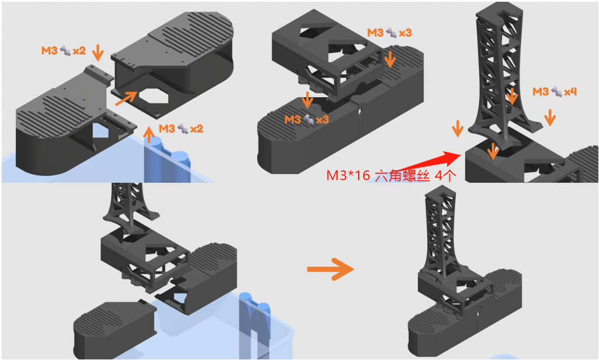

- 베이스를 뒤집으면 조립이 더 쉽습니다。

### 헤드 조립

①먼저 90CM 서보 연장 케이블(검정·흰색 교차)과 서보 케이블(흰색·빨강·검정 교차)을 7 번 서보에 꽂습니다。


②네 개의 M2\*6 와셔 나사로 카메라를 고정합니다

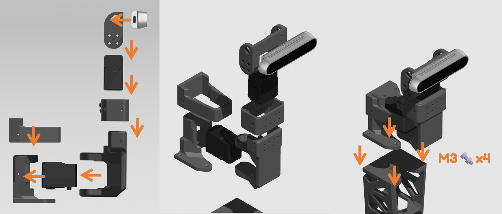

- 서보 혼을 설치할 때 서보 혼의 가운데 구멍에는 나사를 체결하지 않도록 주의합니다。

- 이는 [SO101 로봇 암 조립](https://huggingface.co/docs/lerobot/so101#joint-1) 의 처음 두 단계와 동일해야 합니다。

## 🧵 배선

중요

상단 베이스를 카트에 클램프하기 전에 상단 베이스의 모든 배선과 케이블 정리를 완료하고, Raspberry Pi 를 케이스에 넣습니다。

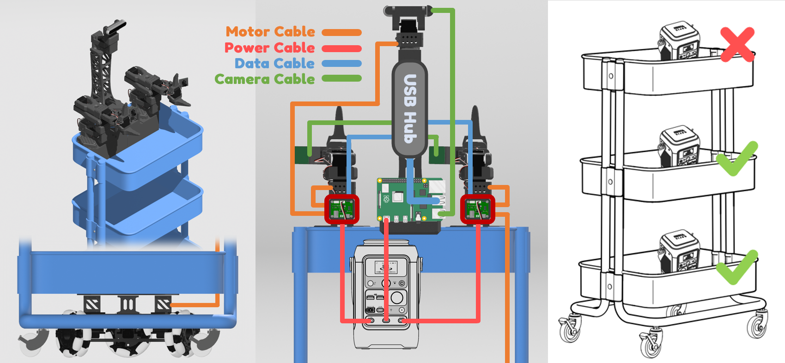

- **Lekiwi 베이스** 에서 나오는 90CM 서보 연장 케이블을 **왼쪽 SO101 로봇 암** 에 연결합니다 (이렇게 하면 베이스와 로봇 암이 Lekiwi 가 됩니다)。

- 2 개의 **USB-C to USB-A 데이터 케이블 ** 을 2 개의 **서보 드라이버 보드** 에서 **Raspberry Pi** (남은 2 개의 USB-A 슬롯은 카메라용) 또는 Jetson 메인보드에 연결합니다。

- 모든 3 개의 **전원 케이블** 을 연결합니다: 2 개의 **서보 드라이버 보드에서 나오는 USB-C to DC (12V)** 와 **Raspberry Pi** 에서 나오는 1 개의 **USB-C to USB-C** 를 전원 공급 장치의 PD 고속 충전 포트에 연결합니다. 각 포트는 동시 충전 시 최대 100W 의 전력을 제공하며, 12V 버전을 구동하기에 충분한 것으로 테스트되었습니다。

### 🔋 배터리 배치 🛒

- 무게 중심을 낮게 유지하기 위해 카트 중간층이나 하층의 아무 곳에나 놓습니다. 배터리에는 미끄럼 방지 바닥이 있어 정상 작동 중에는 쉽게 미끄러지지 않습니다。

- 안전을 위해 똑바로 세워 둡니다。

- 실수로 배터리 설명서도 버렸다면 [여기에 사본이 있습니다](https://github.com/Vector-Wangel/XLeRobot/blob/main/others/Manual_Anker_SOLIX_C300_DC_Portable_Power_Station.pdf)。

중요

서보 드라이버 보드를 보호하기 위해 전원 케이블을 마지막에 연결해야 합니다. 다른 케이블을 꽂거나 뽑을 때는 항상 전원 케이블을 분리하십시오。

## 📸 최종 조립

### 베이스의 카트 장착

중요

상단 베이스를 카트에 클램프하기 전에 상단 베이스의 모든 배선과 케이블 정리를 완료하고, Raspberry Pi 를 케이스에 넣습니다。

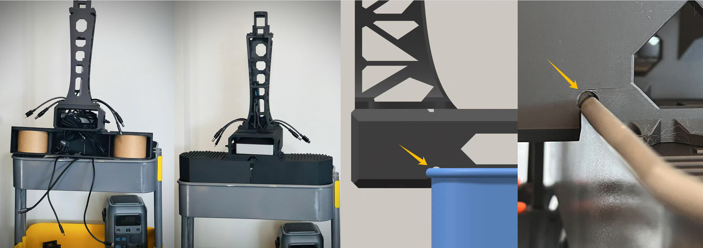

- 카트 가장자리를 케이스 소켓에 밀어 넣을 때 케이스를 손상시키지 않도록 주의하십시오。

- 테스트를 더 쉽게 하기 위해 SO101 로봇 암을 카트에 직접 클램프합니다. [로봇 암 베이스](https://github.com/Vector-Wangel/XLeRobot/blob/main/3D_Models/3D_models_for_printing/XLeRobot_special/SO_5DOF_ARM100_Assemblybases.stl) 를 카트 상층의 두 모서리에 배치한 후 **F 형 고정 클램프** 로 고정합니다。

- Bambu Lab 필라멘트 종이 스풀이 있다면, 안정적인 구조 지지를 제공하기 위해 안에 넣는 것을 잊지 마십시오。

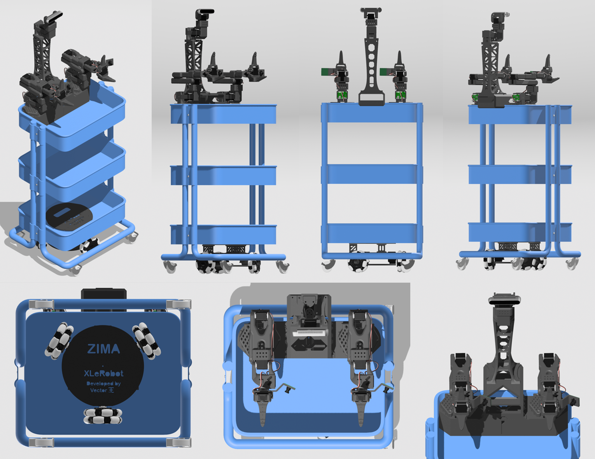

이 단계를 완료하면 XLeRobot 은 물리적으로 잘 조립되어 가사 작업을 할 준비가 됩니다。


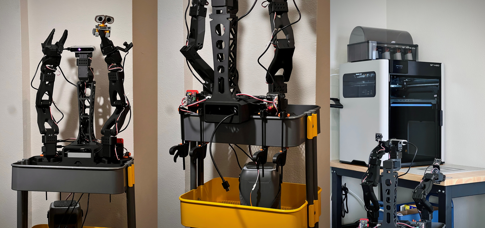

중요

XLeRobot 이 완전히 조립된 후에는 서보 기어가 손상될 수 있으므로 카트처럼 밀고 다니지 마십시오. 수동으로 이동해야 할 때는 로봇을 들어 옮기십시오 (~12kg)。

<RelatedProducts slugs="xlerobot" />
